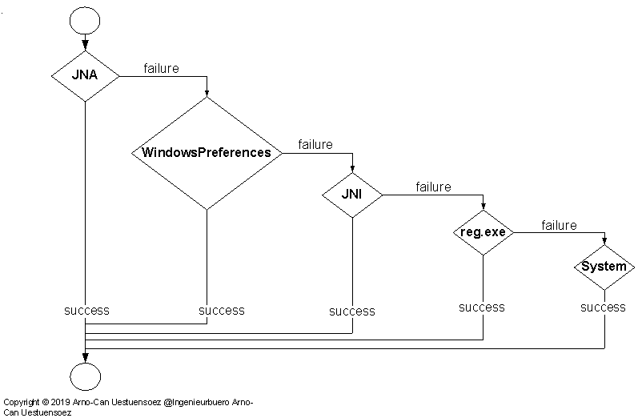

.. _DIST_MODULE_WINDOWS:

platformids.dist.windows
========================
The *platformids.dist.windows* module implements the API for the evaluation of the data for 
the *windows* platform  \[:ref:`doc <enumWINNT>`].

The access to the platform information requires different interfaces for the various implementations.
The information is primarily contained in the windows registry, with some additional information
to be added gathered by the kernel32 API.
In case of Jython the access to the registry requires native access to the platform APIs, while the remaining support 
access via standard libraries *_winreg* / *winreg*.
Additional information by the *kernel32* DLL has to be acquired in both cases via system wrapper libraries,
here by *ctypes* or the various *Java* APIs.

* *CPython*, *IPython*, *IronPython*, and *PyPy*:
   The access to the registry via *_winreg* [WINREG2]_ / *winreg* [WINREG3]_, 
   access to the *kernel32* DLL via *ctypes* [CTYPES]_.
   
   :ref:`dist.nt.windows_kernel32_dll <DIST_WINDOWS_KERNEL32_DLL>` 
      the *WindowsNT* *API* based on access by *ctypes* to the *kernel32.dll* 
   :ref:`dist.nt.windows_products <DIST_WINDOWS_PRODUCTS_MODULE>` 
      for the namebinding of the product enumerations by *pwReturnedProductType* [pwReturnedProductType]_.
   :ref:`dist.nt.windows_subprocess_reg_exe <DISTNTCALLREGEXE>` 
      the *Python* / *Jython* interface for the registry access to *CurrentVersion* 
      via subprocess by *reg.exe* [REGEXE]_, e.g. required in case of *Cygwin*

* *Jython*
   The access to the registry and the *kernel32* DLL via multiple approaches, see :ref:`Jython <JYTHONONWINNTREG>`.
   
   :ref:`jy.dist.nt.ReadCurrentVersionWinPrefs(.java) <DISTNTREADCURRENTVERSION>` 
      the *Java* interface by *java.utils.prefs.WindowsPreferences* for the registry access to *CurrentVersion* 
   JNA 
      access to version information by the Java-Native-Accesses framework,
         :ref:`jy.dist.nt.Advapi32GetCurrentVersion <JNA_ADVAPI32GETCURRENTVERSION>`
            Windows registry access via *Java*
         :ref:`jy.dist.nt.Kernel32GetProductInfo <JNA_ADVAPI32GETPRODUCTINFO>`
            kernel32.dll access via *Java*
   :ref:`dist.nt.windows_products <DIST_WINDOWS_PRODUCTS_MODULE>` 
      for the namebinding of the product enumerations by *pwReturnedProductType* [pwReturnedProductType]_.
   :ref:`dist.nt.windows_subprocess_reg_exe <DISTNTCALLREGEXE>` 
      the *Python* / *Jython* interface for the registry access to *CurrentVersion* 
      via subprocess by *reg.exe* [REGEXE]_.

Module
------
This module *platformids.dist.windows* provides the generic API for *NT* systems and
loads specific plugins for the actual Python implementation. 

.. automodule:: platformids.dist.windows

.. _WINNTDATAACQUISITION:

Data Acquisition
----------------
The *Windows NT* platform supports the central configuration data base *Windows-Registry*,
which stores under the root key *HKEY__LOCAL_MACHINE* the information for the local platform.
The required detailed platform information of all members of the *NT* family is
available by the key

.. parsed-literal::

   Computer\\HKEY_LOCAL_MACHINE\\SOFTWARE\\Microsoft\\Windows NT\\CurrentVersion

The access is on almost any platform and Python implementation supported by the
standard library *_winreg* [WINREG2]_ / *winreg* [WINREG3]_.
The standard implementations are

   .. raw:: html
   
      

      

      

   +----------------+------------------+---------+--------+--------------------+-----+-----+---------+
   | implementation | Syntax           | _winreg | winreg | WindowsPreferences | JNA | JNI | reg.exe |
   +================+==================+=========+========+====================+=====+=====+=========+
   | CPython        | Python2, Python3 | x       | x      | --                 | --  | --  | \(x)    |
   +----------------+------------------+---------+--------+--------------------+-----+-----+---------+
   | IPython        | Python2, Python3 | x       | x      | --                 | --  | --  | \(x)    |
   +----------------+------------------+---------+--------+--------------------+-----+-----+---------+
   | IronPython     | Python2          | x       | --     | --                 | --  | --  | \(x)    |
   +----------------+------------------+---------+--------+--------------------+-----+-----+---------+
   | Jython         | Python2          | --      | --     | x                  | x   | x   | x       |
   +----------------+------------------+---------+--------+--------------------+-----+-----+---------+
   | PyPy           | Python2, Python3 | x       | x      | --                 | --  | --  | \(x)    |
   +----------------+------------------+---------+--------+--------------------+-----+-----+---------+

   .. raw:: html
   
      

      

      

   **WindowsPreferences** - **java.util.prefs.WindowsPreferences**: 
      The *java.util.prefs.WindowsPreferences* is an inoffical internal class 
      providing free registry access, which is used by the official storage for preferences
      *java.util.prefs.Preferences*
      with limited access to *HKEY_LOCAL_MACHINE\\Software\\JavaSoft\\Prefs*.

   **JNA**
      The java native access framework, relevant for Java only.

   **JNI**
      The java native interface, relevant for Java only.

   **reg.exe**
      The official command line interface provided by *WindowsNT*. This could be used as a subprocess
      with post-filtering of the standard output.
      The interface is available for all implementations, but of actual relevance for *Java* only,
      where it is used by *platformids* as a fallback spare solution.

The implementation of *CPython* for *Cygwin* does not support *_winreg* / *winreg*.
*Jython* does not support these, nor *pywin32*.
Thus some specific solutions are required.

The provided library modules are:

   +----------------+---------------------------------------------------------------------+---------+--------+------+-------+
   | Access         | module                                                              | valid implementation            |
   +----------------+---------------------------------------------------------------------+---------+--------+------+-------+
   |                |                                                                     | CPython | Jython | Java | C/C++ |
   +================+=====================================================================+=========+========+======+=======+
   | stdlib         | winreg [WINREG3]_                                                   | x       |        |      |       |
   +                +---------------------------------------------------------------------+---------+--------+------+-------+
   |                | _winreg [WINREG2]_                                                  | x       |        |      |       |
   +                +---------------------------------------------------------------------+---------+--------+------+-------+
   |                | :ref:`windows_kernel32_dll <DIST_WINDOWS_KERNEL32_DLL>`             | x       |        |      |       |
   +----------------+---------------------------------------------------------------------+---------+--------+------+-------+
   | reg.exe        | :ref:`windows_subprocess_reg_exe <DISTNTCALLREGEXE>`                | x       | x      |      |       |
   +----------------+---------------------------------------------------------------------+---------+--------+------+-------+
   | JNA            | :ref:`Advapi32GetCurrentVersion <JNA_ADVAPI32GETCURRENTVERSION>`    |         | x      | x    |       |
   +                +---------------------------------------------------------------------+---------+--------+------+-------+
   |                | :ref:`Kernel32GetProductInfo <JNA_ADVAPI32GETPRODUCTINFO>`          |         | x      | x    |       |
   +----------------+---------------------------------------------------------------------+---------+--------+------+-------+
   | WindowsPrefs   | :ref:`ReadCurrentVersionWinPrefs <DISTNTREADCURRENTVERSION>`        |         | x      | x    |       |
   +----------------+---------------------------------------------------------------------+---------+--------+------+-------+
   | JNI            |  available soon                                                     |         | x      | x    | x     |
   +----------------+---------------------------------------------------------------------+---------+--------+------+-------+
   | shared utility | :ref:`windows_products <DIST_WINDOWS_PRODUCTS_MODULE>`              | x       | x      |      |       |
   +----------------+---------------------------------------------------------------------+---------+--------+------+-------+

.. _PYTHONNTWINREG:

Python
^^^^^^
* winreg

   The *Python* implementation of the standard libraries provide two releases of libraries for the
   registry access. 
   For *Python2* *_winreg* [WINREG2]_, for *Python3* *winreg* [WINREG3]_.
   The libraries are available for the implementations *CPython*, *IPython*, *ItonPython*, and *PyPy*.

* kernel32

   Additional product information is acquired by the API *GetProductInfo* and 
   *GetVersionEx* / *GetVersionExA*  provided by the *kernel32* DLL.
   The inteface is used here via the external native access of *ctypes*.
   When the data is not accessible it is estimated by multiple parameters. 
   
   For deatils see :ref:`dist.nt.windows_kernel32_dll <DIST_WINDOWS_KERNEL32_DLL>`
   and :ref:`dist.nt.windows_products <DIST_WINDOWS_PRODUCTS_MODULE>`.

.. _JYTHONONWINNTREG:

Jython
^^^^^^
The Jython implementation lacks some *ctypes* completeness, and the standard *Java* interface
for the storage of it's own properties by *java.util.prefs.Preferences* serves with
the official interface for the special branch '*JavaSoft*' only.
Some other solutions exist.

0. *WindowsPreferences*
      Using the unofficial internal interface of  *java.util.prefs*,
      which is *java.util.prefs.WindowsPreferences* [SOVFLJAVAREG]_.
1. *reg.exe*
      Using a subprocess to call *reg.exe*,
      scan and fetch the standard output [REGEXE]_ / [SOVFLJAVAREG]_, [SOVFLJAVASUBREG]_.
2. *JNI*
      Using JNI,
      requires a bit more prerequisites [JNI]_ / [SOVFLJNIREG]_. 
3. *JNA*
      Using JNA - a wrapper for *JNI*,
      simplifies coding, build, and deploymentr [JNA]_. 
4. *third-party library*
      Using a third-party library,
      which basically relay on one of the former.
5. *platform.System*
      Using the provided Java API by *Jython* - *platform.System* [Jython]_.
      provides a limited set of the *Windows NT* release and build information.

Each of the solutions has it's own drawback.

The *platfoirmids* supports them all - in a hierachical call order based on the
most common reliability, availability, and best performance.

   |jythonwinreg|
   |jythonwinreg_zoom|

.. |jythonwinreg_zoom| image:: ../_static/zoom.png
   :alt: zoom 
   :target: _static/jython-winreg.png
   :width: 16

0. *JNA* - *Java* + *Jython*
      Try the JNA, which is an official library including official interfaces.
      The installation is pretty simple - for standard OS, just needs for *Windows*
      the following jars in the classpath.
      
      0. jna.jar
      1. jna-platform.jar
      2. win32-x86-64.jar
       
      When this fails continue with the next.

1. *WindowsPreferences* - *Java* + *Jython*
      Try the unofficial interface, which may be almost as stable as an official
      *java.util.prefs.WindowsPreferences*.
      This is currently available within any standard java installation of *jre*.
      
      When this fails - eg. in case of internal API changes - continue with the next.

2. *JNI* - *Java* + *C++* + *Jython*
      Try the JNI, probably the fastest, but requires extra build and deployment steps, introduces
      a third type of module in a single call chain.
      Requires some compilation of C++ modules for each platform, thus may not be available on all platforms.
      
      When this fails continue with the next. 

3. *reg.exe* - *Jython* ( + *reg.exe*)
      Using the official Microsoft commandline tool *reg.exe*.
      This is available for almost sure, but requires a subprocess call and some regular expressions.
      So is the slowest of all.
      
      When this fails continue with the next.

4. *platform.System* - *Jython*
      Using the provided Java API by *Jython* - *platform.System*.
      for a limited poor set of information.

Third party libraries are currently not considered.

This layered approach promisses reliability of the acquisition,
while providing the fastest possible access too.
In case of missing API's a layered fallback is performed by accepting
performance degradation, or in worst case even information reduction - while this is basically out of probability.

* java.util.prefs.WindowsPreferences

   The disadvantage of the *java.util.prefs.WindowsPreferences* is the fact, that it is an inofficial interface
   used by reflection. Thus hist may fail, even though it could basically be said that this is unlikely.
   
   The advantage is the simple use without required additional native access modules, and the fact that it is available on any
   *Windows.NT* platform where the *java.util.prefs.Preferences* class is available - so on any with *Java*.
   This also implies, that the java packages required for *Jython* have to be deployed only. 
   
   For implementation details see :ref:`jy.dist.nt.ReadCurrentVersionWinPrefs(.java) <DISTNTREADCURRENTVERSION>`.  

* JNA

   The community framework *Java Native Access* - *JNA* - [JNA]_ wraps the standard *JNI* framework in order to provide 
   access by a *Java* interface only.
   This has in addition the adavantage of a simplified deployment process though no platform specific C/C++ build is required.  
   The project delivers a wide range of supported platforms, including *ARM* platforms.
   The only required platforms for *platformids* are the *Windows* platforms.
   
   The installation of the *Windows-NT* platform requires the packages - within the CLASSPATH:
   
   #. `jna.jar <https://github.com/java-native-access/jna/blob/master/dist/jna.jar>`_
   #. `jna-platform.jar <https://github.com/java-native-access/jna/blob/master/dist/jna-platform.jar>`_
   #. `win32-x86-64.jar <https://github.com/java-native-access/jna/blob/master/dist/win32-x86-64.jar>`_  
      and/or `win32-x86.jar <https://github.com/java-native-access/jna/blob/master/dist/win32-x86.jar>`_ - depends on the architectecture of the used *JVM*
   
   For implementation details see :ref:`jy.dist.nt.Advapi32GetCurrentVersion <JNA_ADVAPI32GETCURRENTVERSION>`
   an :ref:`jy.dist.nt.Kernel32GetProductInfo <JNA_ADVAPI32GETPRODUCTINFO>`.  
   
   The startup requires the pass of the jar-files by one of the following patterns:
   
   * direct call of *jython.exe*
   
      .. parsed-literal::
      
         c:\\jython270\\bin\jython.exe -J-cp %cd%;c:\\jna\\jna.jar;c:\\jna\\jna-platform.jar;c:\\jna\\win32-x86-64.jar <your-script>
      
   * call of *java.exe* with *jython.jar*
   
      .. parsed-literal::
      
         c:\\jdk1.8.0_131\\bin\\java.exe -cp %cd%;c:\\jna\\jna.jar;c:\\jna\\jna-platform.jar;c:\\jna\\win32-x86-64.jar;c:\\Jython270\\jython.jar org.python.util.jython <your-script>
   
   The codepage has to be set appropriately for Jython, e.g. for UTF:
   
      .. parsed-literal::
      
         chcp 1252
   
* JNI

   Available soon.

* reg.exe

   The call interface for *reg.exe*.
   For implementation details see :ref:`dist.nt.windows_subprocess_reg_exe <DISTNTCALLREGEXE>`.

* java.util.System

.. _CYGWINNTWINREG:

Cygwin
^^^^^^
The native *Python* installed by *Cygwin* comes currently without registry support by *winreg*.
A port exists as *cygwinreg*, else the he standard *Python* implamentations for Windows could
be called either directly, or by wrapping with *cmd.exe* from a *Cygwin* logon.
Thus no additional special treatment is forseen. 

The solution provided by the *Python* based call of the *reg.exe* utility as a subprocess
works, but should be avoided.

Data Structures
---------------

.. index::
   pair: wProductType; VER_NT_WORKSTATION
   pair: wProductType; VER_NT_DOMAIN_CONTROLLER
   pair: wProductType; VER_NT_SERVER
   pair: wProductType; VER_NT_IOT

Product Types
^^^^^^^^^^^^^
The product type information of the data structure *OSVERSIONINFOEXA.wProductType*
is provided by the following predefined values with a proprietary extension:

   .. parsed-literal::
   
      VER_NT_WORKSTATION       = 0x0000001  #: see wProductType
      VER_NT_DOMAIN_CONTROLLER = 0x0000002  #: see wProductType
      VER_NT_SERVER            = 0x0000003  #: see wProductType
      
      VER_NT_IOT               = 0x0000004  #: non standard enum

* *VER_NT_WORKSTATION*
   Serves as a workstation for interactive desktops.
   
* *VER_NT_DOMAIN_CONTROLLER*
   Dedicated server with a major task to control a domain of machines.

* *VER_NT_SERVER*
   Server accessed by clients.

* *VER_NT_IOT*
   Proprietary definition by *platformids* for a new type of interconnected small devices.

Product Identifiers
^^^^^^^^^^^^^^^^^^^
For the productidentifiers refer to :ref:`dist.nt.windows_products <DIST_WINDOWS_PRODUCTS_MODULE>`.

dist.windows.WinVersion
-----------------------

.. autoclass:: WinVersion

Scans and represents the standard windows version information from the
Windows Registry as defined by the "CurrentVersion" key.

  .. parsed-literal::
  
      hklm = HKEY_LOCAL_MACHINE\\SOFTWARE\\Microsoft\\Windows NT\\CurrentVersion

Detects the product type information optionally by the *kernel32.dll*, else
by some heuristics. The technical product data is provided as the consolidated 
*productcategory* attribute.

__init__
^^^^^^^^
.. automethod:: WinVersion.__init__

   Initializes the object and initially calls *fetch_current_version_raw*.
   
   Args:
      none.
      
   Returns:
      An initialized object containing the version information of the
      current platform.
      
   Raises:
      pass-through

__repr__
^^^^^^^^
.. automethod:: WinVersion.__repr__

   Standard representation of current contents.

__str__
^^^^^^^
.. automethod:: WinVersion.__str__

   Standard print of current contents.

fetch_current_version_raw
^^^^^^^^^^^^^^^^^^^^^^^^^
.. automethod:: WinVersion.fetch_current_version_raw

   Reads the complete data from the registry key *CurrentVersion* and
   processes the provided attributes into the *self.raw* dictionary.
   The product data is either read out by interfaces from *kernel32.dll*,
   of constructed by some heuristics.
   
   This is - hopefully - the only and one place, where the actual Python 
   implementation matters for the *platfromids* on *NT*.
   The function utilizes in dependence of the current implementation:
   
   * for the implementations CPython, IPython, IronPython, and PyPy:
      *_winreg*:
          for the acces to the registry with Python2 [WINREG2]_
          
      *winreg*:
          for the acces to the registry with Python3 [WINREG3]_
   
      *ctypes*:
          for the simplified read-out of the product type 
          via *kernel32.dll*  [CTYPES]_
   
   * the following packages are utilized by the Jython implementation
     due to some requirements defined by *Java* for the access to the
     native platform data 
    
        #. :ref:`platformids.jy.dist.nt.ReadCurrentVersionWinPrefs(.java) <DISTNTREADCURRENTVERSION>`
           and if present optional
           :ref:`platformids.jy.dist.nt.Kernel32GetProductInfo(.java) <JNA_ADVAPI32GETPRODUCTINFO>`
   
        #. :ref:`platformids.jy.dist.nt.Advapi32GetCurrentVersion(.java) <JNA_ADVAPI32GETCURRENTVERSION>` 
           and 
           :ref:`platformids.jy.dist.nt.Kernel32GetProductInfo(.java) <JNA_ADVAPI32GETPRODUCTINFO>`
   
   Args:
      none.
   
   Returns:
      In case of success a dictionary containing the raw values,
      else None.
   
   Raises
      pass-through

readout_versioninfo_ext
^^^^^^^^^^^^^^^^^^^^^^^
.. automethod:: WinVersion.readout_versioninfo_ext

   Reads the canonical version information (0) from the raw data.
   The data comprises the common canonical values for the bitmask  representation and in addition
   some context specific attributes optionally provided for special handling within the context of
   *WindowsNT* - (1) + (2) + (3). 

      .. raw:: html
      
         

         

         

      +-----------------------------+-------+---------------------------+------------+-------------------------------+
      | consolidated attributes     |       | source                    | source     | arbitrary example values      |
      +-----------------------------+-------+---------------------------+------------+-------------------------------+
      |                             |       |                           | type       |                               |
      +=============================+=======+===========================+============+===============================+
      | self.ntmajor                | \(0)  | CurrentMajorVersionNumber | REG_SZ     |                           0xa |
      +-----------------------------+-------+---------------------------+------------+-------------------------------+
      | self.ntminor                | \(0)  | CurrentMinorVersionNumber | REG_DWORD  |                           0x0 |
      +-----------------------------+-------+---------------------------+------------+-------------------------------+
      | self.release                | \(0)  | ReleaseId                 | REG_SZ     |                          1511 |
      +-----------------------------+-------+---------------------------+------------+-------------------------------+
      | self.productcategory        | \(1)  | multiple                  |            |                               |
      +-----------------------------+-------+---------------------------+------------+-------------------------------+
      | self.build                  | \(2)  | CurrentBuildNumber        | REG_DWORD  |                         17763 |
      +-----------------------------+-------+---------------------------+------------+-------------------------------+
      | self.ubr                    | \(2)  | UBR                       | REG_DWORD  |                          0x6b |
      +-----------------------------+-------+---------------------------+------------+-------------------------------+
      | self.sp                     | \(2)  | CSDVersion                | REG_SZ     |                           0x0 | 
      +-----------------------------+-------+---------------------------+------------+-------------------------------+
      | self.dwProdType             | \(3)  |                           |            |                               |
      +-----------------------------+-------+---------------------------+------------+-------------------------------+
      | self.editionid              | \(3)  | EditionID                 | REG_SZ     |                  Professional |
      +-----------------------------+-------+---------------------------+------------+-------------------------------+
      | self.installationtype       | \(3)  | InstallationType          | REG_SZ     |                       IoTCore |
      +-----------------------------+-------+---------------------------+------------+-------------------------------+
      | self.sourcepath             | \(3)  | SourcePath                | REG_SZ     |      D:/GERMAN/WINXP/PRO/I386 |
      +-----------------------------+-------+---------------------------+------------+-------------------------------+
      | self.productname            | \(3)  | ProductName               | REG_SZ     |                Windows 10 Pro |
      +-----------------------------+-------+---------------------------+------------+-------------------------------+

      .. raw:: html
      
         

         

         

      **(0)**: part of the common numeric bitmask representation of the distribution
      
      **(1)**: part of the common *PlatformParameters* class with commonly very 
          weak semantic weight e.g. for Posix platforms, defaults to generic   
      
      **(2)**: part of the *WinVersion* class for the context of *WindowsNT* and 
          the numeric bitmask representation of the build release
      
      **(3)**: special open internal data or the context of *WindowsNT* for further
          context specific processing  
        
   Args:
      none.
   
   Returns:
      Reads and consolidates the data from *self.raw* into the canonical attributes and
      returns the sum-up as a *dict*.

         .. parsed-literal::
   
              ret = {
                  "ntmajor":          self.ntmajor,
                  "ntminor":          self.ntminor,
                  "release":          self.release,  # (1)
      
                  "build":            self.build,    # (1)
                  "ubr":              self.ubr,      # (2)
                  "sp":               self.sp,       # (2) - legacy
      
                  "productcategory":  self.productcategory,
                  
                  "InstallationType": self.installationtype,
                  "ProductName":      self.productname,
                  "EditionID":        self.editionid
              }
              
              (1): semantics changed for NT-10.0 
                   dist >= NT-10.0: *release* version and incremental *build* number combined with *ubr*
                   dist <  NT-10.0: *release* == *build*
              
              (2): changed for NT-10.0
                   *dist* >= NT-10.0: *ubr*  
                   *dist* <  NT-10.0: *sp*   # the CSDVersion for release <= 7601(Windows-7)
      
      **ntmajor**: 
        The major version number of the NT distribution.
   
      **ntminor**: 
        The major version number of the NT distribution.
   
      **release**: 
        The release version  of the NT distribution,
        the semantics ha changed with NT-10.0:
      
            ntmajor < 10:
                Same as the build id.
      
            ntmajor == 10: 
                Different from build id, an increment of
                a release number specifying a group of 
                updates for a specific set of features
                maked by *build* and *ubr*::

                   .. parsed-literal::

                      ntmajor.ntminor.build.ubr
      
      **productcategory**:
        The technical category of the product. This implies
        some typical features and services  required for the
        defined categories. 
        This is mainly relevant for WindowsNT, and eventually 
        for OS-X, Ubuntu, Fedora(?) - which are actually 
        almost all for now :-). 

           .. parsed-literal::

                productcategory := (
                      VER_NT_WORKSTATION        | "workstation"
                    | VER_NT_DOMAIN_CONTROLLER  | "controller"
                    | VER_NT_SERVER             | "server"
                    | VER_NT_IOT                | "iot"
                )
      
        default := generic
      
      **build**:
        The semantics has changed for *NT-10.0*.
        
            ntmajor < 10:
                The incremental build number.
      
            ntmajor == 10: 
                The incremental build number with the 
                additional sub-numbering by *ubr* for
                a specific "versionless" context. 
      
        The increment of the build number for a specific
        set of features grouped by *build* and *ubr*:

            .. parsed-literal::
      
                ntmajor.ntminor.build.ubr
      
      **ubr**:
        The relative enummeration of *build* for group of
        features assigned to a specific "versionless"
        context:

            .. parsed-literal::
            
                ntmajor.ntminor.build.ubr = (ntmajor, ntminor, build, ubr) 
      
      **sp**:
        The service pack based on *CSDVersion*.
        This is valid for the old releases only,
        and even changed once at the *kernel32.dll* 
        API.

            ntmajor, ntminor <= 6.3:
                Missing in >= Windows-8.1 (8?).
        
        The service pack is generally not further processed
        by the *platformids*.
      
      **InstallationType**:
        The type of the installation, some found examples are:

            .. parsed-literal::
      
                Server
                Client
                IoTCore
      
      **ProductName**:
        The public marketing name of the product, some found examples are:

            .. parsed-literal::
      
                Windows 10 Pro
                Windows 7 Ultimate
                Microsoft Windows XP
                Windows Server 2008 R2 Standard
                Windows Server 2019 Essentials
                IoTUAP
      
      **EditionID**:
        The product edition as a marketing label, some found examples are:

            .. parsed-literal::
      
                Professional
                Ultimate
                ServerSolution
                IoTUAP

   Raises
      pass-through
        

Source
------

platformids.dist.windows
^^^^^^^^^^^^^^^^^^^^^^^^

.. literalincludewrap:: _static/dist/windows.py
   :language: python
   :linenos:

Download
--------
`windows.py <../_static/dist/windows.py>`_

Resources
---------

* API: GetNativeSystemInfo - [GetNativeSystemInfo]_ 
* API: GetProductInfo - [GetProductInfo]_
* API: GetProductInfo parameter pwReturnedProductType - [pwReturnedProductType]_
* API: GetVersionExA - [GetVersionExA]_
* API: IsWindowsXPSP1OrGreater - [IsWindowsXPSP1OrGreater]_ 
* API: VerifyVersionInfoA - [VerifyVersionInfoA]_ 
* Data: OSVERSIONINFOA structure - [OSVERSIONINFOA]_ 
* Data: OSVERSIONINFOEXA structure - [OSVERSIONINFOEXA]_ 
* Data: SYSTEM_INFO structure structure - [SYSTEMINFO]_
* Java Native Access - [JNA]_
* Java Native Interface - [JNI]_ 
* SDK: Macros for Conditional Declarations - [MACROSRELCOND]_
* Stackoverflow.com - Accessing Windows Registry - [SOVFLJNIREG]_ 
* Stackoverflow.com - Finding a specific registry key using java in windows - [SOVFLJAVASUBREG]_
* Stackoverflow.com - Read/write to Windows registry using Java - [SOVFLJAVAREG]_
