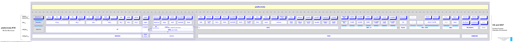

Abstract
========

The '*platformids*' package provides the abstract enumeration of runtime  platforms.
This extends the standard Python facilities by 

* more specific canonical platform enumerations
* provides additional hierarchical bitmasks for faster processing 
* provides mapping of string and numeric representation for human display 
* provides a boolean flag *V3K* for Python3
* provides a bitmask *Vxyz* for the complete Python version for faster operations

The supported platforms are:

* Linux, BSD, Unix, OS-X, Cygwin, and Windows
* Python2.7+, Python3.5+

Cockpit
=======

API
---

.. raw:: html

   

+-------------+-----------------------+-------------------------+
| Component   | Shortcuts             | API                     |
+=============+=======================+=========================+
| platformids | :ref:`SC_platformids` | `platformids.__init__`_ |
+-------------+-----------------------+-------------------------+

.. raw:: html

   

Documents
---------

.. raw:: html

   

+------------------------+-------------------------------------+
| Artifacts              | Shortcuts                           |
+========================+=====================================+
| Concepts and Design    | :ref:`DEVELOPMENTDOCS`              |
+------------------------+-------------------------------------+
| Programming Interfaces | `platformids <package_init.html#>`_ |
+------------------------+-------------------------------------+

.. raw:: html

   

.. _platformids.__init__: package_init.html#

.. _POSIX, CIFS, URI...: package_doc.html#resources

.. _HowTo Custom Data:  howto_custom.html

.. _platformids.config: config.html

.. _config data: config_data.html

Blueprint
=========

The 'platformids' package provides the hierarchical enumeration of runtime data
source and target platform IDs.
The platfom runtime system is therefore logically split into categories, sets, and members
of specific operating system types and distributions.
In addition the Python version is packed into a bit-array, what reduces the required code 
for example for the adaptation of current changes of Python3.x.y on subversion-level.

The following figure depicts a subset only of the current supported platform variants.

|platformidsblueprint|
|platformidsblueprint_zoom|

.. |platformidsblueprint_zoom| image:: _static/zoom.png
   :alt: zoom 
   :target: _static/platformids-blueprint.png
   :width: 16

* **V3K**

  The flag for the *Python3* version [`platformids <package_init.html#v3k>`_]:
     
  .. code-block:: python
     :linenos:
   
     if V3K == True:
        # do sth....
   
     else:
        # do th. else...

* **PYVxyz**

  The more granular combined bit-mask-flag of the Python version *PythonX.Y*
  and release  *PythonX.Y(Z)* is provided by the variable *Vxyz*
  [`PYVxyz <package_init.html#pyvxyz>`_]:

  .. code-block:: python
     :linenos:
     
     PYVxyz := 0bxxxyyyyyzzzzzzzz
      
     xxx:     3 bits / 0-7   for major version, e.g. 3       for 3.6.5  or e.g. future 4.0.2    
     yyyyy:   5 bits / 0-31  for minor version, e.g. 6       for 3.6.5  or e.g. future 3.14.3
     zzzzzz:  8 bits / 0-255 for the release build, e.g. 14  for 2.7.14 or e.g. future 2.7.23

  See also [`getPYVxyz <package_init.html#platformids.__init__.getPYVxyz>`_].

* **getPYVxyz**

  Dynamic version evaluation by compressed bitmasks as single integer values
  by the slim and fast function interface
  [`getPYVxyz <package_init.html#platformids.__init__.getPYVxyz>`_].
   
  .. code-block:: python
     :linenos:
      
     PYV32 = getPYVxyz(3, 2)        # integer
     myPYVxyz = getPYVxyz(3, 6, 5)  # integer
      
     for x in range(1000000000):
   
        if PYVxyz & myPYVxyz:   # pure integer comparison
           callFunction0(x)
      
        elif PYV32 > myPYVxyz:   # pure integer comparison
           callFunction1(x)

* **ISSTR** and **unicode**

  The simplified portability of encodings for Python2 and Python3
  is supported by the adapted type *ISSTR* and the
  conditional *unicode* alias
  [`platformids <package_init.html#>`_]:
   
  .. code-block:: python
     :linenos:
   
     if V3K:
        unicode = str
        ISSTR = (str, bytes,)
   
     else:
        ISSTR = (str, unicode,)

Table of Contents
=================
   
.. toctree::
   :maxdepth: 1

   shortcuts

   python_encode_decode
   python_bitmasks
   
   package_init
   
   install

Indices and tables
==================

* :ref:`genindex`
* :ref:`modindex`
* `References <references.html>`_
* :ref:`search`

Resources
=========

.. include:: project.rst

**Home**

* Sourceforge.net: https://sourceforge.net/projects/pyplatformids/

**Online Documents**

* Sourceforge.net: https://pyplatformids.sourceforge.io/

**Licenses**

* Artistic-License-2.0(base license): `ArtisticLicense20.html <_static/ArtisticLicense20.html>`_

* Forced-Fairplay-Constraints(amendments): `licenses-amendments.txt <_static/licenses-amendments.txt>`_ 

  |profileinfo|  [xkcd]_ Support the OpenSource Authors :-)

  .. |profileinfo| image:: _static/profile_info.png 
     :target: _static/profile_info.html
     :width: 48

**Runtime Repository**

* Python Package Index: https://pypi.org/project/platformids/

**Downloads**

* bitbucket.org: https://bitbucket.org/acue/pyplatformids/

* github.com: https://github.com/ArnoCan/platformids/

* Python Package Index: https://pypi.org/project/platformids/

* Sourceforge.net: https://sourceforge.net/projects/platformids/

