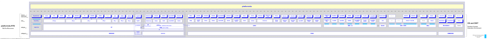

*********
Blueprint
*********

.. _REFERENCE_ARCHITECTURE:

The modern landscapes of information infrastructures are commonly designed 
and organized as stacks of runtime environments and provided as all-inclusive services
for the execution of application processes based on common frameworks.
The technical architecture of the stacks consists of
the building blocks for the physical and virtual machines, operating systems,
and the middleware and execution frameworks of the runtime processes.
This frequently requires the design of slim and relocable services,
frequently requiring adaptation and mediation components for specific platforms.

The *platformids* provides hereby the automated technical detection and the enumeration
based on '`Hirarchical Bit Masks for Numeric Vectors <python_bitmasks.html#>`_',
which are applied as :ref:`Bit Masks for OS and Distro Releases <BITMASKSOSDIST>`.  

.. _FIGURE_ARCHITECTURE:

.. figure:: _static/systems-ids-sublayers.png
   :figwidth: 450
   :align: center
   :target: _static/systems-ids-sublayers.png
   
   Figure: Service Sub-Layers |figuresystemabstractprint_zoom| :ref:`more... <REFERENCE_DETAILS>`

.. |figuresystemabstractprint_zoom| image:: _static/zoom.png
   :alt: zoom 
   :target: _static/systems-ids-sublayers.png
   :width: 16

The  provided the `OS and Distribution layer <os_categorization.html#>`_ by the *platformids*
provides pre-defined values for the most common standard OS and distributions.
*Arbitrary custom identifiers are planned to be available soon.*

The provided hierarchical bitmask representation supports hereby for fast comparison access which outperforms the
common fractured and diverse formats by reducing the access time for single and in particular for repetitive access.
The *platformids* reduces comparison operations on pure OS names, but in particular combined OS and distribution
information including release versions to a remaining little percentage to operations on single integer values. 

The support includes in particular the build time information about the underlying build systems as well as the
target systems.
Thus supporting the information required for various deployment versioning schemes such as fixed and rolling release schedules,
the automation of version schemes for Continous Integration(CI) and Continous Delpoyment(CD).
The definition of custom identifiers and labels as well as mapped-representation, e.g. in case of release names.
The target environments are primarily Data-Center and Cloud deployments,
but also Embedded and IoT deployments based on Linux and BSD distributions with native and cross-builds. 

The package '*platformids*' is part of the set of packages of enumerations for efficient and fast operations of
code variants for software and infrastructure stacks. 
For tested standard OS and distributions see help on `installation <install.html>`_ / :ref:`Tested OS and Python Implementations <TESTED_OS_PYTHON>`.
For other stack layers refer to [machineids]_, [pythonids]_, [resourceids]_, and [extensionids]_.

Bitmask Enumeration for Performance
-----------------------------------

The '*platformids*' package provides in particular the 
:ref:`hierarchical enumeration <BITMASKSFORNUMERICVECTORS>`
of runtime data source and target platform IDs, which supports for simplified compatibility and dynamic code
adaptation.
The 
:ref:`platfom runtime system <BITMASKSOSDIST>`
is therefore logically split into 
:ref:`categories, sets, and members of specific operating system types and distributions <BITMASKSLAYOUT>`.
The *platformids* *hexversion* requires a 32bit bit array, which is an *int* or on some platforms a *long*,
e.g. in case of *Jython*.

The numeric values technically provide the comparison based on one single integer value instead of the
common fragmented arrays and strings.
This replaces for example the partial comparison by *string-slices* and *startswith* with an integer
operation, reducing the pure partial comparison processing time to about 35%, thus for a complete OS and
distribution release draftly calculated

.. parsed-literal::

   os.name + os.version_info + platform.uname()  # e.g. POSIX, with additional processing for uname 

   -65%        3 * -65%           N * -65%       # reduction of each part     

to about a little percentage.
Even less compared to the repetitive comparison with array members.

The contained command line interface `rtplatformids <rtplatformids_cli.html#>`_ provides interactive and
batch mode access to the canonical release information and the data provided by the standard Python library,
enabling simplified platform dependent batch processing, continous integration and deployment.   

.. _REFERENCE_DETAILS:

The following figure depicts a subset of the current supported platform variants.

.. _FIGURE_SUPPORTED_PLATFORMS:

   
   Figure: "The Big Picture" of Supported Platforms |platformidsblueprint_zoom| :ref:`more... <TESTED_OS_PYTHON>`

.. |platformidsblueprint_zoom| image:: _static/zoom.png
   :alt: zoom 
   :target: _static/platformids-blueprint.png
   :width: 16

The provided platforms comprise hereby a wide spectrum of version numbering schemes and associeated
lifetime cycles with various build and update philosophies.
The *platformids* integrates them all into a common numbering identifier based on hierarchical bitarrays.

Examples of the versioning and numbering scheme variants e.g. for the *distrel* are more diverse 
than a single number only.
These represent for some of the *dist* actually various subvariants in a flat numbering scheme.
For example the product variants of the Windows releases are supported frequently as 20 and more
packaged products, or the variants of the *Ubuntu* and *Fedora* releases, 
which are currently up to about 10.
In case of Solaris these differ for the *Solaris10* and *Solaris11* *distrel*, and could span
a larger number due to the long-time of life-cycles.
Other distributions switched their versioning scheme from classic milestone based waterfall numbering schems
to '*versionless*' continuous deployment schemes.

The bit array for the platform ids is designed as a 32bit array due to the number of possible
items, e.g. about 1000 Linux distributions [LinuxPopular]_, [LinuxDist]_ and [LinuxDistComp]_.
This provides enough space for the future extension and custom enumeration ranges.
The specific numbering scheme is hereby embedded logical into a hierarchical tree structure
of version numbering schemes.
Thus multiple independent distribution specific sub-schemes could be applied to the context specific sub-bitfields.

See :ref:`PLATFORMIDS`.

OS and Distro Categories
------------------------

The current runtime environment for the OS and distribution is represented by the global 
variable **RTE** and a set of predefined or custom enumerations.

* **platformids.RTE**

  The granular combined bit-mask-flag of the OS and distro
  [`RTE <platformids.html#pyvxyz>`_] by default:

  .. code-block:: python
     :linenos:
  
     RTE := 0bwwwwxxxxxxyyyyyyyyyyzzzzzzzzzzzz
   
     wwww:               4 bits as bit mask    
     xxxxxx:             6 bits as bit mask    
     yyyyyyyyyy:        10 bits as bit mask
     zzzzzzzzzzzz:      12 bits as bit mask or integer

  The bitmask structure supports optional resizing of subfields for special cases of extended ranges of version numbering ranges. 
  
  For details see also `OS Categorization <os_categorization.html#>`_.

* **platformids.platforms.PlatformParameters**

  The class *PlatformParameters* provides a scanner for the parameters of the current
  runtime platform.
  
.. code-block:: python
   :linenos:

   # collect all
   platformparams = PlatformParameters()
   platformparams.scan()
   print(platformparams)

* **rtplatformids**

  The command line interface *rtplatformids* provides the access from the command line
  and batch scripts with vaious output formats of the platform data. Including *JSON*,
  *bash variables* and *bash array*.
  
.. code-block:: python
   :linenos:

   rtplatformparams

See also `OS Categorization <os_categorization.html#>`_.

Custom Types
------------
The *platformids* supports the definition of custom types.
This is required e.g. in the case of *Linux* due to more than 1000 public available distributions, and 
even more private customized variants, in particular in the field of embedded and IoT.
Thus the range of a 32bit bitmask value does not provide the static enumeration of all distributions.
Therefore custom enums are supported dynamically by an easy-to-use interface.

All to be done is the dynamic allocation and resevration of the next enum value for the current context.
The current context is e.g. the *ostype* with the reservation API 
 
.. parsed-literal::

   platformids.custom_ostype.add_enum()

or the *dist* with the reservation API 
 
.. parsed-literal::

   platformids.custom_dist.add_enum()
  
These could be simply used to acquire and reserve the next free value, which is valid for the whole lifetime
of the current process such as the following example for *Minix*.
The layers *category*, *ostype*. and *dist* are defined by shared values,
the relase versions are defined by algorithms.
Either the dominant :ref:`default <VERSION_THREENUMBERDEFAULT>` algorithm, or by a few specific variants
such as :ref:`windows-nt <enumWINNT>`.
For the most rolling OpenSource distributions by :ref:`3num-date <VERSION_THREENUMBERDATE>`.

.. parsed-literal::

   RTE_MINIX         = RTE_POSIX   + custom_ostype.add_enum()     #: Minix as ostype
   
   RTE_MINIX3        = RTE_MINIX   + custom_dist.add_enum()       #: Minix3 as dist
   
   RTE_MINIX321      = RTE_MINIX3  + 0x00000641                                #: Minix-3.2.1 as distrel / release version (:ref:`default <VERSION_THREENUMBERDEFAULT>`)
   RTE_MINIX330      = RTE_MINIX3  + 0x00000660                                #: Minix-3.3.0 as distrel / release version (:ref:`default <VERSION_THREENUMBERDEFAULT>`)

Due to it's dynamic and volatile numbering scheme, which is valid for the lifetime of a process only,
these cannot be used persistent, thus have to be supported via variables.

 
See also :ref:`Custom Numbering Schemes <CUSTOM_NUMBERING_SCHEMES>`.
