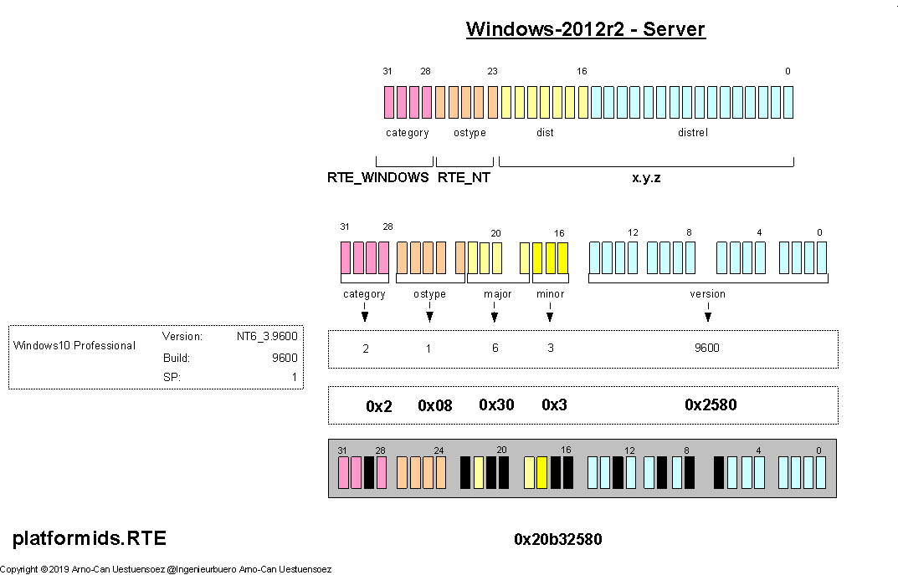
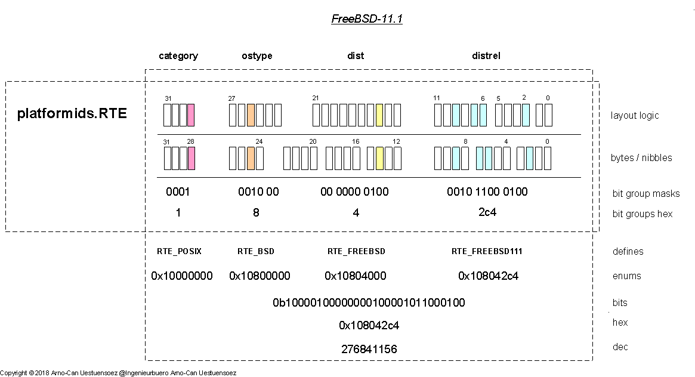

*****************
OS Categorization
*****************

.. _OSTYPEANDDISTCATEGORIES:

OS Type and Distribution Categorization
=======================================
The type of the operating system and the packaged distribution comprise identifiers and information
which are in a hierachical dependecy.
It is essential to understand the logical hierarch of the naming and versioning schemes of OSs and it's distributions
in order to manage groupwise decisions like compatibility.
The standard libraries of the various implementations provide here various inconsistent schemes, which 
lack a little of overall systematics.
The introduced definition of *category*, *ostype*, *distribution*, and *distribution-release* constitute the basic 
relation and dependency of OS families, which are represented in the hierarchical numbering schemes by bitmasks. 

   .. parsed-literal::
   
      <category-of-os>.<ostype>.<distribution>.<distribution-release>

For example the *Linux* OS, defined by the kernel release is the founding core of the distribution RHEL.
The distribution follows it's own identification scheme by releases and specific version numbers,
while the base OS is released independent and included in multiple distributions.
The distributions apply various different versioning schemes, which includes numeric schemes as well as string based
naming of releases.

For example numeric release versioning:

   .. parsed-literal::

      Fedora27            := POSIX.LINUX.FEDORA."27"
      RHEL-7.5            := POSIX.LINUX.RHEL."7.5"
      CentOS-7.6-1804     := POSIX.LINUX.RHEL."7.6"     # 1804 is additional code base info

or numeric release versioning with additional string names:

   .. parsed-literal::

      Debian-9.6          := POSIX.LINUX.DEBIAN."9.6"
      Debian-9.x          := "Debian Stretch"
      OS-X-10.6.8         := "OS-X Snowleopard"

or string based distribution releases:
   
   .. parsed-literal::

      W10P                := WINDOWS.NT.NT100."Windows10"
      W2019SE             := WINDOWS.NT.NT100."Windows Server 2019 Essentials"

The representation of the OS and it's packaging into distributions could be represented
as a scalar value of encoded bitmasks similar to the Python version.
The OS including the distribution is encoded here into a single 32bit value.
The basic priciple of encoding multiple values into a hierarchical bitmask follows
the same principles, see also `Bit Masks for Numeric Vectors <python_bitmasks.html#>`_,
and *Python Categorization* [pythonids]_. 

.. _STANDARDSREFS:

Standards Compliance and Deviation
----------------------------------
The identification of the platforms within the operating systems layer is commonly provided by the used OS.
This implies the specific definition of value sets and value formats, even for releases of distributions.
The diversity is resulting in a large variety of data representation.
The first release of the concepts of  multi-platform libraries for this project date back to the 90s for
several UNIX distributions, and it's wider OpenSource implementation with Linux, BSD, and Cygwin to 2008
by the project *UnifiedSessionsManager* [UnifiedSessionsManager]_, extended by Windows and OS-X 2011
by the version *UnifiedSessionsManager-2.0*.  

The *platformids* provides a common standard set of values with unified representation including value formats.
In addition numeric bit-masks within 32bit and 16bit ranges are defined for the efficient processing in dependent
code sections.

Some major standards defined are Posix [POSIX]_, LSB [LSB]_, and Fredesktop [FREEDESKTOP]_. 
This is accompanied by major defacto industry standards e.g. by the Microsoft Corp. [MICROSOFTINC]_
and Apple Inc. [APPLEINC]_.

The standard specifications are quite reluctant concerning the actual specific formats for each OS and derived
distributions [OSList]_, [OSListLarge]_.
This is last but not least caused by the vast number of distributions resulting from the marketing startegies, but also
the availability of the source code in the field of Linux ([LinuxDistComp]_, [LinuxPopular]_, ...) and
BSD([DRAGONFLY]_, [FREEBSD]_, [OPENBSD]_, ...) OSs.
In case of Linux almost 1000 distributions exist [DISTWATCH]_, which probably has to be provided
in case of generic OpenSource([OSCompOpenSource]_).

In case of e.g. of Windows OSs a large number of product versions are defined based on the internal OS specification.
These product versions actually represent distributions with specific bundling of features including the priority of
pricing([OSCompMSWin]_).
In addition the major difficulty resulting from the numbering scheme and value ranges applied by Microsoft products
is the resulting value ranges, which is not optimized for the CPU register based processing.
This would be desirable in particular for the loop processing in case of platform dependant libraries. 
One example for the sparse value utilization of wide types like 64bit is here *OSVERSIONINFOEXA.wProductType*,
which actually utilizes 3-bits and mapped e.g. to *ctypes.c_int8*, but originally is defined by 64-bit.
Another example is here *OSVERSIONINFOEXA.wSuiteMask* which provides a growing large number og enums for products
originally defined by 64-bits, mapped to *ctypes.c_int8*.
By the aspect of SW platform dependency processing these definitions are highly redundant, but may cost a lot of
maintenance and performance overhead. 

In case of *OS-X* or *MacOS* provided by Apple Inc. [APPLEINC]_ a systematic numbering scheme is established,
but resulting in a sparse usage of the number spaces [OSXVERS]_.

All these special cases, exceptions, sparse value utilization of wide types like 64bit,
and the arbitrary and over the time varying definition of identifiers and names including changes
in numbering schemes are streamlined by the *platformids* into a platform independent common syntax
of a continuous string and numeric value representation.

The main processing structures of the *platformids* are compressed into a 16bit and 32bit integer value as a bit-mask.

* **RTE(32-bit)**: Runtime Environment definition of the platform as a 32-bit value
* **PYVxyz(16-bit)**: The release of the current Python interpreter as a 16-bit value

The :ref:`encoding into single scalar values of bitmasks <BITMASKSFORNUMERICVECTORS>`
reduces the :ref:`processing overhead <PYTHON2VS3INTPERFORMANCE>`
significantly, but further enhances the execution performance by restriction onto 32-bit 
values [PYINTPERF2VS3A]_, [PYINTPERF2VS3B]_.

The initial release focusses on standard sets, while the following support better for dynamic custom definitions
and will further streamline the API.

The major interfaces are:

* Representation of OS platforms:

  * `platformids.fetch_platform_distribution() <platformids.html#get-platform-dist>`_
  * `platformids.fetch_platform_os() <platformids.html#get-platform-os>`_
  * `platformids.platforms.PlatformParameters <platforms.html#platformparameters>`_

* Representation of Python releases:

  * `platformids.encode_pysyntax_to_16bit() <platformids.html#encode_pysyntax_to_16bit>`_

The resulting gain is the reduction of the platform identification and/or verification onto a single
integer operation for all supported platforms.

For the detailed concepts and design see the following sections.

Hierarchy of Platform and Infrastructure Stacks
-----------------------------------------------
The modern landscapes of information infrastructures are commonly designed 
and organized as stacks of runtime environments and provided as all-inclusive services
for the excution of application processes based on common frameworks.
This requires the design of the technical architecture of stacks consisting of
the building blocks for the physical and virtual machines, operating systems,
the execution frameworks for the runtime processes, 
and the application middleware including abstract system services.  

   |systemabstractprint|
   |systemabstractprint_zoom|

.. |systemabstractprint_zoom| image:: _static/zoom.png
   :alt: zoom 
   :target: _static/systems-ids.png
   :width: 16

.. |systemabstractprint| image:: _static/systems-ids.png
   :width: 320

.. _HIERARCHOSCATEGORIES:

Hierarchy of OS Distributions
-----------------------------
The bit mask encoding for the operating system and the bundled distribution is
slightly different than the encoding of the version.
This is in particular due to the variations of the covered platforms and
distributions, which are handeled differently for the categories.
The main decision is here again to decide for an appropriate shared
bit mask layout.

The design supports initially the subset of [OSList]_ as depicted in the following figure.
The OS types BSD and UNIX behave here special in the sense that the common OS-Kernel is basically treated autonomous
and continuously developed to a wider degree independently from the other family members.
In contrast to this the Linux model provides a common OS-Kernel, which is extended by dynamic kernel modules and bundled into
variants of packaging.
This assures the common compatibility of the independently delivered OS-Kernel by the Linux-Foundation with the 
about 1000 [LinuxPopular]_ current existing distributions .
The commercial OS types NT and Darwin of the by Microsoft Inc. and Apple Inc. provide a versioning model, where
the Kernel is closed source and probably almost the invariant despite required maintenance and new APIs, while
the system add-ons and applications evolve for each distribution release.
The release pattern of some distribution varies further between classic version numbering [SWVERS]_,
and continuous micro-deployment [RollingDist]_ while the version numbers remain.  

   |platformidsosdist|
   |platformidsosdist_zoom|

.. |platformidsosdist_zoom| image:: _static/zoom.png
   :alt: zoom 
   :target: _static/platformids-osdist.png
   :width: 16

.. |platformidsosdist| image:: _static/platformids-osdist.png
   :width: 1280

The covered major categories by *platformids* are POSIX and MS-Windows systems including
an emulation layer for mixed APIs like *Cygwin* and the subsystems of *Windows*, 
e.g. *Windows.WSL*.

POSIX
^^^^^
The POSIX based systems are commonly designed and distributed as *Unix style* systems,
which regularly contain all services required for the application as a server and as a
workstation.
Thus any distribution could be configured easily as a server as well as a workstation,
even as an embedded system.

An exception is here the commercial distribution of OS-X, which is bundled as a workstation
or a server distribution.

The *platformids* models the logical hierarchy of POSIX [POSIX]_ based systems by
sets as the mayor OS variation, and the subsets, which are the bundled distributions.
Each distribution comprises a number of member releases.
A specific distinction into server and workstation is not provided. 
Examples for the various numbering schemes are:

* *POSIX.BSD.DragonFlyBSD.DragonFlyBSD5*       # is 5.0.0
* *POSIX.BSD.DragonFlyBSD.DragonFlyBSD54*      # is 5.4.0
* *POSIX.BSD.FreeBSD.FreeBSD11*                # is 11.0
* *POSIX.BSD.FreeBSD.FreeBSD112*               # is 11.2
* *POSIX.BSD.OpenBSD.OpenBSD6*                 # is 6.0
* *POSIX.BSD.OpenBSD.OpenBSD63*                # is 6.3
* *POSIX.Darwin.OSX.SnowLeopard*               # is 10.6.0
* *POSIX.LINUX.Archlinux.ArchLinux20181201*    # Rolling distribution, but released by date based iso filenames
* *POSIX.LINUX.Armbian.Armbian550*             # is debian-9.4 based, has own additional numbering scheme 5.50
* *POSIX.LINUX.CentOS.CentOS7*                 # is 7.0
* *POSIX.LINUX.CentOS.CentOS75*                # is 7.5
* *POSIX.LINUX.CentOS.CentOS76*                # new scheme 7.6-1810, is 7.6 with source from October 2018
* *POSIX.LINUX.Debian.Debian9*                 # is 9.0
* *POSIX.LINUX.Debian.Debian95*                # is 9.5
* *POSIX.LINUX.Fedora.Fedora27*                # single number-releases, is 27
* *POSIX.LINUX.RHEL.RHEL7*                     # is 7.0
* *POSIX.LINUX.RHEL.RHEL75*                    # is 7.5
* *POSIX.LINUX.Raspbian.Raspbian9*             # is 9.0, same as base OS debian-9,0
* *POSIX.LINUX.Raspbian.Raspbian94*            # is 9.4
* *POSIX.UNIX.Solaris.SOLARIS10*               # is 10.0   - old numbering scheme, represents various patch levels 
* *POSIX.UNIX.Solaris.SOLARIS11*               # is 11.0
* *POSIX.UNIX.Solaris.SOLARIS113*              # is 11.3

The mapped values are hereby basically independent from the version and build
numbers as actually used by the OS.

For an overview refer to [UNIXHISTORY]_,
for the underlying architecture see [machineids]_. 

WIN
^^^
The Windows stack is designed slightly different than the POSIX stack.
The never windows stack cosists mainly of distribution variants of the *ostype* *NT*.
The *dist* value represents versions of *NT*, where a 2-number of version numbers is applied.
The provided *build* id  as the 3rd. version entry is - except one legacy release - redundant with the version. 
The focus of the *platformids* (:ref:`see WindowsNT Versions <enumWINNT>`) is here on product variants for a specific *NT* release, which is
in particular covered by the marketing driven release names, see [OSVERSIONINFO]_ and.

   .. code-block:: c++
      :linenos:
   
      typedef struct _OSVERSIONINFOEXA {
        DWORD dwOSVersionInfoSize;
        DWORD dwMajorVersion;
        DWORD dwMinorVersion;
        DWORD dwBuildNumber;
        DWORD dwPlatformId;
        CHAR  szCSDVersion[128];
        WORD  wServicePackMajor;
        WORD  wServicePackMinor;
        WORD  wSuiteMask;
        BYTE  wProductType;
        BYTE  wReserved;
      } OSVERSIONINFOEXA, *POSVERSIONINFOEXA, *LPOSVERSIONINFOEXA;

This consequently requires an additional flag for the distinction of the server and workstation 
releases [OSVERSIONINFO]_.

   .. code-block:: c++
      :linenos:
   
      BYTE  wProductType;
   
      // values:
      //    VER_NT_DOMAIN_CONTROLLER
      //    VER_NT_SERVER
      //    VER_NT_WORKSTATION

The hierarchy defined by the *platformids* distinguishes therefore the *NT* releases and defined for each
the actual product variations [WINVERSIONS]_.

Examples are:

   .. parsed-literal::
   
      Windows-7-6.1.7601-SP1
      Windows-10-10.0.17134-SP0
      Windows-XP-5.1.2600-SP3

* *WIN.NT.NT5_2.WIN2003STD*
* *WIN.NT.NT6_0,WIN2008*          # is OS type NT, distribution NT-6.0, build 6002, Windows Server 2008
* *WIN.NT.NT6_1.WIN2008R2*        # is OS type NT, distribution NT-6.1, build 7601, Windows Server 2008 Release 2
* *WIN.NT.NT6_1.WIN7*             # is OS type NT, distribution NT-6.1, build 7801, Windows 7
* *WIN.NT.NT6_1.WIN7H*
* *WIN.NT.NT6_1.WIN7P*
* *WIN.NT.NT6_1.WIN7U*
* *WIN.NT.NT6_2.WIN2012STD*
* *WIN.NT.NT6_2.WIN8P*
* *WIN.NT.NT6_3.WIN2012R2STD*
* *WIN.NT.NT6_3.WIN81P*
* *WIN.NT.NT10_0.WIN10*           # is OS type NT, distribution NT-10.0, build 1803, Windows 10
* *WIN.NT.NT10_0.WIN10*           # is OS type NT, distribution NT-10.0, build 1809, Windows 10
* *WIN.NT.NT10_0.WIN10H*
* *WIN.NT.NT10_0.WIN10P*
* *WIN.NT.NT10_0.WIN2016STD*

Some legacy examples for display only are former components of Windows-3.1 and Windows-95:

* *DOS.MSDOS.DOS.DOS622*    # legacy example
* *WIN.WIN.WINDOWS.WIN31*   # legacy example
* *WIN.WIN.WINDOWS.WIN311*  # legacy example
* *WIN.WIN.WINDOWS.WIN95*   # legacy example

For an overview refer to [OSWindows]_,
for the underlying architecture see [machineids]_. 

DOS
^^^
The former pure command line base system [DOS]_ also called as DOS has actually numerous variants [DOSLIST]_.
Represenation only of legacy examples are:

* *DOS.AMIGADOS.DOS.DOSxyz*
* *DOS.APPLE.DOS.DOSxyz*
* *DOS.DRDOS.DOS.DOSxyz*
* *DOS.FREEDOS.DOS.DOS2016*  [FREEDOS]_
* *DOS.MSDOS.DOS.DOS622*
* *DOS.PCDOS.DOS.PCDOSxyz*

These may eventually be required for some industrial 'appliances' and legacy solutions.
A typical former late-time application was to install BIOS updates. 
The recommended nowadays release for *x86* based systems e.g. for BIOS updates is *FreeDOS*. 

PWEMU
^^^^^
The combined Posix and Windows emulation layer.
This is provided by various components within Windows-NT and
the User-Lands of POSIX OSs.
The difference to the following *PEMU* type is the seamless mixed emulation of *PWEMU*, 
while the the *PEMU* provides a distinguished and basically isolated pure *POSIX* emulation
as an embedded emulated 'alien' environment for the cross-task.  

The traditional *PWEMU* within the *NT* family is the OpenSOurce *Cygwin*
whereas the provided *POSIX* environment by the company MKS Inc. was commercial.
The attempt by Microsoft Inc. itself is provided by the *POSIX-Subsytem*, former as a part of the SDK.

**Cygwin**

   Cygwin is a longterm *NT* extention layer which emulates a *POSIX* based environment, while the
   Windows based environment is still accessible [CYGWIN]_.
   The *POSIX* emulation includes the programming API as well as the runtime environment by the
   command line interface of the *POSIX* based environment. 
   various 
   The provided parameters for *Cygwin*
   
      .. parsed-literal::
      
         category               = posix
         dist                   = cygwin
         distrel                = cygwin
         distrel_hexversion     = 268435456
         distrel_key            = cygwin210
         distrel_name           = Cygwin-2.10.0
         distrel_version        = [2, 10, 0]
         ostype                 = cygwin
         ostype_version         = [2, 10, 0]

PEMU
^^^^

**Windows.WSL**

   The combined Posix emulation layer as represented from *NT10_0* on by the sub system  linux *Windows.WSL*.
   The same architecture is basically founding the *bash* integration into *NT-10.0*.
   
   Will be completed soon.

.. _BITMASKSOSDIST:

Bit Masks for Distribution Releases
===================================
The logical data hierarchy as depicted by the following figure is encoded into a bit mask scalar
for single-operation or a few-operation steps of comparison operations.
The encoding of the bitmask follows hereby various schemes, which depends on the concrete distribution.
While the fields *category* and the *ostype* are defined generic, the distribution and in particular it's
version numbering scheme is defined by various paradigmas.
The internal bitmask representaion therefore varies, while the API unifies these for high-level abstract processing.
  

   |odsdisthierarchy|
   |odsdisthierarchy_zoom|

.. |odsdisthierarchy_zoom| image:: _static/zoom.png
   :alt: zoom 
   :target: _static/osdist-categories.png
   :width: 16

.. |odsdisthierarchy| image:: _static/osdist-categories.png
   :width: 1000

The scalar representation of the OS and the distribution is given by the
bit mask encoding comprising the OS type, the packaged distribution with the version.
See the :ref:`supported OS <STANDARDOSDIST>`, and an overview of 'existing' operating systems [OSList]_.

Distribution  Numbering Schemes
-------------------------------
The OS distributions use a variety of release version numbering schemes.

Single Version Number
^^^^^^^^^^^^^^^^^^^^^
The case for a single version number represents the scheme for version numbering literally consisting of one integer value only.
A prominent example is :ref:`Fedora <enumFEDORA>` Linux.

   .. parsed-literal::
   
      :ref:`Fedora27 <enumFEDORA>`
      :ref:`Fedora28 <enumFEDORA>`
      :ref:`Fedora29 <enumFEDORA>`

The consequence here is the required wider range of possible values.

.. _MAJORMINORVERSIONNUMBER:

Major and Minor Version Number
^^^^^^^^^^^^^^^^^^^^^^^^^^^^^^
The case of the Major-Minor version number represents the scheme for example for 
:ref:`CentOS <enumCENTOS>` /
:ref:`RHEL <enumRHEL>`,
:ref:`Debian <enumDEBIAN>`,
:ref:`FreeBSD <enumFREEBSD>`,
:ref:`OpenBSD <enumOPENBSD>`,
:ref:`OpenSUSE <enumOPENSUSE>`,
and 
:ref:`Solaris <enumSOLARIS>` starting with version 11. 

   .. parsed-literal::
   
      :ref:`CentOS6.10 <enumCENTOS>`
      :ref:`CentOS7.5 <enumCENTOS>`
      :ref:`Debian9.4 <enumDEBIAN>`
      :ref:`FreeBSD11.2 <enumFREEBSD>`
      :ref:`OpenBSD6.3 <enumOPENBSD>`
      :ref:`OpenSUSE15.0 <enumOPENSUSE>`
      :ref:`OpenSUSE42.3 <enumOPENSUSE>`
      :ref:`RHEL7.3 <enumRHEL>`
      :ref:`Solaris11.3 <enumSOLARIS>`

The layout in this case is is driven by major releases with larger cycles and sub releases for fixes and minor to medium changes.
Thus the range for the minor version number regularly requires larger values, while the major number is incremented commonly 
by larger release periods.

In some cases,e.g. for :ref:`Armbian <enumARMBIAN>`, the version is incremented mainly by usin the *minor* version number.

   .. parsed-literal::
   
      :ref:`Armbian-4.81 <enumARMBIAN>`
      :ref:`Armbian-5.50 <enumARMBIAN>`
      :ref:`Armbian-5.76 <enumARMBIAN>`

This requires some special extra handling due to the range.

.. _TREEVALUEVERSIONNUMBER:

Three-Value Version Number
^^^^^^^^^^^^^^^^^^^^^^^^^^
The case for the three-value major release version numbering represents the scheme for example for *OS-X* [OSXVERS]_
and *Windows.NT* [WINVERSIONS]_.
The Linux variant *OpenWRT* is numbered by a 3-value scheme too.
Another case is the 3-value enumeration based on dates and/or increments.

All of the following numbering schemes are basically sparely used, and exceed the provided standard
bit-array sizes.
These thus require either the extended mode, or a mapping of version labels
onto incremental index values.

Some examples are:

* OpenWRT [OPENWRT]_:

  A typical case for an equally used version number base on 3 values.
  
   .. parsed-literal::
   
      :ref:`OpenWRT <secnetOPENWRT>`-17.01.6
      :ref:`OpenWRT <secnetOPENWRT>`-18.06.1

  For details see 
  :ref:`OpenWRT <secnetOPENWRT>`.

* macOS / OS-X [OSXVERS]_:

   The *major* version *10* is at least for a while constant, whereas the *minor* and *micro* version
   numbers are mainly used for version increments. 
   
   .. parsed-literal::
   
      :ref:`macOS / OS-X <enumOSX>`-10.6.0   - SnowLeopard
      :ref:`macOS / OS-X <enumOSX>`-10.6.8   - SnowLeopard

  For details see 
  :ref:`macOS / OS-X <enumOSX>`.

* Windows-NT [WINVERSIONS]_:

  The OS *WindowsNT* or *NT* uses a version numbering scheme for the distributions, while the products as packaged
  distribution releases follown an independent business model with a separate naming space.  
  The exception in the version numbering layout of *Windows-NT* occured with the release *NT-10.0*, when it announced
  a rolling release model
  
  The old scheme just literally assembles the build number at the time of the release with the 2-number version
  of the planned distribution of *NT*.   

   .. parsed-literal::
   
      :ref:`NT-6.1.7601 <enumWINNT61>`   - Windows-7   + Windows-2008
      :ref:`NT-6.3.9600 <enumWINNT63>`   - Windows-8.1 + Windows-2012

  The new scheme from *NT-10.0* on distinguishes between version numbers and build numbers, where the
  version number labels a product release, while the build number keeps track of the rolling updates, 
  which are much shorter in term than the produc release cycles.

  Version numbers:

   .. parsed-literal::
   
      :ref:`NT-10.0.1809 <enumWINNT100>`   - Windows-10 + Windows-2016 + Windows-2019 - builds NT-10.0.17763.

  Build numbers:

   .. parsed-literal::
   
      :ref:`NT-10.0.17763 <enumWINNT100>`      - Windows-10.0.1809
      :ref:`NT-10.0.17763.1 <enumWINNT100>`    - Windows-10.0.1809 - Release Preview
      :ref:`NT-10.0.17763.17 <enumWINNT100>`   - Windows-10.0.1809 - with update KB4467228 - Slow ring and release preview: October 9, 2018

  For details see 
  :ref:`Rolling Version <conceptROLLINGVERSION>`, and
  :ref:`Windows NT <enumWINNT>`.
  
* CentOS [CENTOS]_ 

  The distibution *CentOS* has recently changed to a scheme represented similarly starting 
  with *CentOS7* [CENTOSVERSIONS]_ / [CENTOSVERSIONSLATEST]_.

   .. parsed-literal::
   
      :ref:`CentOS-7.0-1406 <enumCENTOS>` - CentOS-7.0 release date 2014.06
      :ref:`CentOS-7.1-1503 <enumCENTOS>` - CentOS-7.1 release date 2015.03
      :ref:`CentOS-7.5-1804 <enumCENTOS>` - CentOS-7.5 release date 2018.04
      :ref:`CentOS-7.6-1810 <enumCENTOS>` - CentOS-7.6 release date 2018.10

  The major and minor version still keep to be significant, while the third number independently labels the date of
  the source-checkout, so is not a determining part of the version number.

  For details see 
  :ref:`CentOS <enumCENTOS>`.

The third number has for the various distributions different semantics. 
In some cases the third number is part of the major number, while in others it represents an additional build index.
In case of *NT* it even switched the semantics from incremental build numbering to a date based version number.
Another variant is the independent hint to the release date of the code as a build base, so in case of *CentOS*. 

.. _conceptROLLINGVERSION:

Rolling Version
^^^^^^^^^^^^^^^
Rolling release versioning avoids fixed milestones of releases for packaged features, instaed tries to frequently
deploy smaller updates, for further details see [RollingDist]_.
The application of rolling release workflow does not contradict the application of version schemes.
The actual interpretation of this by some projects is not homogeneous.
Some projects (seem?) not to provides a proper current release status detection, which is labeled by a release version.
Thus the case for the rolling version has to be splitted.   
The main aspect to be handeled by *platformids* is the unified representation
of all variants at the API.

It still remains - as for all other distribution at all - in the responsiblity of the admin,
when manual non-standard updates are applied, which are not recognized by the distributions deployment mechanisms.

For the actual resulting implementation pattern 
see :ref:`3-number-date <VERSION_THREENUMBERDATE>` and :ref:`Windows NT <enumWINNT>`.

**Date based Three Number Version**
   The date based numbering scheme is in particular well suited for version-less schemes such
   as *Rolling Distribution* [RollingDist]_.
   It is also the best native readable scheme for human interpretation.
   Sadly not all rolling distribution present a standard runtime API in order to use
   a date of the last refresh.
   
   The only distribution - within the current supported set of rolling Linux distributions - which represents a
   release date API at all is :ref:`KaliLinux <secnetKALILINUX>`.
   The release ID is stored within the '*/etc/os-release*' file.
   Thus the release date evaluated from this file is used here as the current version. 
   
   For the current implementation of *platformids* refer to :ref:`KaliLinux <secnetKALILINUX>`.
   For the new adapted-rolling numbering scheme of *Windows-NT* refer first to the following section.
 
**Windows-NT as OaaS**
   The new concept of *Windows* and *WindowsNT* in particular as an OS service - *OaaS* implies an updated
   sales and distribution concept. 
   The new release paradigm of the *WindowsNT* or *NT* operating system distribution follows basically a
   combined release scheme paradigm.
   This fulfils for the technical update purposes the rolling paradigm with smaller short-term updates - almost consequnetly.
   While it satisfies the required business model by still defining packages of delivery for the sales of packaged products.
   Though it is basically a superposition of rolling and waterfall models.
   
   The old scheme just literally assembles the build number at the time of the release with the 2-number version
   of the planned distribution of *NT*.   
   
      .. parsed-literal::
      
         :ref:`NT-6.1.7601 <enumWINNT61>`   - Windows-7   + Windows-2008
         :ref:`NT-6.3.9600 <enumWINNT63>`   - Windows-8.1 + Windows-2012
   
   The new rolling scheme from *NT-10.0* on distinguishes between version numbers and build numbers, where the
   version number labels a core OS product release, while the build number keeps track of the rolling updates, 
   which are much shorter in term than the produc release cycles.
   
   The version numbers are based on the release date of the core OS.
   These comprise the year offset from the year 2000, and the month of the release.
   
      .. parsed-literal::
      
         :ref:`NT-10.0.1809 <enumWINNT100>`   - Windows-10 + Windows-2016 + Windows-2019 - builds NT-10.0.17763.
         :ref:`NT-10.0.1803 <enumWINNT100>`   - Windows-10 + Windows-2016 + Windows-2019 - builds NT-10.0.17134.
   
   The build numbers consis of two parts.
   The first part is the overall incremented build number of the first product release,
   while the second part is a relative incremented build counter for the released updates.
   This is linked to a release note supplied as a knowledge base issue, and an assigned version number.
   
      .. parsed-literal::
      
         :ref:`NT-10.0.17763 <enumWINNT100>`      - Windows-10.0.1809
         :ref:`NT-10.0.17763.1 <enumWINNT100>`    - Windows-10.0.1809 - Release Preview
         :ref:`NT-10.0.17763.17 <enumWINNT100>`   - Windows-10.0.1809 - with update KB4467228 - Slow ring and release preview: October 9, 2018
         :ref:`NT-10.0.17134 <enumWINNT100>`      - Windows-10.0.1803
         :ref:`NT-10.0.17134.619 <enumWINNT100>`  - Windows-10.0.1803
   
   To sumup the new versioning paradigm, it practices a kind of rolling release with little variation,
   while keeping the earned versioning scheme for their business modell alive.
   This in particular is quite helpful for the *platformids* when it comes to the ongoing update of the 
   version numbering.
   
   For details and curent implementation of *platformids* see :ref:`Windows NT <enumWINNT>`

**No Release Numbers**
   As already stated, some rolling distributions do not provide an easily applicable API or an API at all
   for the determination of the actual release state.
   To the understanding of the author it is not senseful to suppress the current state of the runtime platform
   installation at all.
   This is in particular annoying, when it comes to system related programming, which almost in any case requires
   some information of the underlying runtime platform infrastructure, in particular in heterogeneous
   cloud based environements.
   The rolling version paradigm does not prohibit the release numbering at all.
   
   The supported distributions :ref:`Arch Linux <enumARCHLIN>` and :ref:`Gentoo <enumGENTOO>`
   provide the release date as part of the name of their installation images,
   but seem not to offer any official runtime API in order to determine e.g. the update status
   of the distribution.
   
   * :ref:`ArchLinux <enumARCHLIN>`:
   
      .. parsed-literal::
      
         :ref:`ArchLinux-2001.11.01 <enumARCHLIN>`   - archlinux-2018.11.01-x86_64.iso 
         :ref:`ArchLinux-2001.12.01 <enumARCHLIN>`   - archlinux-2018.12.01-x86_64.iso 
   
     See also [ARCHLIN]_, [ARCHLINVERSIONS]_, and [ARCHLINRELEASES]_.
   
   * :ref:`Gentoo Linux <enumGENTOO>` [GENTOO]_:
   
      .. parsed-literal::
      
         :ref:`Gentoo-2012.1 <enumGENTOO>`   - livedvd-amd64-multilib-2012.1.iso 
         :ref:`Gentoo-2012.1 <enumGENTOO>`   - livedvd-x86-amd64-32ul-2012.1.iso 
   
   For the current implementation of *platformids* refer to :ref:`ArchLinux <enumARCHLIN>`
   and :ref:`Gentoo Linux <enumGENTOO>`.

State Driven Versions
^^^^^^^^^^^^^^^^^^^^^
The state driven versioning defines milestones when specific states of the software are reached.
This of course is the happiest type of version numbering |smilecool|.

A typical example is here *Slackware* [SLACKWARE]_ with varying release dates.
The numbering scheme is still basically incremental, while the associated release dates do follow a state of quality
scheme rather than fixed scedule of predefined milestone dates.

* :ref:`Slackware Linux <enumSLACKWARE>` [SLACKWARE]_:

   .. parsed-literal::
   
      :ref:`Slackware-13.0 <enumSLACKWARE>`   - 2009-08-26 
      :ref:`Slackware-13.1 <enumSLACKWARE>`   - 2010-05-24 
      :ref:`Slackware-13.37 <enumSLACKWARE>`  - 2011-04-27 **(1)** 
      :ref:`Slackware-14.0 <enumSLACKWARE>`   - 2012-09-28 
      :ref:`Slackware-14.1 <enumSLACKWARE>`   - 2013-11-04 
      :ref:`Slackware-14.2 <enumSLACKWARE>`   - 2016-06-30 

There is one exception **(1)** in the applied numbering scheme for the old version Slackware-13.37 / 2011-04-27 / EOL=2018-07-05.
This will not fit into the default numbering scheme due the limited standard range of the minor version.
But it is seen by the author as an singular exception of an EOL release for which no effort will be spent,
and no runtime performance degredation will be accepted. 

.. _BITMASKSLAYOUT:

Bit Mask Layouts
----------------
The numeric representation is designed as a bitmask record containing logical sub-masks as fields,
which model a hierarchical order.  
The supported distributions provide a variety of numbering schemes for the release versions which has to fit
into the bitmask layout.
The layout provides therefore a generic standard representation matching the majority
of required numeric schemes, and the option to add prepared exceptions, or arbitrary custom schemes.

This section displays the logical record formats, while the detailed implementation patterns are
depicted in the section ':ref:`Bitmask Implementations <BITMASK_IMPLEMENTATIONS>`' and the
actual specific implementation variants of each supported distribution
':ref:`Supported Standard OS and Dists <STANDARDOSDIST>`'
and
':ref:`Embedded Systems and IoT <EMDEDDEDANDIOT>`'
. 

.. _PATTERN_DEFAULTSCHEMEVERSION:

Standard Numbering Scheme
^^^^^^^^^^^^^^^^^^^^^^^^^

The following bit-mask encoding layout represents the standard layout applicable to almost all supported distribution
following a standard numbering scheme with version numbers up to 3 values.
The sizes of the bit groups are designed to be sufficient for all most supported OS and distributions, which represent
various versioning philosophies and different weights on resulting numbering schemes as well as various
release incrementation periods.
The range is foreseen to be sufficient for the applied numbering schemes at least for the coming 50 years.

   |bitarrayprinciplestack|
   |bitarrayprinciplestack_zoom|
   
   .. |bitarrayprinciplestack_zoom| image:: _static/zoom.png
      :alt: zoom 
      :target: _static/bitarray-principle-stack.png
      :width: 16
   
   .. |bitarrayprinciplestack| image:: _static/bitarray-principle-stack.png
      :width: 450

The mapping scheme of the bit allocation within bytes is

   |bitarrayprinciplestackbytes|
   |bitarrayprinciplestackbytes_zoom|
   
   .. |bitarrayprinciplestackbytes_zoom| image:: _static/zoom.png
      :alt: zoom 
      :target: _static/bitarray-principle-stack-bytes.png
      :width: 16
   
   .. |bitarrayprinciplestackbytes| image:: _static/bitarray-principle-stack-bytes.png
      :width: 450

The following table shows the available number ranges for the components of the bit array **platformids.RTE**.

   +-----------+-------+----------------------+-------------------------------------+
   | bit-group | width | preferred  operators | encoding                            |
   +===========+=======+======================+=====================================+
   | category  | 4bit  | == & ^ |pi|          | *platformids*                       |
   +-----------+-------+----------------------+-------------------------------------+
   | ostype    | 5bit  | == & ^ |pi|          | *platformids os domains*            |
   +-----------+-------+----------------------+-------------------------------------+
   | dist      | 7bit  | ==  & ^ |pi|         | *platformid dist domains*           |
   +-----------+-------+----------------------+-------------------------------------+
   | distrel   | 16bit | < > ==               | *domain specific version numbering* |
   +-----------+-------+----------------------+-------------------------------------+

The *distrel* field is subdivided into the standard scheme  :ref:`3-number-default <VERSION_THREENUMBERDEFAULT>`, 
which covers almost all *POSIX* based distributions,
e.g. 
:ref:`CentOS <enumCENTOS>`,
:ref:`RHEL <enumRHEL>`,
:ref:`Fedora <enumFEDORA>`,
:ref:`Debian <enumDEBIAN>`,
:ref:`OpenBSD <enumOPENBSD>`,
:ref:`macOS/OS-X <enumOSX>`,
and
:ref:`Solaris11 <enumSOLARIS11>`.

.. _PATTERN_NTSCHEMEVERSION:

Windows NT Scheme
^^^^^^^^^^^^^^^^^
The Microsoft Windows versioning scheme follows a slightly different philosophy, where the 
*ostype* for *Windows-NT* defines also the distribution as an incremental *ostype* version.
The naming scheme of the released ditributions is independet and 
follows a more marketing driven paradigm with various namings for the distribution variants 
and product classification [WINVERSIONS]_. 
The versioning scheme behind the scenes is straight forward and incremental, this is still the case
for the last change of the numbering paradigm.
This scheme requires though a wider range of numbers for the *distrel*
bit array.

Anyhow, in deviation to the other distributions the *NT* the release is effectivelly an *OS release*,
while the packaging is defined by the 
:ref:`product type <NT_PRODTY>` and the :ref:`product <NT_PRODS>`.
This fits perfectly for the most common requirement of the enumeration of code segments for appropriate APIs.
When additional information for product or producttype specific code segments is required,
this has to be evaluated specifically.

   |bitarrayprinciplestacknt|
   |bitarrayprinciplestacknt_zoom|
   
   .. |bitarrayprinciplestacknt_zoom| image:: _static/zoom.png
      :alt: zoom 
      :target: _static/bitarray-principle-stack-nt.png
      :width: 16
   
   .. |bitarrayprinciplestacknt| image:: _static/bitarray-principle-stack-nt.png
      :width: 450

The mapping scheme of the bit allocation within bytes is

   |bitarrayprinciplestackntbytes|
   |bitarrayprinciplestackntbytes_zoom|
   
   .. |bitarrayprinciplestackntbytes_zoom| image:: _static/zoom.png
      :alt: zoom 
      :target: _static/bitarray-principle-stack-nt-bytes.png
      :width: 16
   
   .. |bitarrayprinciplestackntbytes| image:: _static/bitarray-principle-stack-nt-bytes.png
      :width: 450

The following table shows the available number ranges for the components of the bit array **platformids.RTE**.

   +-----------+-------+----------------------+---------------------------------------------------+
   | bit-group | width | preferred  operators | encoding                                          |
   +===========+=======+======================+===================================================+
   | category  | 4bit  | == & ^ |pi|          | *platformids*                                     |
   +-----------+-------+----------------------+---------------------------------------------------+
   | ostype    | 5bit  | == & ^ |pi|          | *platformids os domains*                          |
   +-----------+-------+----------------------+---------------------------------------------------+
   | dist      | 7bit  | < > ==  & ^ |pi|     | *NT dist identification by major/minor numbering* |
   +-----------+-------+----------------------+---------------------------------------------------+
   | distrel   | 16bit | < > == & ^ |pi|      | *NT dist versions by single int numbering* (1)    |
   +-----------+-------+----------------------+---------------------------------------------------+

**(1)**: Old and new style of numbers:

  * Old style: build counter at release
  * New style(>=10.0): year-month at release

For the specific implementation see :ref:`windows-nt <enumWINNT>`.

Custom Numbering Scheme
^^^^^^^^^^^^^^^^^^^^^^^
coming soon

Rolling Version
^^^^^^^^^^^^^^^
Rolling release versioning avoids fixed milestones of releases for packaged features, instaed tries to frequently
deploy smaller updates, for further details see [RollingDist]_.
The main aspect to be handeled by *platformids* is the unified representation
of the data at the API.

.. _PATTERN_DATEBASEDVERSION:

**Date based Three Number Version**
   The date based numbering scheme is in particular well suited for versionless schemes such
   as *Rolling Distribution* [RollingDist]_.
   It is also the best native readable scheme for human interpretation.
   The following scheme depicts the applied enumeration scheme. 
   The required reorganization of the subranges of the version number requires specific treatment.
   Thus these are in general handeled for performance reasons by the upper numbering range.
   
      |bitarrayprinciplestackext|
      |bitarrayprinciplestackext_zoom|
      
      .. |bitarrayprinciplestackext_zoom| image:: _static/zoom.png
         :alt: zoom 
         :target: _static/bitarray-principle-stack-ext.png
         :width: 16
      
      .. |bitarrayprinciplestackext| image:: _static/bitarray-principle-stack-ext.png
         :width: 450
   
   The upper range in the context of the *ostype* *Linux* is activated when the bit *22* of the *dist* field is set.
   This enables the conditional processing of extended ranges by simple and fast
   detection of the range by bit operations, for the performance impact see ':ref:`Logic Operations Performance <LOGICPERFORMANCE>`'.
   
   
   The mapping scheme of the bit allocation within bytes is
   
      |bitarrayprinciplestackdatebytes|
      |bitarrayprinciplestackdatebytes_zoom|
      
      .. |bitarrayprinciplestackdatebytes_zoom| image:: _static/zoom.png
         :alt: zoom 
         :target: _static/bitarray-principle-stack-date-bytes.png
         :width: 16
      
      .. |bitarrayprinciplestackdatebytes| image:: _static/bitarray-principle-stack-date-bytes.png
         :width: 450
   
   The fields for the *month* and *date* are kept here native with the appropriate number of bits.
   The field for the *year* is foreseen to contain  7-bits for an offset relative to a specific year,
   which provides a range of 0-126 years.
   The absolute year is calculated as  the distance to a user defined offset.
   Thus this scheme provides a sufficient range while utilizing the numbers of required bits efficiently.
   
   For an example refer to :ref:`KaliLinux <secnetKALILINUX>`, which maintains the file '*/etc/os-release*'.

.. _PATTERN_NOVERSIONAVAIL:

**No Release Numbers**
   The rolling version paradigm allows for the prohibition of release numbering at all, thus in this 
   case the version is by default not available for processing.
   Typical examples are given by :ref:`ArchLinux <enumARCHLIN>`
   and :ref:`Gentoo <enumGENTOO>`.
   
   Even though the ISO images and the distribution directory trees provide the year and month as the release
   numbering scheme for the avoidance of file system name collisions, the runtime system does seemingly
   not provide any official API.
   
   The *platformids* support the standard file '*/etc/os-release*', whoch has to be maintained
   by the user.
   The provided default value for technical reasons is the release version value of '*0*'.
   
   Despite the missing data, the scheme is identical to the date based version number of the previous section
   ':ref:`Date based Three Number Version <PATTERN_DATEBASEDVERSION>`'.

.. _PATTERN_STATEDRIVENVERSION:

State Driven Versions
^^^^^^^^^^^^^^^^^^^^^
The state driven versioning defines milestones when specific states of the software are reached.
This of course is the happiest type of version numbering |smilecool|.

A typical example is here *Slackware* [SLACKWARE]_ with varying release dates.
The numbering scheme is still basically incremental, while the associated release dates do follow a state of quality
scheme rather than fixed scedule of predefined milestone dates.
The numbering scheme follows the default scheme
:ref:`Standard Numbering Scheme <PATTERN_DEFAULTSCHEMEVERSION>`.

There is one exception in the applied numbering scheme for the old version Slackware-13.37 / 2011-04-27 / EOL=2018-07-05.
This will not fit into the numbering scheme due the limited standard range of the minor version.
But it is seen as an exception of an EOL release, for which no effort will be spent,
and no runtime performance degredation will be accepted. 

.. _OPERATIONSPERFORMANCE:

Performance of Comparison Operations
------------------------------------
The provided standard information on OS and ditribution releases is fragmented across several interfaces.
The data is presented by various parts with different data types. Some libraries provide a more condensed
ste of data, but not comprising.
The data is in general not primarily intended for frequent access by high performance routines.

The *platformids* provide therefore the information as numeric values only in order to enable fast comparison and
range checks.
The layout is still a compromise due to the huge amounts of distributions to be represented by a generic application.
But resulting of the design the measured access on the various platforms offers speed improvements beginning
by about 60% with frequently more than 300% compared to the usage of the standard data.     
The numeric representation in addition provides simpler code by avoiding the implementation of specific caching
values.

The performance gain is e.g. in particular enhanced in comparison to interfaces like  *string.startswith()*,
which is directly applied to the standard string values.
The gain is here more than 60% compared on all supported platforms. 

.. _LOGICPERFORMANCE:

Logic Operations Performance
^^^^^^^^^^^^^^^^^^^^^^^^^^^^
The required treatment of multiple variants of bitmask layouts of version numbers requires
some conditional code segments.
In order to reduce the performance loss two choices these groups of cases are combined by specific value ranges.
The programmatical decision could either be determined by the comparison operators of the
numeric bistmasks or by simple bit operations in order to check the bit marking the beginning of the range.

This was measured by simple calls based on *timeit*, which undiscloses a performance impact of about 100%.
The comparison operator requires e.g. *0.0261 usec*

   .. parsed-literal::
   
      [acue@lap001 ~]$ python3 -m timeit -n 10000000 '12>8'
      10000000 loops, best of 3: 0.0261 usec per loop

while the boolean bit operator requires e.g. *0.0116 usec*

   .. parsed-literal::
      [acue@lap001 ~]$ python3 -m timeit -n 10000000 '12&8'
      10000000 loops, best of 3: 0.0116 usec per loop

The relation is the same for various variants and repetitions, e.g.

   .. parsed-literal::
   
      [acue@lap001 ~]$ python2 -m timeit -n 1000000000 '12>8'
      1000000000 loops, best of 3: 0.0222 usec per loop
      [acue@lap001 ~]$ python2 -m timeit -n 1000000000 '12&8'
      1000000000 loops, best of 3: 0.0134 usec per loop

including other *CPython* releases.

   .. parsed-literal::
   
      acue@lap001 ~]$ python3 -m timeit -n 100000000 '12>8'
      100000000 loops, best of 3: 0.0267 usec per loop
      [acue@lap001 ~]$ python3 -m timeit -n 100000000 '12&8'
      100000000 loops, best of 3: 0.0118 usec per loop

.. _BITMASK_IMPLEMENTATIONS:

Bitmask Implementations
-----------------------
The standard schemes and layouts are implemented and tested for all supported platforms,
and should work on all standards based.
The aquisition of the OS and distribution data may in some cases rely on non-standard
sources or number ranges, thus in these cases the application has to implement an adapted custom scheme.
An example is here :ref:`Armbian <enumARMBIAN>`, which dominantly increments version numbers by the
minor version number.

.. _VERSION_THREENUMBERDEFAULT:

3-number-default
^^^^^^^^^^^^^^^^

The 3-number default scheme provides the common default release numbering scheme for the vast majority
of the distributions for all OS types.
For distributions where the ranges fit, but which use less numbers, the remaining are filled with zero.
E.g. for '*Fedora27*' the resulting version numbering is '*27.0.0*'.
The following figure depicts the logical standard subfield allocation within the *distrel* field.

   |bitarrayrtestandardvalues|
   |bitarrayrtestandardvalues_zoom|

With the detailed byte mapping

   |bitarrayrtestandardbytes|
   |bitarrayrtestandardbytes_zoom|

.. _VERSION_THREENUMBERDATE:

3-number-date
^^^^^^^^^^^^^

The 3-number date scheme provides the version numbering based on date entries.
This is in particular the case for rolling releases.
The bit layout is based on the epoch time or also known as unixtime [UNIXTIME]_.
The field *distrel* contains the subfields *year*, *month*, and *day*.
The following figure depicts the logical standard subfield allocation within the *distrel* field.
The adapted encoding relies on the value ranges with the set bit *22* for specific numbering.

   |bitarrayrtedatevalues|
   |bitarrayrtedatevalues_zoom|

With the detailed byte mapping

   |bitarrayrtedatebytes|
   |bitarrayrtedatebytes_zoom|

The number of available bits is 16, thus the value is encoded as a compressed value 
incremented  relative to an anchor.
The number of years is counted relative to the *unixtime* or *epoch time*, which is the *1.1.1970 00:00:00*,
while the *month* and *day* values are locally relative.
This enables in particular a tight integration into the commonly available library functions
for time and date processing.
The value range for the number of years is 7bit wide, thus provides a range of 0-125.
Therefore the possible range of representation is

   .. parsed-literal::
   
      1.1.1970 - 31.12.2095

Even though limited, the range as an incremental numbering scheme is spoken in computing ages 'almost endless'
and in line with the design goal of applicability at least for the next 50 years.
Thus within the decision base of the 32bit bitmask-vector.

The *unixtime* is known to going to have the Year-2038 problem [YEAR2038]_ due to it's common limitation
to an 32bit unsigned integer value.
The standard calculations with the *3-num-date* format are not affected by this limitation.
But when system libraries are used it may.
But anyhow, this issue is so important, thus will be solved until 2038 appropriately - for sure |smilecool|. 

Typical applications are here for the Linux based OS 
:ref:`Archlinux <enumARCHLIN>`, 
:ref:`Gentoo <enumGENTOO>`, 
and
:ref:`KaliLinux <secnetKALILINUX>`.

.. _VERSION_THREENUMBERMINOREXT:

3-number-minor-ext
^^^^^^^^^^^^^^^^^^

The 3-number-minor-ext scheme provides the release numbering scheme where the increment priority is laid on the
minor version number.
This is e.g. the case for :ref:`Armbian <enumARMBIAN>` with the current version '*Armbian-5.50*'.
The following figure depicts the logical standard subfield allocation within the *distrel* field.

   |bitarrayrteminorextvalues|
   |bitarrayrteminorextvalues_zoom|

With the detailed byte mapping

   |bitarrayrteminorextbytes|
   |bitarrayrteminorextbytes_zoom|

.. _VERSION_THREENUMBERCUSTOM:

custom-distrel
^^^^^^^^^^^^^^
The *dist* field of the *ostype* context *RTE_LINUX* is subdvided by the significance of bit *22* into two
equal ranges of 63 distributions.
The *platformids* reserves some values for the standard distributions in both ranges, for the
supported and tested standard distributions with standard numbring schemes and the special schemes
like rolling release distributions.
The upper range of 63 distributions is reserved for optional special numbering schemes, while the default
scheme is still the the common 3 number scheme.
The limitation just touches the number of distributions to be handeled at once.
While the assignment is dynamic, though basically not limited for almost all use-cases of practical relevance.

**Concept**
   The custom scheme is activated when the extension flag is set.
   This includes the standard special cases of non-default schemes as well as schemes dynamically
   registered by the applications.
   
   In this case the provided interface of the corresponding module is called,
   which may define it's own free layout of the *distrel* field and implement customized processing.
   
      |bitarrayrtecustomvalues|
      |bitarrayrtecustomvalues_zoom|
   
   This includes the custom byte mapping of the *distrel*.
   
      |bitarrayrtecustombytes|
      |bitarrayrtecustombytes_zoom|
   
   Even though hard-coded for performance reasons, the supported Posix based standard distributions with non-default
   version layouts utilize exactly this case.
   So 
   :ref:`KaliLinux <secnetKALILINUX>`, 
   :ref:`ArchLinux <enumARCHLIN>`,
   :ref:`Gentoo <enumGENTOO>`,
   and
   :ref:`Armbian <enumARMBIAN>`.

**Examples**
   ffs.

   Parrot Linux

OS Numbering Schemes
--------------------
Will be available soon.

Global Variables
================
The provided global variable *platformids.RTE* is initialized during the load of *platformids* by the
automated scan of the current platform 
`platformids.platforms.PlatformParameters.scan() <platforms.html#platformids.platforms.PlatformParameters.scan>`_
.

   |bitarrayrte|
   |bitarrayrte_zoom|

.. |bitarrayrte_zoom| image:: _static/zoom.png
   :alt: zoom 
   :target: _static/bitarray-rte.png
   :width: 16

.. |bitarrayrte| image:: _static/bitarray-rte.png
   :width: 450

The bit masks could be applied in each sub hierarchy by a domain specific encoding.
This frequently comprises numbering schemes for specific Linux distributions, but could comprise 
for example the *dist* and *distrel* fields as for example for the categories 
of :ref:`posix.darwin.osx <OSXCATEGORIES>`, where *OSX* uses a :ref:`3-number version scheme <TREEVALUEVERSIONNUMBER>`.

Special Dependencies of Python
==============================
The standard distribution and the closely designed Python implementations share more or less a common view and semantics within
their interfaces including the provided standard libraries.
This is different to some degree when it comes to cross-platform Python implementations such as *Jython*.
One example is here the different paradigma of the degree of the encapsulation of the underlying
system resources.
While the *C/C++* based standard distribution and it's close allys refer to the platform as the underlying
OS and distribution resources, the *Jython* implementation sets here an abstract view of the *JVM* as it's platform.
Referring to the native platform as the underlying OS and distribution information.

The system programming in particular of infrastructure applications therefore require here to go some extra miles
in order to identify the actually required common information about the native platform.     
See also [pythonids]_.

.. _STANDARDOSDIST:

Supported Standard OS and Dists
===============================

.. _OS_SUPPORTED:

The current actively supported and tested OS and distributions are listed in the following table.
More distributions are supported generically, but not explicitly tested by the author.
For an graphical overview of in general supported platforms refer to
'*Unix History - Simplified Overview*'[UNIXHISTORY]_ |unixhist_zoom|,
and 
'*Microsoft timeline of operating systems*' [MSOSHISTORY]_ |winhist_zoom|.
The current supported set of OS by '*PlatformIDs*' |platformids_zoom| as listed in the following table,
where the tests include the complete set of supported Python implementations as defined by *pythonids* [pythonids]_
as available.

   .. raw:: html
   
      

      

      

   
   +---------------+--------------+-----------------+--------------------+--------------------------------------------------+------------------------------------------------------+-----------------------------------------+-----------+-------------+
   | category      | ostype       | dist            | tested distrel     | bit-mask                                         | doc                                                  | ref                                     | py        | test status |
   +---------------+--------------+-----------------+--------------------+--------------------------------------------------+------------------------------------------------------+-----------------------------------------+-----------+-------------+
   |               |              |                 |                    | scheme                                           |                                                      |                                         | \(8)      |             |
   +===============+==============+=================+====================+==================================================+======================================================+=========================================+===========+=============+
   | RTE_POSIX     | RTE_BSD      | RTE_FREEBSD     | 11.2               | :ref:`default <VERSION_THREENUMBERDEFAULT>`      | :ref:`FreeBSD <enumFREEBSD>`                         | `freebsd <dist/freebsd.html#>`_         | cij       | OK          |
   +---------------+--------------+-----------------+--------------------+--------------------------------------------------+------------------------------------------------------+-----------------------------------------+-----------+-------------+
   |               |              | RTE_NETBSD      |                    | :ref:`default <VERSION_THREENUMBERDEFAULT>`      | :ref:`NetBSD <enumNETBSD>`                           | `netbsd <dist/netbsd.html#>`_           | cij       |             |
   +---------------+--------------+-----------------+--------------------+--------------------------------------------------+------------------------------------------------------+-----------------------------------------+-----------+-------------+
   |               |              | RTE_OPENBSD     | 6.4                | :ref:`default <VERSION_THREENUMBERDEFAULT>`      | :ref:`OpenBSD <enumOPENBSD>`                         | `openbsd <dist/openbsd.html#>`_         | cijp      | OK          |
   +---------------+--------------+-----------------+--------------------+--------------------------------------------------+------------------------------------------------------+-----------------------------------------+-----------+-------------+
   |               | RTE_DARWIN   | RTE_OSX         | 10.6.8             | :ref:`default <VERSION_THREENUMBERDEFAULT>`      | :ref:`OS-X <enumOSX>`                                | `darwin <dist/darwin.html#>`_           | cij       | OK          |
   +---------------+--------------+-----------------+--------------------+--------------------------------------------------+------------------------------------------------------+-----------------------------------------+-----------+-------------+
   |               | RTE_LINUX    | RTE_ALPINELINUX | 3.8.1              | :ref:`default <VERSION_THREENUMBERDEFAULT>`      | :ref:`AlpineLinux <enumALPINELIN>`                   | `alpinelinux <dist/alpinelinux.html#>`_ | cij       | OK          |
   +---------------+--------------+-----------------+--------------------+--------------------------------------------------+------------------------------------------------------+-----------------------------------------+-----------+-------------+
   |               |              | RTE_ARCHLINUX   | 20181101 + updates | :ref:`3num-date <VERSION_THREENUMBERDATE>`       | :ref:`ArchLinux <enumARCHLIN>`                       | `archlinux <dist/archlinux.html#>`_     | cij       | OK          |
   +---------------+--------------+-----------------+--------------------+--------------------------------------------------+------------------------------------------------------+-----------------------------------------+-----------+-------------+
   |               |              | RTE_CENTOS      | 6.*                | :ref:`default <VERSION_THREENUMBERDEFAULT>`      | :ref:`CentOS <enumCENTOS>`                           | `centos <dist/centos.html#>`_           | cij       | OK          |
   +---------------+--------------+-----------------+--------------------+--------------------------------------------------+------------------------------------------------------+-----------------------------------------+-----------+-------------+
   |               |              |                 | 7.*                | :ref:`default <VERSION_THREENUMBERDEFAULT>`      | :ref:`CentOS <enumCENTOS>`                           | `centos <dist/centos.html#>`_           | cij       | OK          |
   +---------------+--------------+-----------------+--------------------+--------------------------------------------------+------------------------------------------------------+-----------------------------------------+-----------+-------------+
   |               |              | RTE_DEBIAN      | 9.*                | :ref:`default <VERSION_THREENUMBERDEFAULT>`      | :ref:`Debian <enumDEBIAN>`                           | `debian <dist/debian.html#>`_           | cij       | OK          |
   +---------------+--------------+-----------------+--------------------+--------------------------------------------------+------------------------------------------------------+-----------------------------------------+-----------+-------------+
   |               |              | RTE_FEDORA      | 27                 | :ref:`default <VERSION_THREENUMBERDEFAULT>`      | :ref:`Fedora <enumFEDORA>`                           | `fedora <dist/fedora.html#>`_           | cijp      | OK          |
   +---------------+--------------+-----------------+--------------------+--------------------------------------------------+------------------------------------------------------+-----------------------------------------+-----------+-------------+
   |               |              |                 | 28                 | :ref:`default <VERSION_THREENUMBERDEFAULT>`      | :ref:`Fedora <enumFEDORA>`                           | `fedora <dist/fedora.html#>`_           | cijp      | OK          |
   +---------------+--------------+-----------------+--------------------+--------------------------------------------------+------------------------------------------------------+-----------------------------------------+-----------+-------------+
   |               |              |                 | 29                 | :ref:`default <VERSION_THREENUMBERDEFAULT>`      | :ref:`Fedora <enumFEDORA>`                           | `fedora <dist/fedora.html#>`_           | cijp      | OK          |
   +---------------+--------------+-----------------+--------------------+--------------------------------------------------+------------------------------------------------------+-----------------------------------------+-----------+-------------+
   |               |              | RTE_GENTOO      |                    | :ref:`3num-date <VERSION_THREENUMBERDATE>`       | :ref:`Gentoo <enumGENTOO>`                           | `gentoo <dist/gentoo.html#>`_           | cij       |             |
   +---------------+--------------+-----------------+--------------------+--------------------------------------------------+------------------------------------------------------+-----------------------------------------+-----------+-------------+
   |               |              | RTE_OEL         | 7.*                | :ref:`default <VERSION_THREENUMBERDEFAULT>`      | :ref:`Oracle-EL <enumOEL>`                           | `oraclelinux <dist/oraclelinux.html#>`_ | cij       | OK          |
   +---------------+--------------+-----------------+--------------------+--------------------------------------------------+------------------------------------------------------+-----------------------------------------+-----------+-------------+
   |               |              | RTE_OPENSUSE    | 15.*               | :ref:`default <VERSION_THREENUMBERDEFAULT>`      | :ref:`OpenSUSE <enumOPENSUSE>`                       | `opensuse <dist/opensuse.html#>`_       | cij       | OK          |
   +---------------+--------------+-----------------+--------------------+--------------------------------------------------+------------------------------------------------------+-----------------------------------------+-----------+-------------+
   |               |              | RTE_RHEL        | 7.*                | :ref:`default <VERSION_THREENUMBERDEFAULT>`      | :ref:`RHEL <enumRHEL>`                               | `rhel <DIST_MODULE_RHEL>`               | cij       | OK          |
   +---------------+--------------+-----------------+--------------------+--------------------------------------------------+------------------------------------------------------+-----------------------------------------+-----------+-------------+
   |               |              |                 | 8-preview          | :ref:`default <VERSION_THREENUMBERDEFAULT>`      | :ref:`RHEL <enumRHEL>`                               | `rhel <DIST_MODULE_RHEL>`               | cij       | OK          |
   +---------------+--------------+-----------------+--------------------+--------------------------------------------------+------------------------------------------------------+-----------------------------------------+-----------+-------------+
   |               |              | RTE_SLES        | 15.*               | :ref:`default <VERSION_THREENUMBERDEFAULT>`      | :ref:`SLES <enumSLES>`                               | `rhel <dist/sles.html#>`_               | c         | OK          |
   +---------------+--------------+-----------------+--------------------+--------------------------------------------------+------------------------------------------------------+-----------------------------------------+-----------+-------------+
   |               |              | RTE_UBUNTU      | 16.04.*            | :ref:`default <VERSION_THREENUMBERDEFAULT>`      | :ref:`Ubuntu <enumUBUNTU>`                           | `ubuntu <dist/ubuntu.html#>`_           | cij       | OK          |
   +---------------+--------------+-----------------+--------------------+--------------------------------------------------+------------------------------------------------------+-----------------------------------------+-----------+-------------+
   |               |              |                 | 18.04.*            | :ref:`default <VERSION_THREENUMBERDEFAULT>`      | :ref:`Ubuntu <enumUBUNTU>`                           | `ubuntu <dist/ubuntu.html#>`_           | cij       | OK          |
   +---------------+--------------+-----------------+--------------------+--------------------------------------------------+------------------------------------------------------+-----------------------------------------+-----------+-------------+
   |               |              |                 | 18.10.*            | :ref:`default <VERSION_THREENUMBERDEFAULT>`      | :ref:`Ubuntu <enumUBUNTU>`                           | `ubuntu <dist/ubuntu.html#>`_           | cij       | OK          |
   +---------------+--------------+-----------------+--------------------+--------------------------------------------------+------------------------------------------------------+-----------------------------------------+-----------+-------------+
   |               | RTE_UNIX     | RTE_SOLARIS     | 10                 | :ref:`default <VERSION_THREENUMBERDEFAULT>` (7)  | :ref:`Solaris <enumSOLARIS>`                         | `solaris <dist/solaris.html#>`_         | cij       | OK          |
   +---------------+--------------+-----------------+--------------------+--------------------------------------------------+------------------------------------------------------+-----------------------------------------+-----------+-------------+
   |               |              |                 | 11.2               | :ref:`default <VERSION_THREENUMBERDEFAULT>`      | :ref:`Solaris <enumSOLARIS>`                         | `solaris <dist/solaris.html#>`_         | cij       | OK          |
   +---------------+--------------+-----------------+--------------------+--------------------------------------------------+------------------------------------------------------+-----------------------------------------+-----------+-------------+
   | RTE_WINDOWS   | RTE_NT       | RTE_NT5_0       | 5.0.2195       (5) | :ref:`windows-nt <enumWINNT>`                    |                                                      | `windows <dist/windows.html#>`_         | c         | \(OK) \(11) |
   +---------------+--------------+-----------------+--------------------+--------------------------------------------------+------------------------------------------------------+-----------------------------------------+-----------+-------------+
   |               |              | RTE_NT5_1       | 5.1.2600 P     (5) | :ref:`windows-nt <enumWINNT>`                    | :ref:`WindowsXP <enumWINNT51>`                       | `windows <dist/windows.html#>`_         | cijr (10) | OK    \(10) |
   +---------------+--------------+-----------------+--------------------+--------------------------------------------------+------------------------------------------------------+-----------------------------------------+-----------+-------------+
   |               |              | RTE_NT5_2       | 5.2.           (9) | :ref:`windows-2003 + 2003r2 <enumWINNT>`     (9) |                                                      | `windows <dist/windows.html#>`_         |           |             |
   +---------------+--------------+-----------------+--------------------+--------------------------------------------------+------------------------------------------------------+-----------------------------------------+-----------+-------------+
   |               |              | RTE_NT6_0       | 6.0                | :ref:`windows-nt <enumWINNT>`                    |                                                      | `windows <dist/windows.html#>`_         |           |             |
   +---------------+--------------+-----------------+--------------------+--------------------------------------------------+------------------------------------------------------+-----------------------------------------+-----------+-------------+
   |               |              | RTE_NT6_1       | 6.1.7601 U     (5) | :ref:`windows-nt <enumWINNT>`                    | :ref:`Windows7 <enumWINNT61>`                        | `windows <dist/windows.html#>`_         | cijpr     | OK          |
   +---------------+--------------+-----------------+--------------------+--------------------------------------------------+------------------------------------------------------+-----------------------------------------+-----------+-------------+
   |               |              | RTE_NT6_1       | 6.1.7601 S     (5) | :ref:`windows-nt <enumWINNT>`                    | :ref:`Windows Server 2008R2 <enumWINNT61>`           | `windows <dist/windows.html#>`_         | cijpr     | OK          |
   +---------------+--------------+-----------------+--------------------+--------------------------------------------------+------------------------------------------------------+-----------------------------------------+-----------+-------------+
   |               |              | RTE_NT6_2       | --                 | :ref:`windows-nt <enumWINNT>`                    | :ref:`Windows-8.0 <enumWINNT>`                       | `windows <dist/windows.html#>`_         |           |             |
   +---------------+--------------+-----------------+--------------------+--------------------------------------------------+------------------------------------------------------+-----------------------------------------+-----------+-------------+
   |               |              | RTE_NT6_3       | 6.3.9600 P     (5) | :ref:`windows-nt <enumWINNT>`                    | :ref:`Windows-8.1 <enumWINNT63>`                     | `windows <dist/windows.html#>`_         | cijpr     | OK          |
   +---------------+--------------+-----------------+--------------------+--------------------------------------------------+------------------------------------------------------+-----------------------------------------+-----------+-------------+
   |               |              | RTE_NT6_3       | 6.3.9600 S     (5) | :ref:`windows-nt <enumWINNT>`                    | :ref:`Windows Server 2012R2 <enumWINNT63>`           | `windows <dist/windows.html#>`_         | cijpr     | OK          |
   +---------------+--------------+-----------------+--------------------+--------------------------------------------------+------------------------------------------------------+-----------------------------------------+-----------+-------------+
   |               |              | RTE_NT10_0      | 1809 P+H       (5) | :ref:`windows-nt <enumWINNT>`                    | :ref:`Windows10 <enumWINNT100>`                      | `windows <dist/windows.html#>`_         | cijpr     | OK          |
   +---------------+--------------+-----------------+--------------------+--------------------------------------------------+------------------------------------------------------+-----------------------------------------+-----------+-------------+
   |               |              | RTE_NT10_0      | 1809 S         (5) | :ref:`windows-nt <enumWINNT>`                    | :ref:`Windows Server 2016 <enumWINNT100>`            | `windows <dist/windows.html#>`_         | cijpr     | OK          |
   +---------------+--------------+-----------------+--------------------+--------------------------------------------------+------------------------------------------------------+-----------------------------------------+-----------+-------------+
   |               |              | RTE_NT10_0      | 1809 SE        (5) | :ref:`windows-nt <enumWINNT>`                    | :ref:`Windows Server 2019 Essentials <enumWINNT100>` | `windows <dist/windows.html#>`_         | cijpr     | OK          |
   +---------------+--------------+-----------------+--------------------+--------------------------------------------------+------------------------------------------------------+-----------------------------------------+-----------+-------------+
   |               |              | RTE_NT10_0      | 1809 S         (5) | :ref:`windows-nt <enumWINNT>`                    | :ref:`Windows Server 2019 <enumWINNT100>`            | `windows <dist/windows.html#>`_         |           |             |
   +---------------+--------------+-----------------+--------------------+--------------------------------------------------+------------------------------------------------------+-----------------------------------------+-----------+-------------+
   |               |              | RTE_NT10_0      | 1511           (5) | :ref:`windows-nt <enumWINNT>`                    | :ref:`Windows 10 IoT Core <WINIOTRASPI>`             | `windows <dist/windows.html#>`_         |           |             |
   +---------------+--------------+-----------------+--------------------+--------------------------------------------------+------------------------------------------------------+-----------------------------------------+-----------+-------------+
   | RTE_PWEMU (1) | RTE_CYGWINNT | RTE_CYGWIN      | 2.6                | :ref:`default <VERSION_THREENUMBERDEFAULT>`      | :ref:`Cygwin <enumCYGWIN>`                           | `cygwin <dist/cygwin.html#>`_           | cijpr     | OK          |
   +---------------+--------------+-----------------+--------------------+--------------------------------------------------+------------------------------------------------------+-----------------------------------------+-----------+-------------+
                                                                                                                                                                                                                           
   .. raw:: html                                                                                                                                                                                                           
                                                                                                                                                                                                                           
      
                                                                                                                                                                                                               
      
                                                                                                                                                                                                               
      
                                                                                                                                                                                                               

**(1)**: *RTE_PWEMU*                                                                                                                                                                                                    
  The *RTE_PWEMU* represents the seamless combined native inbound *POSIX* emulation
  and API translators on *WINDOWS*, currently *Cygwin* only.                                                                                             
  A similar emulator/translator was/is provided by *Mortice Kern Systems Inc.* [MKS]_ now *PTC*. 

**(2)**: *RTE_WPEMU* 
  The *RTE_WPEMU* represents the virtual emulation of *Windows* on *POSIX*,
  and API translators, 
  e.g. to the opposite direction as represented by *Wine* [WINE]_.

**(3)**: *RTE_REACTOS* 
  The *RTE_REACTOS* represents the *Windows-NT* clone based on *WIN2003* / *NT5_2*. It  aims to be binary compatible
  with full degree drop-in replacement down to driver level [REACTOS]_.  

**(4)**: *RTE_AIX13* 
  The *RTE_AIX13* represents "*AIX 1.3 for PS/2*" executed within VirtualBox. The release is outdated 
  and far behind it's EOL, thus meant for test and demo purposes only.

**(5)**: Microsoft Product Variants
  The charactes signify the following product variants:

  * *H*: Home Edition
  * *U*: Ultimate Edition
  * *P*: Professional Edition
  * *S*: Server
  * *SE*: Server Essentials

**(7)**: *Solaris10*

**(8)**: *Python Implementation*
   **c**: CPython, by default *cpython-2.7.x*, *cpython-3.5.x*, *cpython-3.6.x*, *cpython-3.7.x*, and , *cpython-3.8.x-pre-release*

   **i**: IPython, by default combined with *CPython*

   **j**: Jython, by default *Jython-2.7.0* with *jdk1.8.0_131*, *jdk1.8.0_181*, *jdk1.8.0_202*, *openjdk-11.0.2*, and/or *openjdk-12.0.0*   

   **p**: PyPy, by default *pypy2-6.0.0*, and *pypy3-6.0.0*

   **r**: IronPython, by default *IronPython-2.7.7*, and/or  *IronPython-2.7.9*

   The tested versions on old systems are the newest possible. This is limited e.g. on WindowsNT
   platforms by the supported installer and the compiler in case of an intended alternate compilation.

**(9)**: *Windows-2003 + Windows-2003R2*
   The *Windows-2003R2* release is the only and one execption from the numbering scheme of the *R2* releases,
   which normally were assigned the incremented *NT* release of the following version. In case of 
   *Windows-2003R2* the *dist* number was kept.

**(10)**: *cijpr*
   All are supported as version 2 only.

**(11)**: *(OK)*
   Limited features due to platform libraries.
   

**Custom Examples**:
   
   .. raw:: html
   
      

      

      

   
   +-------------+-------------+----------------+----------------+---------------------------------------------+----------------------------------------+--------------------------------------------+------+-------------+
   | category    | ostype      | dist           | tested distrel | bit-mask                                    | doc                                    | ref                                        | py   | test status |
   +-------------+-------------+----------------+----------------+---------------------------------------------+----------------------------------------+--------------------------------------------+------+-------------+
   |             |             |                |                | scheme                                      |                                        |                                            | \(8) |             |
   +=============+=============+================+================+=============================================+========================================+============================================+======+=============+
   | RTE_POSIX   | RTE_BSD     | RTE_DRAGONBSD  |                | :ref:`default <VERSION_THREENUMBERDEFAULT>` | :ref:`DragonFlyBSD <enumDRAGONFLYBSD>` | `dragonbsd <custom/dragonbsd.html#>`_      | c    | OK          |
   +-------------+-------------+----------------+----------------+---------------------------------------------+----------------------------------------+--------------------------------------------+------+-------------+
   |             |             | RTE_GHOSTBSD   |                | :ref:`default <VERSION_THREENUMBERDEFAULT>` | :ref:`GhostBSD <enumGHOSTBSD>`         | `ghostbsd <custom/ghostbsd.html#>`_        |      |             |
   +-------------+-------------+----------------+----------------+---------------------------------------------+----------------------------------------+--------------------------------------------+------+-------------+
   |             |             | RTE_NOMADBSD   |                | :ref:`default <VERSION_THREENUMBERDEFAULT>` | :ref:`NomadBSD <enumNOMADBSD>`         | `nomadbsd <custom/nomadbsd.html#>`_        | c    |             |
   +-------------+-------------+----------------+----------------+---------------------------------------------+----------------------------------------+--------------------------------------------+------+-------------+
   |             |             | RTE_TRUEOS     |                | :ref:`default <VERSION_THREENUMBERDEFAULT>` | :ref:`TrueOS <enumTRUEOS>`             | `trueos <custom/trueos.html#>`_            | c    |             |
   +-------------+-------------+----------------+----------------+---------------------------------------------+----------------------------------------+--------------------------------------------+------+-------------+
   |             | RTE_LINUX   | RTE_LINUXMINT  |                | :ref:`default <VERSION_THREENUMBERDEFAULT>` | :ref:`LinuxMint <enumLINUXMINT>`       | :ref:`linuxmint <CUSTOM_MODULE_LINUXMINT>` | c    | OK          |
   +-------------+-------------+----------------+----------------+---------------------------------------------+----------------------------------------+--------------------------------------------+------+-------------+
   |             |             | RTE_SLACK      |                | :ref:`default <VERSION_THREENUMBERDEFAULT>` | :ref:`Slackware <enumSLACKWARE>`       | `slackware <custom/slackware.html#>`_      | c    | OK          |
   +-------------+-------------+----------------+----------------+---------------------------------------------+----------------------------------------+--------------------------------------------+------+-------------+
   |             | RTE_MINIX   | RTE_MINIX2     |                | :ref:`default <VERSION_THREENUMBERDEFAULT>` | :ref:`Minix2 <enumMINIX>`              | `minix2 <custom/minix2.html#>`_            | c    | OK          |
   +-------------+-------------+----------------+----------------+---------------------------------------------+----------------------------------------+--------------------------------------------+------+-------------+
   |             |             | RTE_MINIX3     |                | :ref:`default <VERSION_THREENUMBERDEFAULT>` | :ref:`Minix3 <enumMINIX>`              | `minix <custom/minix.html#>`_              | c    | OK          |
   +-------------+-------------+----------------+----------------+---------------------------------------------+----------------------------------------+--------------------------------------------+------+-------------+
   |             | RTE_UNIX    | RTE_AIX        | 1.3            | :ref:`default <VERSION_THREENUMBERDEFAULT>` | :ref:`AIX <enumAIX>`                   | `aix <custom/aix.html#>`_                  | c    |             |
   +-------------+-------------+----------------+----------------+---------------------------------------------+----------------------------------------+--------------------------------------------+------+-------------+
   | RTE_WINDOWS | RTE_REACTOS | RTE_REACTOS5_2 | 0.4.9          | :ref:`default <VERSION_THREENUMBERDEFAULT>` | :ref:`ReactOS <enumREACTOS>`           | `reactos <custom/reactos.html#>`_          | c    |             |
   +-------------+-------------+----------------+----------------+---------------------------------------------+----------------------------------------+--------------------------------------------+------+-------------+
   
   .. raw:: html                                                                                                                                                                                                           
                                                                                                                                                                                                                           
      
                                                                                                                                                                                                               
      
                                                                                                                                                                                                               
      
                                                                                                                                                                                                               
   

   
.. |unixhist_zoom| image:: _static/zoom.png
   :alt: zoom 
   :target: _static/Unix_history_simple.svg
   :width: 16

.. |winhist_zoom| image:: _static/zoom.png
   :alt: zoom 
   :target: _static/Microsoft_timeline_of_operating_systems_2.png
   :width: 16

.. |platformids_zoom| image:: _static/zoom.png
   :alt: zoom 
   :target: _images/platformids-blueprint.png
   :width: 16
   

Linux
=====
.. _enumALPINELIN:

Alpine Linux
------------

For the module description refer to :ref:`platformids.dist.alpinelinux <DIST_MODULE_ALPINE>`. 

   .. raw:: html
   
      

      

      

   
   +----------+-------------------+-------------+---------------------------------------------------------------------------+
   | type     | enum              | string      | remarks                                                                   |
   +==========+===================+=============+===========================================================================+
   | category | RTE_POSIX         | posix       |                                                                           |
   +----------+-------------------+-------------+---------------------------------------------------------------------------+
   | ostype   | RTE_LINUX         | linux       |                                                                           |
   +----------+-------------------+-------------+---------------------------------------------------------------------------+
   | dist     | RTE_ALPINE        | alpinelinux | [ALPINE]_                                                                 |
   +----------+-------------------+-------------+---------------------------------------------------------------------------+
   | distrel  | see `alipine.py`_ |             | see [ALPINEVERSIONS]_, scheme :ref:`default <VERSION_THREENUMBERDEFAULT>` |
   +----------+-------------------+-------------+---------------------------------------------------------------------------+
   | pretty   |                   | AlpineLinux |                                                                           |
   +----------+-------------------+-------------+---------------------------------------------------------------------------+
   
   .. raw:: html
   
      

      

      

.. _alipine.py: dist/alpinelinux.html#

The value ranges and incremental behaviour fit into the standard scheme.
The *AlpineLinux* distribution uses the :ref:`default <VERSION_THREENUMBERDEFAULT>` versioning scheme.

   |bitarrayrtestandardbytes|
   |bitarrayrtestandardbytes_zoom| :ref:`read more... <VERSION_THREENUMBERDEFAULT>`

The current version at the time of writing is:

   .. parsed-literal::
   
      AlpineLinux-3.8.1

The following example shows the encoding for the runtime environment of *AlpineLinux*

   .. code-block:: python
      :linenos:
   
      Category:     posix
      OS:           linux
      Distro:       AlpineLinux
      Distrorel:    3.8.1

Resulting in the bitmask:

   |bitarrayrtealpine|
   |bitarrayrtealpine_zoom|

or the final encoding: 

   .. code-block:: python
      :linenos:
   
      RTE_POSIX              =                   0x10000000   # bit: 31-28: category is POSIX   
      RTE_LINUX              =  RTE_POSIX      + 0x00800000   # bit: 27-23: ostype is Linux   
      RTE_ALPINELIN          =  RTE_LINUX      + 0x00110000   # bit: 22-16: dist AlpineLinux
   
      RTE_ALPINELIN381       =  RTE_ALPINELIN  + 0x00000d01   # bit:15-00: distrel is AlpineLinux release 3.8.1
                                               -------------
                                               
      RTE_OPENWRT18061       =                   0x10910d01 
   
      RTE_ARCHLINUX20181201  =  277941505   =    0x10910d01 = 0b10000100100010000110100000001

See also `alpinelinux.py <dist/alpinelinux.html#>`_

.. _enumARCHLIN:

Arch Linux
----------

For the module description refer to :ref:`platformids.dist.archlinux <DIST_MODULE_ARCHLIN>`. 

   .. raw:: html
   
      

      

      

   
   +----------+---------------------+------------+--------------------------------------------------------------------+
   | type     | enum                | string     | remarks                                                            |
   +==========+=====================+============+====================================================================+
   | category | RTE_POSIX           | posix      |                                                                    |
   +----------+---------------------+------------+--------------------------------------------------------------------+
   | ostype   | RTE_LINUX           | linux      |                                                                    |
   +----------+---------------------+------------+--------------------------------------------------------------------+
   | dist     | RTE_ARCHLINUX       | archlinux  | [ARCHLIN]_                                                         |
   +----------+---------------------+------------+--------------------------------------------------------------------+
   | distrel  | see `archlinux.py`_ |            | see [ARCHLINVERSIONS]_, :ref:`3num-date <VERSION_THREENUMBERDATE>` |
   +----------+---------------------+------------+--------------------------------------------------------------------+
   | pretty   |                     | Arch Linux |                                                                    |
   +----------+---------------------+------------+--------------------------------------------------------------------+
   
   .. raw:: html
   
      

      

      

.. _archlinux.py: dist/archlinux.html#

The *Arch Linux* distribution [ARCHLIN]_ is based on the Rolling Release philosophy [RollingDist]_.
Therefore it virtually supports one release over it's life cycle with frequent small fixes and updates.
The production dates are provided for files - e.g. ISO images - in order to avoid collisions
of file system names, while the runtime system itself does not provide any release numbering.

   |bitarrayrtedatebytes|
   |bitarrayrtedatebytes_zoom| :ref:`read more... <VERSION_THREENUMBERDATE>`

.. note::

   The legacy file */etc/arch-release* is empty, though itself a label for *Arch Linux* itself. 
   The names of the provided ISO images are currently not available for the runtime system.
   The */proc* directory does not provide sufficient information either.

Thus the *platformids* provide as the basic information of the installation state for
now the last modification time of the package cache directory of *pacman*.
For details and remarks on actual reliability refer to :ref:`Rolling Version Identifier <ARCHLINUX_VERSIONID>`.

Examples for the *Arch Linux* ISO file production naming are:

   .. parsed-literal::
   
      archlinux             => 0x1050f000
      archlinux-2018.06.01  => 0x1050f0c1
      archlinux-2018.10.01  => 0x1050f111
      archlinux-2018.11.01  => 0x1050f121
      archlinux-2018.12.01  => 0x1050f131

The offset for *ArchLinux* is the standard offset unixtime 1970.1.1:

   .. parsed-literal::
   
      archlinux             => 0x1050f000
      archlinux-2018.12.01  => 0x1050a581

Resulting in the bitmask:
The following example shows the encoding for the runtime environment of *ArchLinux*

   .. code-block:: python
      :linenos:
   
      Category:     posix
      OS:           linux
      Distro:       ArchLinux
      Distrorel:    2018.12.01

Resulting in the bitmask:

   |bitarrayrtearchlin|
   |bitarrayrtearchlin_zoom| :ref:`read more... <VERSION_THREENUMBERDATE>`

or the final encoding for the default offset of the year 1970.1.1: 

   .. code-block:: python
      :linenos:
   
   
      RTE_POSIX              =                   0x10000000   # bit: 31-28: category is POSIX   
      RTE_LINUX              =  RTE_POSIX      + 0x00800000   # bit: 27-23: ostype is Linux   
      RTE_ARCHLINUX          =  RTE_LINUX      + 0x00048000   # bit: 22-16: dist ArchLinux-Linux
                                                              # bit: 22     custom bit-group 
   
      RTE_ARCHLINUX20181201  =  RTE_ARCHLINUX  + 0x00006181   # bit:16-00: distrel is ArchLinux release 2018.12.01
                                               -------------
                                               
      RTE_ARCHLINUX20181201  =                   0x10c86181 
   
      RTE_ARCHLINUX20181201  =  281567617   =    0x10c86181 = 0b10000110010000110000110000001

The field *VERSION* in the file */etc/os-release* [OSRELEASE]_ is supported as an optional custom value which is
scanned into the internal version numbering scheme.
This provides for the modelling of more granular version dependencies, but requires the maintenance of the file.  
Optionally any file system path could be provided to a local custom file with the same format as *os-release*.

See `Arch Linux.py <dist/archlinux.html#>`_

.. _enumCENTOS:

CentOS
------
For the module description refer to :ref:`platformids.dist.centos <DIST_MODULE_CENTOS>`. 

   .. raw:: html
   
      

      

      

   
   +----------+------------------+--------+----------------------------------------------------------------------------+
   | type     | enum             | string | remarks                                                                    |
   +==========+==================+========+============================================================================+
   | category | RTE_POSIX        | posix  |                                                                            |
   +----------+------------------+--------+----------------------------------------------------------------------------+
   | ostype   | RTE_LINUX        | linux  |                                                                            |
   +----------+------------------+--------+----------------------------------------------------------------------------+
   | dist     | RTE_CENTOS       | centos | [CENTOS]_                                                                  |
   +----------+------------------+--------+----------------------------------------------------------------------------+
   | distrel  | see `centos.py`_ |        | see [CENTOSVERSIONS]_,  scheme :ref:`default <VERSION_THREENUMBERDEFAULT>` |
   +----------+------------------+--------+----------------------------------------------------------------------------+
   | pretty   |                  | CentOS |                                                                            |
   +----------+------------------+--------+----------------------------------------------------------------------------+
   
   .. raw:: html
   
      

      

      

.. _centos.py: dist/centos.html#

The  distribution *CentOS* has changed it's numbering scheme slightly beginning with the release
*CentOS7* [CENTOS]_.
The actual numbering remains the same as for the previous releases, while the date of the code base is
added by a preceding hyphen as a hint for further builds.
The old numbering scheme 

   .. parsed-literal::
   
      CentOS-6.9
      CentOS-6.10

 
the new scheme from *CentOS7* on is

   .. parsed-literal::
   
      CentOS-7.0-1406
      CentOS-7.1-1503
      CentOS-7.2-1511
      CentOS-7.3-1611
      CentOS-7.4-1708
      CentOS-7.5-1804
      CentOS-7.6-1810

Thus the actual numbering scheme of relevance for the platform dependency ramains as before.
The *platformids* therefore just ignores the code base suffix. 

   .. parsed-literal::
   
      CentOS-7.0-1406   -> 7.0
      CentOS-7.1-1503   -> 7.1
      CentOS-7.2-1511   -> 7.2
      CentOS-7.3-1611   -> 7.3
      CentOS-7.4-1708   -> 7.4
      CentOS-7.5-1804   -> 7.5 
      CentOS-7.6-1810   -> 7.6 

The applied encoding is here the default pattern.

   |bitarrayrtestandardbytes|
   |bitarrayrtestandardbytes_zoom| :ref:`read more... <VERSION_THREENUMBERDEFAULT>`

The scheme domain for the numbering of CentOS [CENTOS]_ releases is based on classical 2-number version identifiers.
The third entry since the introduction in 7.4 - e.g. 7.6-1810 - represents the additional information of the used source code snapshot,
thus is for the version numbering scheme not relevant.

The following example shows the encoding for the runtime environment of *CentOS-7.6.1810*

   .. code-block:: python
      :linenos:
   
      Category:     posix
      OS:           linux
      Distro:       centos
      Distrorel:    7.4-1810      => CentOS release 7.4 based on code of 1810 == 2018.10

Resulting in the bitmask:

   |bitarrayrtecentos|
   |bitarrayrtecentos_zoom|

.. |bitarrayrtecentos_zoom| image:: _static/zoom.png
   :alt: zoom 
   :target: _static/bitarray-rte-centos.png
   :width: 16

or the final encoding

   .. code-block:: python
      :linenos:
   
      RTE_POSIX    =                0x10000000   # bit:31-28: category is POSIX   
      RTE_LINUX    =  RTE_POSIX   + 0x00800000   # bit:27-22: ostype is Linux   
      RTE_CENTOS   =  RTE_LINUX   + 0x00020000   # bit:21-12: dist CentOS-Linux   
      RTE_CENTOS74 =  RTE_CENTOS  + 0x00001c80   # bit:11-00: distrel is CentOS release 7.4-1810 
      
      RTE_CENTOS74 =                0x10821c80 
   
      RTE_CENTOS74 =  276962432   = 0x10821c80 = 0b10000100000100001110010000000

This layout focusses on the supported distributions and enables for those direct comparisons
and membership checks by single logical operations. 
While the versions and releases are still ordered for threshold and range operations.

   .. code-block:: python
      :linenos:
   
      RTE = RTE_CENTOS74
      
      if RTE & RTE_POSIX:
         ...
   
      if RTE & RTE_LINUX:
         ...
   
      if RTE & RTE_CENTOS:
         ...
      elif RTE & RTE_DEBIAN:
         ...
      elif RTE & RTE_RHEL:
         ...
   
      if (RTE & RTE_CENTOS) and RTE >= RTE_CENTOS74:
         ...
   
      elif (RTE & RTE_CENTOS): # split it
         if RTE < RTE_CENTOS7:
            ...
         elif RTE < RTE_CENTOS74:
            ...
   
      else:
         ...

See `centos.py <dist/centos.html#>`_

.. _enumCYGWIN:

Cygwin
------
For the module description refer to :ref:`platformids.dist.cygwin <DIST_MODULE_CYGWIN>`. 

   .. raw:: html
   
      

      

      

   
   +----------+------------------+----------+---------------------------------------------------------------------------+
   | type     | enum             | string   | remarks                                                                   |
   +==========+==================+==========+===========================================================================+
   | category | RTE_PWEMU        | pwemu    |                                                                           |
   +----------+------------------+----------+---------------------------------------------------------------------------+
   | ostype   | RTE_CYGWINNT     | cygwinnt |                                                                           |
   +----------+------------------+----------+---------------------------------------------------------------------------+
   | dist     | RTE_CYGWIN       | cygwin   | [CYGWIN]_                                                                 |
   +----------+------------------+----------+---------------------------------------------------------------------------+
   | distrel  | see `cygwin.py`_ |          | see [CYGWINVERSIONS]_, scheme :ref:`default <VERSION_THREENUMBERDEFAULT>` |
   +----------+------------------+----------+---------------------------------------------------------------------------+
   | pretty   |                  | Cygwin   |                                                                           |
   +----------+------------------+----------+---------------------------------------------------------------------------+
   
   .. raw:: html
   
      

      

      

.. _cygwin.py: dist/cygwin.html#

*Cygwin* emulates a *POSIX* environment on *Windows* [CYGWIN]_.
The  version numbering for *Cygwin* is based on a 3-number version format,
where the numbers change moderately, the current used version is *2.9.0*.

The applied encoding is here the default pattern.

   |bitarrayrtestandardbytes|
   |bitarrayrtestandardbytes_zoom| :ref:`read more... <VERSION_THREENUMBERDEFAULT>`

Some examples are:

   .. parsed-literal::
   
      cygwin-2.9.0

See `cygwin.py <dist/cygwin.html#>`_

.. _enumDEBIAN:

Debian
------
For the module description refer to :ref:`platformids.dist.debian <DIST_MODULE_DEBIAN>`. 

   .. raw:: html
   
      

      

      

   
   +----------+------------------+--------+---------------------------------------------------------------------------+
   | type     | enum             | string | remarks                                                                   |
   +==========+==================+========+===========================================================================+
   | category | RTE_POSIX        | posix  |                                                                           |
   +----------+------------------+--------+---------------------------------------------------------------------------+
   | ostype   | RTE_LINUX        | linux  |                                                                           |
   +----------+------------------+--------+---------------------------------------------------------------------------+
   | dist     | RTE_DEBIAN       | debian | [DEBIAN]_                                                                 |
   +----------+------------------+--------+---------------------------------------------------------------------------+
   | distrel  | see `debian.py`_ |        | see [DEBIANVERSIONS]_, scheme :ref:`default <VERSION_THREENUMBERDEFAULT>` |
   +----------+------------------+--------+---------------------------------------------------------------------------+
   | pretty   |                  | Debian |                                                                           |
   +----------+------------------+--------+---------------------------------------------------------------------------+
   
   .. raw:: html
   
      

      

      

.. _debian.py: dist/debian.html#

The  distribution *Debian* [DEBIAN]_ applies the standard pattern for a 2-number version.
Examples are:

   .. parsed-literal::
   
      debian-8.2
      debian-9.3
      debian-9.4
      debian-9.5
      debian-9.6

The applied encoding is here the default pattern.

   |bitarrayrtestandardbytes|
   |bitarrayrtestandardbytes_zoom| :ref:`read more... <VERSION_THREENUMBERDEFAULT>`

See `debian.py <dist/debian.html#>`_

.. _enumFEDORA:

Fedora
------
For the module description refer to :ref:`platformids.dist.fedora <DIST_MODULE_FEDORA>`. 

   .. raw:: html
   
      

      

      

   
   +----------+------------------+--------+---------------------------------------------------------------------------+
   | type     | enum             | string | remarks                                                                   |
   +==========+==================+========+===========================================================================+
   | category | RTE_POSIX        | posix  |                                                                           |
   +----------+------------------+--------+---------------------------------------------------------------------------+
   | ostype   | RTE_LINUX        | linux  |                                                                           |
   +----------+------------------+--------+---------------------------------------------------------------------------+
   | dist     | RTE_FEDORA       | fedora | [FEDORA]_                                                                 |
   +----------+------------------+--------+---------------------------------------------------------------------------+
   | distrel  | see `fedora.py`_ |        | see [FEDORAVERSIONS]_, schema :ref:`default <VERSION_THREENUMBERDEFAULT>` |
   +----------+------------------+--------+---------------------------------------------------------------------------+
   | pretty   |                  | Fedora |                                                                           |
   +----------+------------------+--------+---------------------------------------------------------------------------+
   
   .. raw:: html
   
      

      

      

.. _fedora.py: dist/fedora.html#

The scheme domain for the numbering of Fedora [FEDORA]_ releases is based on frequent short-term scheduled release cycles with
a single major version number only. For example *Fedora27*, *Fedora28*,  and *Fedora29* as the versions active at
the time of the writing this section.
For the naming scheme of former releases see [FEDORARELNAMES]_.

   .. parsed-literal::
   
      fedora-27
      fedora-28
      fedora-29

The applied encoding is here the default pattern.

   |bitarrayrtestandardbytes|
   |bitarrayrtestandardbytes_zoom| :ref:`read more... <VERSION_THREENUMBERDEFAULT>`

The following example shows the encoding for the runtime environment of *Fedora27*

   .. code-block:: python
      :linenos:
   
      Category:     posix
      OS:           linux
      Distro:       fedora
      Distrorel:    27      => Fedora release 27 - Twenty Seven

Resulting in the bitmask:

   |bitarrayrtefe27|
   |bitarrayrtefe27_zoom|

.. |bitarrayrtefe27_zoom| image:: _static/zoom.png
   :alt: zoom 
   :target: _static/bitarray-rte-fe27.png
   :width: 16

.. |bitarrayrtefe27| image:: _static/bitarray-rte-fe27.png
   :width: 500

or the final encoding

   .. code-block:: python
      :linenos:
   
      RTE_POSIX    =                0x10000000   # bit:31-28: category is POSIX   
      RTE_LINUX    =  RTE_POSIX   + 0x00800000   # bit:27-23: ostype is Linux   
      RTE_FEDORA   =  RTE_LINUX   + 0x00010000   # bit:22-16: dist Fedora-Linux   
      RTE_FEDORA27 =  RTE_FEDORA  + 0x00006c00   # bit:15-00: distrel is Fedora release 27 
      
      RTE_FEDORA27 =                0x10816c00   # bit:11-00: distrel is Fedora release 27 Everything 
   
      RTE_FEDORA27 =  276917248   = 0x10816c00 = 0b10000100000010110110000000000

See `fedora.py <dist/fedora.html#>`_.

.. _enumGENTOO:

Gentoo
------

See `gentoo.py <dist/gentoo.html#>`_, [GENTOOVERSIONS]_.

.. _enumOPENSUSE:

OpenSUSE
--------
For the module description refer to :ref:`platformids.dist.opensuse <DIST_MODULE_OPENSUSE>`. 

   .. raw:: html
   
      

      

      

   
   +----------+--------------------+----------+-----------------------------------------------------------------------------+
   | type     | enum               | string   | remarks                                                                     |
   +==========+====================+==========+=============================================================================+
   | category | RTE_POSIX          | posix    |                                                                             |
   +----------+--------------------+----------+-----------------------------------------------------------------------------+
   | ostype   | RTE_LINUX          | linux    |                                                                             |
   +----------+--------------------+----------+-----------------------------------------------------------------------------+
   | dist     | RTE_OPENSUSE       | opensuse | [OPENSUSE]_                                                                 |
   +----------+--------------------+----------+-----------------------------------------------------------------------------+
   | distrel  | see `opensuse.py`_ |          | see [OPENSUSEVERSIONS]_, schema :ref:`default <VERSION_THREENUMBERDEFAULT>` |
   +----------+--------------------+----------+-----------------------------------------------------------------------------+
   | pretty   |                    | OpenSUSE |                                                                             |
   +----------+--------------------+----------+-----------------------------------------------------------------------------+
   
   .. raw:: html
   
      

      

      

.. _opensuse.py: dist/opensuse.html#

The applied encoding is here the default pattern.

   |bitarrayrtestandardbytes|
   |bitarrayrtestandardbytes_zoom| :ref:`read more... <VERSION_THREENUMBERDEFAULT>`

Examples are:

   .. parsed-literal::
   
      opensuse-15.1 - leap
      opensuse-42.3 - leap

See `opensuse.py <dist/opensuse.html#>`_, [OPENSUSE]_, and for legacy [SUSE]_.

.. _enumOEL:

Oracle Enterprise Linux
-----------------------
For the module description refer to :ref:`platformids.dist.oraclelinux <DIST_MODULE_ORACLELIN>`. 

   .. raw:: html
   
      

      

      

   
   +----------+-----------------------+-----------------------------+------------------------------------------------------------------------------+
   | type     | enum                  | string                      | remarks                                                                      |
   +==========+=======================+=============================+==============================================================================+
   | category | RTE_POSIX             | posix                       |                                                                              |
   +----------+-----------------------+-----------------------------+------------------------------------------------------------------------------+
   | ostype   | RTE_LINUX             | linux                       |                                                                              |
   +----------+-----------------------+-----------------------------+------------------------------------------------------------------------------+
   | dist     | RTE_OEL               | oraclelinux                 | [ORACLELIN]_                                                                 |
   +----------+-----------------------+-----------------------------+------------------------------------------------------------------------------+
   | distrel  | see `oraclelinux.py`_ |                             | see [ORACLELINVERSIONS]_, schema :ref:`default <VERSION_THREENUMBERDEFAULT>` |
   +----------+-----------------------+-----------------------------+------------------------------------------------------------------------------+
   | pretty   |                       | Oracle Enterprise Linux (*) |                                                                              |
   +----------+-----------------------+-----------------------------+------------------------------------------------------------------------------+
   
   .. raw:: html
   
      

      

      

**(\*)**: The variant of Oracle derived from RHEL
   The name has changed multiple times, e.g. *Unbreakable Linux*, *Oracle Linux*, ...

.. _oraclelinux.py: dist/oraclelinux.html#

The  distribution *Oracle Enterprise Linux* or *OEL*  applies the same classic 2-number version scheme as *CentOS*.
The syntax is slightly modified and represents the version similar to the Java releases by using the *update*
marker by a *u* instead of a dot.

.. parsed-literal::

   OEL-6u9
   OEL-7U6

The applied encoding is here the default pattern.

|bitarrayrtestandardbytes|
|bitarrayrtestandardbytes_zoom| :ref:`read more... <VERSION_THREENUMBERDEFAULT>`

See `oraclelinux.py <dist/oraclelinux.html#>`_

.. _enumRHEL:

RHEL
----
For the module description refer to :ref:`platformids.dist.rhel <DIST_MODULE_RHEL>`. 

   .. raw:: html
   
      

      

      

   
   +----------+----------------+--------+-------------------------------------------------------------------------+
   | type     | enum           | string | remarks                                                                 |
   +==========+================+========+=========================================================================+
   | category | RTE_POSIX      | posix  |                                                                         |
   +----------+----------------+--------+-------------------------------------------------------------------------+
   | ostype   | RTE_LINUX      | linux  |                                                                         |
   +----------+----------------+--------+-------------------------------------------------------------------------+
   | dist     | RTE_RHEL       | rhel   | [RHEL]_                                                                 |
   +----------+----------------+--------+-------------------------------------------------------------------------+
   | distrel  | see `rhel.py`_ |        | see [RHELVERSIONS]_, schema :ref:`default <VERSION_THREENUMBERDEFAULT>` |
   +----------+----------------+--------+-------------------------------------------------------------------------+
   | pretty   |                | RHEL   |                                                                         |
   +----------+----------------+--------+-------------------------------------------------------------------------+
   
   .. raw:: html
   
      

      

      

.. _rhel.py: dist/rhel.html#

The  distribution *RHEL* applies the standard pattern for a 2-number version.
Examples are:

   .. parsed-literal::
   
      rhel-6.2
      rhel-6.4
      rhel-7.2
      rhel-7.3

The applied encoding is here the default pattern.

   |bitarrayrtestandardbytes|
   |bitarrayrtestandardbytes_zoom| :ref:`read more... <VERSION_THREENUMBERDEFAULT>`

See `rhel.py <dist/rhel.html#>`_

.. _enumSLES:

SLES
----
For the module description refer to :ref:`platformids.dist.sles <DIST_MODULE_SLES>`. 

   .. raw:: html
   
      

      

      

   
   +----------+----------------+--------+-------------------------------------------------------------------------+
   | type     | enum           | string | remarks                                                                 |
   +==========+================+========+=========================================================================+
   | category | RTE_POSIX      | posix  |                                                                         |
   +----------+----------------+--------+-------------------------------------------------------------------------+
   | ostype   | RTE_LINUX      | linux  |                                                                         |
   +----------+----------------+--------+-------------------------------------------------------------------------+
   | dist     | RTE_SLES       | sles   | [SLES]_                                                                 |
   +----------+----------------+--------+-------------------------------------------------------------------------+
   | distrel  | see `sles.py`_ |        | see [SLESVERSIONS]_, schema :ref:`default <VERSION_THREENUMBERDEFAULT>` |
   +----------+----------------+--------+-------------------------------------------------------------------------+
   | pretty   |                | SLES   |                                                                         |
   +----------+----------------+--------+-------------------------------------------------------------------------+
   
   .. raw:: html
   
      

      

      

.. _sles.py: dist/sles.html#

The  distribution *SLES* applies the standard pattern for a 2-number version.
Examples are:

   .. parsed-literal::
   
      sles-15.1

The applied encoding is here the default pattern.

   |bitarrayrtestandardbytes|
   |bitarrayrtestandardbytes_zoom| :ref:`read more... <VERSION_THREENUMBERDEFAULT>`

See `sles.py <dist/sles.html#>`_

.. _enumUBUNTU:

Ubuntu
------
For the module description refer to :ref:`platformids.dist.ubuntu <DIST_MODULE_UBUNTU>`. 

   .. raw:: html
   
      

      

      

   
   +----------+------------------+--------+---------------------------------------------------------------------------+
   | type     | enum             | string | remarks                                                                   |
   +==========+==================+========+===========================================================================+
   | category | RTE_POSIX        | posix  |                                                                           |
   +----------+------------------+--------+---------------------------------------------------------------------------+
   | ostype   | RTE_LINUX        | linux  |                                                                           |
   +----------+------------------+--------+---------------------------------------------------------------------------+
   | dist     | RTE_UBUNTU       | ubuntu | [UBUNTU]_                                                                 |
   +----------+------------------+--------+---------------------------------------------------------------------------+
   | distrel  | see `ubuntu.py`_ |        | see [UBUNTUVERSIONS]_, schema :ref:`default <VERSION_THREENUMBERDEFAULT>` |
   +----------+------------------+--------+---------------------------------------------------------------------------+
   | pretty   |                  | Ubuntu |                                                                           |
   +----------+------------------+--------+---------------------------------------------------------------------------+
   
   .. raw:: html
   
      

      

      

.. _ubuntu.py: dist/ubuntu.html#

The  distribution *Ubuntu* versions are based on standard 2-number scheme.

   .. parsed-literal::
   
      Ubuntu-16.04
      Ubuntu-18.04
      Ubuntu-18.10

The applied encoding is here the default pattern.

   |bitarrayrtestandardbytes|
   |bitarrayrtestandardbytes_zoom| :ref:`read more... <VERSION_THREENUMBERDEFAULT>`

See `ubuntu.py <dist/ubuntu.html#>`_

BSD
===

.. _enumFREEBSD:

FreeBSD
-------
For the module description refer to :ref:`platformids.dist.freebsd <DIST_MODULE_FREEBSD>`. 

   .. raw:: html
   
      

      

      

   
   +----------+-------------------+---------+----------------------------------------------------------------------------+
   | type     | enum              | string  | remarks                                                                    |
   +==========+===================+=========+============================================================================+
   | category | RTE_POSIX         | posix   |                                                                            |
   +----------+-------------------+---------+----------------------------------------------------------------------------+
   | ostype   | RTE_BSD           | bsd     |                                                                            |
   +----------+-------------------+---------+----------------------------------------------------------------------------+
   | dist     | RTE_FREEBSD       | freebsd | [FREEBSD]_                                                                 |
   +----------+-------------------+---------+----------------------------------------------------------------------------+
   | distrel  | see `freebsd.py`_ |         | see [FREEBSDVERSIONS]_, schema :ref:`default <VERSION_THREENUMBERDEFAULT>` |
   +----------+-------------------+---------+----------------------------------------------------------------------------+
   | pretty   |                   | FreeBSD |                                                                            |
   +----------+-------------------+---------+----------------------------------------------------------------------------+
   
   .. raw:: html
   
      

      

      

.. _freebsd.py: dist/freebsd.html#

The  distribution *FreenBSD* [FREEBSD]_ applies the standard pattern for a 2-number version.
Examples are:

   .. parsed-literal::
   
      freenbsd-11.1
      freenbsd-11.2
      freenbsd-12.0

The applied encoding is here the default pattern.

   |bitarrayrtestandardbytes|
   |bitarrayrtestandardbytes_zoom| :ref:`read more... <VERSION_THREENUMBERDEFAULT>`

The newer release versions  follow a 2-number scheme, but provided in the past a 3-number scheme, e.g.
the releases *3.5.1* and *4.1.1*.
Examples for the provided value ranges are *<major><minor><build>* :

* Current *12.0.0* - 2019:

  * *major* : 6-bits -> 0..61 - current: 12
  * *minor* : 4-bits -> 0..15 - current: 0
  * *index* : 2-bits -> 0..3 - current: 0

* Last *11.2.0* - 2018:

  * *major* : 6-bits -> 0..61 - last: 11
  * *minor* : 4-bits -> 0..15 - last: 2
  * *index* : 2-bits -> 0..3 - last: 0

* Historic *4.1.1* - 2000:

  * *major* : 6-bits -> 0..61 - historic: 4
  * *minor* : 4-bits -> 0..15 - historic: 1
  * *index* : 2-bits -> 0..3 - historic: 1

* Historic *3.5.1* - 2000:

  * *major* : 6-bits -> 0..61 - historic: 3
  * *minor* : 4-bits -> 0..15 - historic: 5
  * *index* : 2-bits -> 0..3 - historic: 1

See `freebsd.py <dist/freebsd.html#>`_

.. _enumNETBSD:

NetBSD
------

For the module description refer to :ref:`platformids.dist.netbsd <DIST_MODULE_NETBSD>`. 

   .. raw:: html
   
      

      

      

   
   +----------+------------------+--------+---------------------------------------------------------------------------+
   | type     | enum             | string | remarks                                                                   |
   +==========+==================+========+===========================================================================+
   | category | RTE_POSIX        | posix  |                                                                           |
   +----------+------------------+--------+---------------------------------------------------------------------------+
   | ostype   | RTE_BSD          | bsd    | [NETBSD]_                                                                 |
   +----------+------------------+--------+---------------------------------------------------------------------------+
   | dist     | RTE_NETBSD       | netbsd | see [NETBSDVERSIONS]_, schema :ref:`default <VERSION_THREENUMBERDEFAULT>` |
   +----------+------------------+--------+---------------------------------------------------------------------------+
   | distrel  | see `netbsd.py`_ |        |                                                                           |
   +----------+------------------+--------+---------------------------------------------------------------------------+
   | pretty   |                  | NetBSD |                                                                           |
   +----------+------------------+--------+---------------------------------------------------------------------------+
   
   .. raw:: html
   
      

      

      

.. _netbsd.py: dist/netbsd.html#

See `netbsd.py <dist/netbsd.html#>`_

.. _enumOPENBSD:

OpenBSD
-------
For the module description refer to :ref:`platformids.dist.openbsd <DIST_MODULE_OPENBSD>`. 

   .. raw:: html
   
      

      

      

   
   +----------+-------------------+---------+----------------------------------------------------------------------------+
   | type     | enum              | string  | remarks                                                                    |
   +==========+===================+=========+============================================================================+
   | category | RTE_POSIX         | posix   |                                                                            |
   +----------+-------------------+---------+----------------------------------------------------------------------------+
   | ostype   | RTE_BSD           | bsd     |                                                                            |
   +----------+-------------------+---------+----------------------------------------------------------------------------+
   | dist     | RTE_OPENBSD       | openbsd | [OPENBSD]_                                                                 |
   +----------+-------------------+---------+----------------------------------------------------------------------------+
   | distrel  | see `openbsd.py`_ |         | see [OPENBSDVERSIONS]_, schema :ref:`default <VERSION_THREENUMBERDEFAULT>` |
   +----------+-------------------+---------+----------------------------------------------------------------------------+
   | pretty   |                   | OpenBSD |                                                                            |
   +----------+-------------------+---------+----------------------------------------------------------------------------+
   
   .. raw:: html
   
      

      

      

.. _openbsd.py: dist/openbsd.html#

The applied encoding is here the default pattern.

   |bitarrayrtestandardbytes|
   |bitarrayrtestandardbytes_zoom| :ref:`read more... <VERSION_THREENUMBERDEFAULT>`

Examples are:

   .. parsed-literal::
   
      openbsd-6.2
      openbsd-6.3
      openbsd-6.4

See `openbsd.py <dist/openbsd.html#>`_

OS-X / Darwin
=============
.. _OSXCATEGORIES:

.. _enumOSX:

OS-X
----

The name including the versioning scheme of *OS-X* or now *macOS X*, changed frequently.
The base message is here, that the distribution of the Apple OS is commonly an *<current-name> X*
with *X* as latin for *release 10* named OS distribution.

For the module description refer to :ref:`platformids.dist.darwin <DIST_MODULE_DARWIN>`. 

   .. note::
   
      see Wikipedia - [OSX]_
      
      macOS (/mkos/;[8] previously Mac OS X and later OS X, Roman numeral "X" pronounced "ten") is a series of 
      graphical operating systems developed and marketed by Apple Inc. since 2001. It is the primary operating system
      for Apple's Mac family of computers. Within the market of desktop, laptop and home computers, and by web usage,
      it is the second most widely used desktop OS, after Microsoft Windows.[9][10]
   
      macOS is the second major series of Macintosh operating systems. The first is colloquially called the "classic" 
      Mac OS, which was introduced in 1984, and the final release of which was Mac OS 9 in 1999. The first desktop 
      version, Mac OS X 10.0, was released in March 2001, with its first update, 10.1, arriving later that year. 
      After this, Apple began naming its releases after big cats, which lasted until OS X 10.8 Mountain Lion. 
      Since OS X 10.9 Mavericks, releases have been named after locations in California.[11] Apple shortened 
      the name to "OS X" in 2012 and then changed it to "macOS" in 2016, adopting the nomenclature that they 
      were using for their other operating systems, iOS, watchOS, and tvOS. The latest version is macOS Mojave,
      which was publicly released in September 2018.
   
      Between 1999 and 2009, Apple sold a separate series of operating systems called Mac OS X Server. 
      The initial version, Mac OS X Server 1.0, was released in 1999 with a user interface similar to Mac OS 8.5. 
      After this, new versions were introduced concurrently with the desktop version of Mac OS X. Beginning with 
      Mac OS X 10.7 Lion, the server functions were made available as a separate package on the Mac App Store.[12]
   
      macOS is based on technologies developed between 1985 and 1997 at NeXT, a company that Apple co-founder 
      Steve Jobs created after leaving the company. The "X" in Mac OS X and OS X is the Roman numeral for the
      number 10 and is pronounced as such. The X was a prominent part of the operating system's brand identity
      and marketing in its early years, but gradually receded in prominence since the release of Snow Leopard 
      in 2009. UNIX 03 certification was achieved for the Intel version of Mac OS X 10.5 Leopard[13] and all 
      releases from Mac OS X 10.6 Snow Leopard up to the current version also have UNIX 03 certification.
      [14][15][16][17][18][19][20][21][22] macOS shares its Unix-based core, named Darwin, and many of its 
      frameworks with iOS,[23] tvOS and watchOS. A heavily modified version of Mac OS X 10.4 Tiger was used
      for the first-generation Apple TV.[24] 

The complete version numbering for *OS-X* is based on a 3-number version format.
The *OS-X* is fully spelled as *Mac OS-X v10.x* [OSXVERS]_,
the former was named differently, while the numbering scheme was incremented:

* version 10.x: *Mac OS-X 10* [OSXVERS]_
* version 8.x - 9.x: *Mac OS 8* and *Mac OS 9* [OSXVERS]_
* version 7.x: *System 7* [OSXVERS]_
* version 1.x - 6.x: Classic *Mac OS 1* to *Mac OS 6* [OSXVERS]_

This may change in future.

Thus the current distribution name contains actually the first number of the version, *macOS-10* or *OS-10*,
or  *macOS-X-10* or *OS-X-10*.
Therefore the *OS-X* versions freed from redundancy actually represent a 2-number version scheme only. 

   .. raw:: html
   
      

      

      

   
   +----------+------------------+--------+--------------------------------------------------------------------+
   | type     | enum             | string | remarks                                                            |
   +==========+==================+========+====================================================================+
   | category | RTE_POSIX        | posix  |                                                                    |
   +----------+------------------+--------+--------------------------------------------------------------------+
   | ostype   | RTE_DARWIN       | darwin |                                                                    |
   +----------+------------------+--------+--------------------------------------------------------------------+
   | dist     | RTE_OSX          | osx    | [OSX]_                                                             |
   +----------+------------------+--------+--------------------------------------------------------------------+
   | distrel  | see `darwin.py`_ |        | see [OSXVERS]_, schema :ref:`default <VERSION_THREENUMBERDEFAULT>` |
   +----------+------------------+--------+--------------------------------------------------------------------+
   | pretty   |                  | OS-X   |                                                                    |
   +----------+------------------+--------+--------------------------------------------------------------------+
   
   .. raw:: html
   
      

      

      

.. _darwin.py: dist/darwin.html#

The applied encoding is here the default pattern.

   |bitarrayrtestandardbytes|
   |bitarrayrtestandardbytes_zoom| :ref:`read more... <VERSION_THREENUMBERDEFAULT>`

The available number ranges are:

   .. parsed-literal::
   
      OSX-x.y.z = OSX10.x.y
   
        x: 0..63
        y: 0..31
        z: 0..31

Some examples are:

   .. parsed-literal::
   
      OS-X-10.6.0   - SnowLeopard
      OS-X-10.6.8   - SnowLeopard
      OS-X-10.13.0  - HighSierra
      OS-X-10.13.1  - HighSierra
      OS-X-10.13.2  - HighSierra
      OS-X-10.13.6  - HighSierra
      OS-X-10.14.0 -  Mojave

See `darwin.py <dist/darwin.html#>`_

Unix
====

.. _enumSOLARIS:

Solaris
-------
The distribution *Solaris* of the *ostype*  *SunOS* applies various numbering schemes.
The *platformids* supports the versions *Solaris10* / *SunOS5.10* and *Solaris11* / *SunOS5.11* only.
These apply two different numbering schemes.

For the module description refer to :ref:`platformids.dist.solaris <DIST_MODULE_SOLARIS>`. 

.. _enumSOLARIS10:

Solaris10
^^^^^^^^^

   .. raw:: html
   
      

      

      

   
   +----------+-------------------+---------+----------------------------------------------------------------------------+
   | type     | enum              | string  | remarks                                                                    |
   +==========+===================+=========+============================================================================+
   | category | RTE_POSIX         | posix   |                                                                            |
   +----------+-------------------+---------+----------------------------------------------------------------------------+
   | ostype   | RTE_UNIX          | unix    |                                                                            |
   +----------+-------------------+---------+----------------------------------------------------------------------------+
   | dist     | RTE_SOLARIS       | solaris | [SOLARIS]_                                                                 |
   +----------+-------------------+---------+----------------------------------------------------------------------------+
   | distrel  | see `solaris.py`_ |         | see [SOLARISVERSIONS]_, schema :ref:`default <VERSION_THREENUMBERDEFAULT>` |
   +----------+-------------------+---------+----------------------------------------------------------------------------+
   | pretty   |                   | Solaris |                                                                            |
   +----------+-------------------+---------+----------------------------------------------------------------------------+
   
   .. raw:: html
   
      

      

      

.. _solaris.py: dist/solaris.html#

The  distribution *Solaris10* relies on a 1-number version scheme with an additional patch level, 
virtually as a second number of the version.
These numbers are sparsely used ranges which could easily exceed the defined bit array of distrel.

The current version of *platformids* simply ignores the patch level and represents all *Solaris10* / *SunOS5.10*
as the version *10*.

The applied encoding is here the default pattern.

   |bitarrayrtestandardbytes|
   |bitarrayrtestandardbytes_zoom| :ref:`read more... <VERSION_THREENUMBERDEFAULT>`
 
See `solaris.py <dist/solaris.html#>`_

.. _enumSOLARIS11:

Solaris11
^^^^^^^^^

   .. raw:: html
   
      

      

      

   
   +----------+-------------------+---------+----------------------------------------------------------------------------+
   | type     | enum              | string  | remarks                                                                    |
   +==========+===================+=========+============================================================================+
   | category | RTE_POSIX         | posix   |                                                                            |
   +----------+-------------------+---------+----------------------------------------------------------------------------+
   | ostype   | RTE_UNIX          | unix    |                                                                            |
   +----------+-------------------+---------+----------------------------------------------------------------------------+
   | dist     | RTE_SOLARIS       | solaris | [SOLARIS]_                                                                 |
   +----------+-------------------+---------+----------------------------------------------------------------------------+
   | distrel  | see `solaris.py`_ |         | see [SOLARISVERSIONS]_, schema :ref:`default <VERSION_THREENUMBERDEFAULT>` |
   +----------+-------------------+---------+----------------------------------------------------------------------------+
   | pretty   |                   | Solaris |                                                                            |
   +----------+-------------------+---------+----------------------------------------------------------------------------+
   
   .. raw:: html
   
      

      

      

.. _solaris.py: dist/solaris.html#

The  distribution *Solaris11* has changed to a standard 2-number version scheme.
Examples are:

   .. parsed-literal::
   
      solaris-11.1
      solaris-11.3

The applied encoding is here the default pattern.

   |bitarrayrtestandardbytes|
   |bitarrayrtestandardbytes_zoom| :ref:`read more... <VERSION_THREENUMBERDEFAULT>`

See `solaris.py <dist/solaris.html#>`_

.. _enumWINNT:

Windows NT
==========

The Windows OS products are almost completely based on the *NT* technology.
Therefore all supported Windows distributions of *category== RTE_WINDOWS* are of the *ostype== RTE_NT* with
an incremental release version numbering scheme [WINVERSIONS]_.

For the module description refer to :ref:`platformids.dist.windows <DIST_MODULE_WINDOWS>`. 

NT Version Numbering Concepts
-----------------------------
The scheme has changed since *Windows NT-10.0* from a waterfall based distribution paradigm [WINVERSIONS]_ 
of major packaged releases and updates into a continuous deployment paradigm documented by 
the updated '*Windows lifecycle fact sheet*' [WIN10LIFECYCLE]_ / '*Modern Lifecycle Policy FAQ*' [WIN10LIFECYCLEFAQ]_.
The OS is basically seen as '*OS as an Service*' - *OaaS* - now, with continuous updates on a short term basis
seemingly about a mothly base, and additional distribution channels with various periods.
This consequently changes the version numbering scheme to a more adequate numbering scheme based
on major versions and intermediate build steps  [WIN10VERSIONS]_ / [WIN10RELEASEINFO]_ / [WIN10UPDATEHIST]_.
  
  
The common scheme for versions is still based on the major and minor version number, which is from now on
declared as fixed to *10.0*.

   .. parsed-literal::
   
      NT-<major>.<minor>

But the former third entry is now changed from the previous incremental build number at the time of 
the package release

   .. parsed-literal::
   
      NT-<major>.<minor>.<build-at-release>
      
      build-at-release := "incremental build, frozen for each public release"

to a 4-digit date based version number 
for the release of major steps:

   .. parsed-literal::
   
      NT-<major>.<minor>.<year-month-at-release>
      
      year-month-at-release := "date of public release counted from offset year 2000: YYMM"

The release versions are related to the underlying OS build at the published date only,
these do not further distinct e.g. product variants and patch levels.
While this was handled by the former so called service packs, 
this is now sub-numbered independently by the build number of the major release extended by a relative incremental
sub-build number [WIN10VERSIONS]_. 

   .. parsed-literal::
   
      <major>.<minor>.<build-at-release>[.<relative-build-at-update-release>]

The numbering of preview builds and production releases are handeled differently.
Here the preview-builds are numbered by the single build number only, while the update releases of a production
release keeps the major build number and adds the relative sub-build indexes  [WIN10VERSIONS]_.

.. _conceptWINNTSCHEME:

The *platformids* supports seamlessly the old and the new numbering schemes, which still fit into a hierarchical
32bit bitarray of a version identifier vector for fast numerical comparison operations.
The resulting layout usese for the *ostype == RTE_NT* the *dist* field by the numeric representation of the specific distribution.
This are the  *major* and *minor* release numbers.
E.g. for *NT10.0* *major=10* and *minor=0*.
The result is the unified representation of the complete release version for the old and new representation.

.. _FIGURE_WINNTENCODING:

   
   Figure: Windows NT Enconding |windowsntencode_zoom|

.. |windowsntencode_zoom| image:: _static/zoom.png
   :alt: zoom 
   :target: _static/bitarray-rte-nt.png
   :width: 16

The mathematical characteristict of the order relations for the old and new pure numeric representation still 
remain and are applicable e.g. on combined values.

   .. parsed-literal::
   
      ( RTE_NT61 < RTE_NT100 ) is True
   
This assures the fast bitwise access to the complete range of version numbers for all releases.
The following layout example depicts the release versions of 'Windows 7 Ultimate' and 'Windows 10 Professional':

.. _FIGURE_WINNTDIST:

   
   Figure: Windows NT Releases |windowsntdist_zoom|

.. |windowsntdist_zoom| image:: _static/zoom.png
   :alt: zoom 
   :target: _static/bitarray-rte-distrel-nt.png
   :width: 16

When specific distinction in relation to the service packs or intermediate preview-build or update-builds is required,
the complete build id or service pack identifier has to be evaluated.
Another point is the packaged product type, which is to behandled by the library interface.
E.g. the distinction of *WORKSTATION*, *SERVER*, *PROFESSIONAL*, etc.

The *platformids* therefore provides the 32bit numeric vector for fast and efficient release version only based processing,
alternatively the class *platformids.platforms.PlatfromParameters* for the complete set of possible parameters on each
platform, but with resulting additional processing of course. 

For the required  defines of *Windows-NT* see `windows.py <dist/windows.html#>`_,
for *ReactOS* see `reactos.py <dist/reactos.html#>`_.

Some numbering examples are:

   .. raw:: html
   
      

      

      

   +--------------+-----------------+-------------------------------------+--------------------------------+--------------------------------+-------------+----------------------------------------------+
   | release      | build           | distrel                             | product-type                   | product-map                    | test-status | specials                                     |
   +==============+=================+=====================================+================================+================================+=============+==============================================+
   | NT-10.0.1806 | 10.0.17134.316  | :ref:`Windows10P <enumWINNT100>`    | :ref:`Workstation <NT_PRODTY>` | :ref:`Professional <NT_PRODS>` | OK          | scheme :ref:`nt-scheme <conceptWINNTSCHEME>` |
   +--------------+-----------------+-------------------------------------+--------------------------------+--------------------------------+-------------+----------------------------------------------+
   | NT-10.0.1806 | 10.0.17134      | :ref:`Windows10H <enumWINNT100>`    | :ref:`Workstation <NT_PRODTY>` | :ref:`Home <NT_PRODS>`         | OK          | scheme :ref:`nt-scheme <conceptWINNTSCHEME>` |
   +--------------+-----------------+-------------------------------------+--------------------------------+--------------------------------+-------------+----------------------------------------------+
   | NT-10.0.1607 | 10.0.14393.2670 | :ref:`Windows2016S <enumWINNT100>`  | :ref:`Server <NT_PRODTY>`      | :ref:`Standard <NT_PRODS>`     | OK          | scheme :ref:`nt-scheme <conceptWINNTSCHEME>` |
   +--------------+-----------------+-------------------------------------+--------------------------------+--------------------------------+-------------+----------------------------------------------+
   | NT-10.0.1809 | 10.0.17763.195  | :ref:`Windows2019S <enumWINNT100>`  | :ref:`Server <NT_PRODTY>`      | :ref:`Standard <NT_PRODS>`     | OK          | scheme :ref:`nt-scheme <conceptWINNTSCHEME>` |
   +--------------+-----------------+-------------------------------------+--------------------------------+--------------------------------+-------------+----------------------------------------------+
   | NT-10.0.1809 | 10.0.17763.195  | :ref:`Windows2019SE <enumWINNT100>` | :ref:`Server <NT_PRODTY>`      | :ref:`Essential <NT_PRODS>`    | OK          | scheme :ref:`nt-scheme <conceptWINNTSCHEME>` |
   +--------------+-----------------+-------------------------------------+--------------------------------+--------------------------------+-------------+----------------------------------------------+
   | NT-6.3.9600  | 9600            | :ref:`Windows2012R2 <enumWINNT63>`  | :ref:`Server <NT_PRODTY>`      | :ref:`Standard <NT_PRODS>`     | OK          | scheme :ref:`nt-scheme <conceptWINNTSCHEME>` |
   +--------------+-----------------+-------------------------------------+--------------------------------+--------------------------------+-------------+----------------------------------------------+
   | NT-6.3.9600  | 9600            | :ref:`Windows8.1 <enumWINNT63>`     | :ref:`Workstation <NT_PRODTY>` | :ref:`Professional <NT_PRODS>` | OK          | scheme :ref:`nt-scheme <conceptWINNTSCHEME>` |
   +--------------+-----------------+-------------------------------------+--------------------------------+--------------------------------+-------------+----------------------------------------------+
   | NT-6.1.7601  | 7601            | :ref:`Windows7U <enumWINNT61>`      | :ref:`Workstation <NT_PRODTY>` | :ref:`Ultimate <NT_PRODS>`     | OK          | scheme :ref:`nt-scheme <conceptWINNTSCHEME>` |
   +--------------+-----------------+-------------------------------------+--------------------------------+--------------------------------+-------------+----------------------------------------------+
   | NT-6.1.7601  | 7601            | :ref:`Windows7P <enumWINNT61>`      | :ref:`Workstation <NT_PRODTY>` | :ref:`Professional <NT_PRODS>` | OK          | scheme :ref:`nt-scheme <conceptWINNTSCHEME>` |
   +--------------+-----------------+-------------------------------------+--------------------------------+--------------------------------+-------------+----------------------------------------------+
   | NT-6.1.7601  | 7601            | :ref:`Windows2008R2 <enumWINNT61>`  | :ref:`Server <NT_PRODTY>`      | :ref:`Standard <NT_PRODS>`     | OK          | scheme :ref:`nt-scheme <conceptWINNTSCHEME>` |
   +--------------+-----------------+-------------------------------------+--------------------------------+--------------------------------+-------------+----------------------------------------------+
   | NT-5.1.2600  | 2600            | :ref:`WindowsXP <enumWINNT51>`      | :ref:`Workstation <NT_PRODTY>` | :ref:`Professional <NT_PRODS>` |             | scheme :ref:`nt-scheme <conceptWINNTSCHEME>` |
   +--------------+-----------------+-------------------------------------+--------------------------------+--------------------------------+-------------+----------------------------------------------+
      
   .. raw:: html
   
      

      

      

.. _NT_DIST:

* **release**:

  The actual numbering and name of an released package.

.. _NT_DISTREL:

* **build**:

  The public reference to a packaged distribution.

* **distrel**:

  The public name of the distributed product.

.. _NT_PRODTY:

* **product-type**:

  The categories defined by Microsoft.

  .. parsed-literal::

     `OSVERSIONINFOEXA.wProductType <https://docs.microsoft.com/en-us/windows/desktop/api/winnt/ns-winnt-_osversioninfoexa>`_

.. _NT_PRODS:

* **product-map**:

  The released products defined by Microsoft 
  
  .. parsed-literal::

     `OSVERSIONINFOEXA.wSuiteMask <https://docs.microsoft.com/en-us/windows/desktop/api/winnt/ns-winnt-_osversioninfoexa>`_

  are remapped to
  a more abstract and reduced proprietary map.

  .. parsed-literal::

     `platformids.dist.windows.prod_type_categories <dist/windows.html#>`_

  The map defines the following values: 
  
  .. parsed-literal::

     prod_type_categories = (
          "H",     # 0:  Home
          "HS",    # 1:  Home Server
          "WS",    # 2:  Workstation
          "D",     # 3:  Data Center
          "E",     # 4:  Enterprise Server
          "STD",   # 5:  Standard Server 
          "BS",    # 6:  Basic Server: Small Business Server / Essential Server
          "VIRT",  # 7:  Virtualization
          "EMB",   # 8:  Embedded / IoT
          "EDU",   # 9:  Education
     )

  These values are mapped from the result of the API '*GetProductInfo*'
  by the mapping of the resulting values:
      
  .. parsed-literal::

     prod_ext = {
          0x00000006: 8,   # PRODUCT_BUSINESS
          0x00000012: 8,   # PRODUCT_CLUSTER_SERVER
          0x00000065: 8,   # PRODUCT_CORE
          0x00000050: 3,   # PRODUCT_DATACENTER_EVALUATION_SERVER
          0x00000008: 3,   # PRODUCT_DATACENTER_SERVER
          0x0000000C: 3,   # PRODUCT_DATACENTER_SERVER_CORE
          0x00000027: 3,   # PRODUCT_DATACENTER_SERVER_CORE_V
          0x00000025: 3,   # PRODUCT_DATACENTER_SERVER_V
          #
          # ... for the full list refer to `platformids.dist.windows.prod_ext <dist/windows.html#>`_
          #
      }

.. _conceptWINNT100:
 
New Version Paradigm
^^^^^^^^^^^^^^^^^^^^
The *Windows10* release is announced by Microsoft to be the last Windows version,
which is from than on an *OS as a service*.
The consequence is a versionless paradigm of continuous short-term updates - but implemented pragmatically with
extended release channels of longer periods for commercial and critical infrastructures.

The following lists - just a quoted - short excerpt from the new versionless continuous development and deployment of 
the *Windows10* '*OS as a service*' - *OaaS* for the *PC* version.
The resulting practical definition of the term '*version*' is a constant part *10.0* extended by the 
variable date based third number.

   .. note::
   
      The current versions-of-windows10-versions at the time of writing are, see [WIN10VERSIONS]_.
      
      .. parsed-literal::
   
         1 Rings
         2 PC version history
          2.1 Version 1507
          2.2 Version 1511 (November Update)
          2.3 Version 1607 (Anniversary Update)
          2.4 Version 1703 (Creators Update)
          2.5 Version 1709 (Fall Creators Update)
          2.6 Version 1803 (April 2018 Update)
          2.7 Version 1809 (October 2018 Update)
          2.8 Version 1903
          2.9 Codename 19H2
          2.10 Codename 20H1
      
         3 Mobile version history 
         ...

.. _NT100VERSIONSTABLE:

For the detailed life cycle of the current versions refer to the updated 
'*Windows lifecycle fact sheet*' [WIN10LIFECYCLE]_.
For the complete table of the following extract see
the version definitions [WIN10VERSIONS]_ - Section '*1 Rings*'.

   .. raw:: html
   
      

      

      

   
   +---------+-------------+-------------------+--------------+--------+
   | Version | Codename    | Release date      | Latest build |        |
   +---------+-------------+-------------------+--------------+--------+
   |         |             |                   | PC           | Mobile |
   +=========+=============+===================+==============+========+
   | 1507    | Threshold 1 | July 29, 2015     | 10240        | N/A    |
   +---------+-------------+-------------------+--------------+--------+
   | 1511    | Threshold 2 | November 10, 2015 | 10586        | 10586  |
   +---------+-------------+-------------------+--------------+--------+
   | 1607    | Redstone 1  | August 2, 2016    | 14393        | 14393  |
   +---------+-------------+-------------------+--------------+--------+
   | 1703    | Redstone 2  | April 5, 2017     | 15063        | 15063  |
   +---------+-------------+-------------------+--------------+--------+
   | 1709    | Redstone 3  | October 17, 2017  | 16299        | 15254  |
   +---------+-------------+-------------------+--------------+--------+
   | 1803    | Redstone 4  | April 30, 2018    | 17134        | N/A    |
   +---------+-------------+-------------------+--------------+--------+
   | 1809    | Redstone 5  | November 13, 2018 | 17763        | N/A    |
   +---------+-------------+-------------------+--------------+--------+
   | 1903    | 19H1        | TBA               | 18348        | N/A    |
   +---------+-------------+-------------------+--------------+--------+
   | TBA     | 19H2        | TBA               | N/A          | N/A    |
   +---------+-------------+-------------------+--------------+--------+
   | TBA     | 20H1        | TBA               | 18845        | N/A    |
   +---------+-------------+-------------------+--------------+--------+
   
   .. raw:: html
   
      

      

      

Each version of the '*NT-10.0*' release is continuously updated in accordance to it's lifecycle plan [WIN10LIFECYCLE]_
by continuous build steps.
The following example of the '*Public patches of Windows 10 version 1809*' [WIN10VERSIONS]_
displays the complete version number and product name with the binding to the complete build number.

   .. parsed-literal::
   
      10.0.17763.1  == Windows 10 - 1809 - Release preview and public release: October 2, 2018
      10.0.17763.17 == Windows 10 - 1809 - KB4467228 - Slow ring and release preview: October 9, 2018 
      10.0.17763.55 == Windows 10 - 1809 - KB4464330 - Slow ring, release preview and public release: October 9, 2018

The name-part *Slow ring* binds the update scheme in accordance to the update channel [WIN10LIFECYCLE]_.
For the complete list of the following extract refer to *Wikipedia*  [WIN10VERSIONS]_.

   .. raw:: html
   
      

      

      

   +-------------------------------------------+----------------+------------------------------------------------+
   | Public patches of Windows 10 version 1809                                                                   |
   +-------------------------------------------+----------------+------------------------------------------------+
   | Version                                   | Knowledge base | Release date(s)                                |
   +===========================================+================+================================================+
   | 10.0.17763.1                              |                | Release preview and public release:            |
   +-------------------------------------------+----------------+------------------------------------------------+
   |                                           |                | October 2, 2018                                |
   +-------------------------------------------+----------------+------------------------------------------------+
   | 10.0.17763.17                             | KB4467228      | Slow ring and release preview:                 |
   +-------------------------------------------+----------------+------------------------------------------------+
   |                                           |                | October 9, 2018                                |
   +-------------------------------------------+----------------+------------------------------------------------+
   | 10.0.17763.55                             | KB4464330      | Slow ring, release preview and public release: |
   +-------------------------------------------+----------------+------------------------------------------------+
   |                                           |                | October 9, 2018                                |
   +-------------------------------------------+----------------+------------------------------------------------+
   | ...                                       | ...            | ...                                            |
   +-------------------------------------------+----------------+------------------------------------------------+
   | 10.0.17763.316                            | KB4487044      | Slow ring, release preview and public release: |
   +-------------------------------------------+----------------+------------------------------------------------+
   |                                           |                | February 12, 2019                              |
   +-------------------------------------------+----------------+------------------------------------------------+
   | ...                                       | ...            | ...                                            |
   +-------------------------------------------+----------------+------------------------------------------------+

   .. raw:: html
   
      

      

      

Examples for the output of the *ver.exe* command are:

   .. parsed-literal::
   
      old: Windows7-Ultimate:       Microsoft Windows [Version 6.1.7601]
      
      new: Windows10-Professional:  Microsoft Windows [Version 10.0.17763.316]
   
 
Implemented Version Scheme and processing
^^^^^^^^^^^^^^^^^^^^^^^^^^^^^^^^^^^^^^^^^
The new version scheme, which has to be provided as a seamless  integrated scheme with the old schemes,
opens some challenges for the bitmask representation by a 32bit value.
This in particular is not possible by direct copy of the partial values because each componen itself is
in most cases 64bit wide.
Even though the value ranges are used really sparse.

To remember, the main target of the implementation by *platformids* is the support of a numeric value for fast and
efficient comparison operations.
Thus the provided 32bit value, which could contain a compressed representation of the complete version only,
has still to provide an accurate order criteria.

Even though the possibility to address specific releases is enhanced, for the developer it may become more
difficult to keep track of all pre-required changes.

The current changes of the *NT10_0* release versioning scheme - which seem to be an intermediate step to... - basically break the numbering scheme of any other distribution.
This is not handsome when it comes to unify the version schemes for heterogenous cloud environments into one common library.
The *platformids* handles this by introducing optional custom callbacks for non-standard OS distributions.
The additional handling degrades the processing for these non-standard-custom version schemes, thus should be cached in case of large loops. 

Build Identifiers
^^^^^^^^^^^^^^^^^
The appropriate runtime identifier for the new build enumeration starting with *NT.10.0*
extended by the build id.

will be available soon

Implementation
^^^^^^^^^^^^^^
The actual core implementation for the *Windows NT* platform is naturally based on the *Windows-Registry*,
which is supported by the standard libraries *winreg* [WINREG3]_  and *_winreg* [WINREG2]_ .
Due to the lack of availability on the standard platforms in two cases some special solutions are required.

#. :ref:`Cygwin <CYGWINNTWINREG>`
#. :ref:`Python <PYTHONNTWINREG>`
#. :ref:`Jython <JYTHONONWINNTREG>`

For details refer to the *Windows* module :ref:`platformids.dist.windows <DIST_MODULE_WINDOWS>`.

Windows NT Registry
^^^^^^^^^^^^^^^^^^^
The main source for the acquisition of the information is 
is finally chosesn as the registry.
This is not as trivial as it sounds because this includes the complete range of the *Python*
implementations, so *Jython*, and the the implementation of the platform *Cygwin*.
Both by default do not provide the standard library *winreg*/*_winreg*, which is used else. 

The next challange is the frequent change of the registry keys, thus the *platformids*
provides a canonical representation for all supported *WindowsNT* releases beginning with *NT4_0*.
 

The standard key

.. parsed-literal::

   HKEY_LOCAL_MACHINE\\SOFTWARE\\Microsoft\\Windows NT\\CurrentVersion

provides basically two main variants of the key, the *pre-NT-10* and the
*NT-10-and-later*.
Both variants offer different sets of attributes for the required platform information.
For details refer to the *Windows* module :ref:`platformids.dist.windows <DIST_MODULE_WINDOWS>`.

   .. raw:: html
   
      

      

      

   
   +---------------------------+-------+-------+-------+------------+---------+---------+---------+---------+--------+--------+-------+-------+
   | key                       | NT4_0 | NT5_0 | NT5_1 | ReactOS5_2 | NT6_1   | NT6_1   | NT6_3   | NT6_3   | NT10_0 |        |       |       |
   +---------------------------+-------+-------+-------+------------+---------+---------+---------+---------+--------+--------+-------+-------+
   |                           | 1381  | 2195  | 2600  | 3790       | 7601    | 7601    | 9600    | 9600    | 1511   | 1809   | 1607  | 1809  |
   +---------------------------+-------+-------+-------+------------+---------+---------+---------+---------+--------+--------+-------+-------+
   |                           | nt40  | w2000 | wxp   | ReactOS    | w2008r2 | w7      | w2012r2 | w8.1    | w10IoT | w10    | w2016 | w2019 |
   +===========================+=======+=======+=======+============+=========+=========+=========+=========+========+========+=======+=======+
   | BuildBranch               |       |       |       |            |         |         |         |         | x      | x      | x     | x     |
   +---------------------------+-------+-------+-------+------------+---------+---------+---------+---------+--------+--------+-------+-------+
   | BuildGUID                 |       |       |       |            | x       | x       | x       | x       | x      | x      | x     | x     |
   +---------------------------+-------+-------+-------+------------+---------+---------+---------+---------+--------+--------+-------+-------+
   | BuildLab                  |       |       | x     | x          | x       | x       | x       | x       | x      | x      | x     | x     |
   +---------------------------+-------+-------+-------+------------+---------+---------+---------+---------+--------+--------+-------+-------+
   | BuildLabEx                |       |       |       |            | x       | x       | x       | x       | x      | x      | x     | x     |
   +---------------------------+-------+-------+-------+------------+---------+---------+---------+---------+--------+--------+-------+-------+
   | CompositionEditionID      |       |       |       |            |         |         |         |         |        | x      | x     | x     |
   +---------------------------+-------+-------+-------+------------+---------+---------+---------+---------+--------+--------+-------+-------+
   | CSDBuildNumber            |       |       |       | x          | x       | x       |         |         |        |        |       |       |
   +---------------------------+-------+-------+-------+------------+---------+---------+---------+---------+--------+--------+-------+-------+
   | CSDVersion                | x     | x     | x     | x          | x       | x       |         |         |        |        |       |       |
   +---------------------------+-------+-------+-------+------------+---------+---------+---------+---------+--------+--------+-------+-------+
   | CurrentBuild              | x     | x     | x     | x          | x       | x       | x       | x       | x      | x      | x     | x     |
   +---------------------------+-------+-------+-------+------------+---------+---------+---------+---------+--------+--------+-------+-------+
   | CurrentBuildNumber        | x     | x     | x     | x          | x       | x       | x       | x       | x      | x      | x     | x     |
   +---------------------------+-------+-------+-------+------------+---------+---------+---------+---------+--------+--------+-------+-------+
   | CurrentMajorVersionNumber |       |       |       |            |         |         |         |         | x      | x      | x     | x     |
   +---------------------------+-------+-------+-------+------------+---------+---------+---------+---------+--------+--------+-------+-------+
   | CurrentMinorVersionNumber |       |       |       |            |         |         |         |         | x      | x      | x     | x     |
   +---------------------------+-------+-------+-------+------------+---------+---------+---------+---------+--------+--------+-------+-------+
   | CurrentType               | x     | x     | x     | x          | x       | x       |         | x       | x      | x      | x     | x     |
   +---------------------------+-------+-------+-------+------------+---------+---------+---------+---------+--------+--------+-------+-------+
   | CurrentVersion            | x     | x     | x     | x          | x       | x       | x       | x       | x      | x      | x     | x     |
   +---------------------------+-------+-------+-------+------------+---------+---------+---------+---------+--------+--------+-------+-------+
   | DigitalProductId          |       | x     | x     |            | x       | x       | x       | x       |        | x      | x     | x     |
   +---------------------------+-------+-------+-------+------------+---------+---------+---------+---------+--------+--------+-------+-------+
   | DigitalProductId4         |       |       |       |            | x       | x       | x       | x       |        | x      | x     | x     |
   +---------------------------+-------+-------+-------+------------+---------+---------+---------+---------+--------+--------+-------+-------+
   | EditionID                 |       |       |       |            | x       | x       | x       | x       | x      | x      | x     | x     |
   +---------------------------+-------+-------+-------+------------+---------+---------+---------+---------+--------+--------+-------+-------+
   | EditionSubManufacturer    |       |       |       |            |         |         |         |         |        | x      |       | x     |
   +---------------------------+-------+-------+-------+------------+---------+---------+---------+---------+--------+--------+-------+-------+
   | EditionSubVersion         |       |       |       |            |         |         |         |         |        | x      |       | x     |
   +---------------------------+-------+-------+-------+------------+---------+---------+---------+---------+--------+--------+-------+-------+
   | EditionSubstring          |       |       |       |            |         |         |         |         |        | x      |       | x     |
   +---------------------------+-------+-------+-------+------------+---------+---------+---------+---------+--------+--------+-------+-------+
   | InstallDate               | x     | x     | x     | x          | x       | x       | x       | x       | x      | x      | x     | x     |
   +---------------------------+-------+-------+-------+------------+---------+---------+---------+---------+--------+--------+-------+-------+
   | InstallTime               |       |       |       |            |         |         |         |         |        | x      | x     | x     |
   +---------------------------+-------+-------+-------+------------+---------+---------+---------+---------+--------+--------+-------+-------+
   | InstallationType          |       |       |       |            | x       | x       | x       | x       | x      | x      | x     | x     |
   +---------------------------+-------+-------+-------+------------+---------+---------+---------+---------+--------+--------+-------+-------+
   | LicenseInfo               |       |       | x     |            |         |         |         |         |        |        |       |       |
   +---------------------------+-------+-------+-------+------------+---------+---------+---------+---------+--------+--------+-------+-------+
   | PathName                  | x     | x     | x     | x          | x       | x       | x       | x       |        | x      | x     | x     |
   +---------------------------+-------+-------+-------+------------+---------+---------+---------+---------+--------+--------+-------+-------+
   | ProductId                 | x     | x     | x     |            | x       | x       | x       | x       |        | x      | x     | x     |
   +---------------------------+-------+-------+-------+------------+---------+---------+---------+---------+--------+--------+-------+-------+
   | ProductName               | x     | x     | x     | x          | x       | x       | x       | x       | x      | x      | x     | x     |
   +---------------------------+-------+-------+-------+------------+---------+---------+---------+---------+--------+--------+-------+-------+
   | RegDone                   |       | x     | x     | x          | x       | x       |         |         |        |        |       |       |
   +---------------------------+-------+-------+-------+------------+---------+---------+---------+---------+--------+--------+-------+-------+
   | RegisteredOrganization    | x     | x     | x     | x          | x       | x       | x       | x       |        | x      | x     | x     |
   +---------------------------+-------+-------+-------+------------+---------+---------+---------+---------+--------+--------+-------+-------+
   | RegisteredOwner           |       | x     | x     | x          | x       | x       | x       | x       |        | x      | x     | x     |
   +---------------------------+-------+-------+-------+------------+---------+---------+---------+---------+--------+--------+-------+-------+
   | ReleaseId                 |       |       |       |            |         |         |         |         | x      | x      | x     | x     |
   +---------------------------+-------+-------+-------+------------+---------+---------+---------+---------+--------+--------+-------+-------+
   | SoftwareType              | x     | x     | x     | x          | x       | x       | x       | x       | x      | x      | x     | x     |
   +---------------------------+-------+-------+-------+------------+---------+---------+---------+---------+--------+--------+-------+-------+
   | SourcePath                | x     | x     | x     |            |         |         |         |         |        |        |       |       |
   +---------------------------+-------+-------+-------+------------+---------+---------+---------+---------+--------+--------+-------+-------+
   | SubVersionNumber          |       |       | x     |            |         |         |         |         |        |        |       |       |
   +---------------------------+-------+-------+-------+------------+---------+---------+---------+---------+--------+--------+-------+-------+
   | SystemRoot                | x     | x     | x     | x          | x       | x       | x       | x       | x      | x      | x     | x     |
   +---------------------------+-------+-------+-------+------------+---------+---------+---------+---------+--------+--------+-------+-------+
   | UBR                       |       |       |       |            |         | x       | x       |         | x      | x      | x     | x     |
   +---------------------------+-------+-------+-------+------------+---------+---------+---------+---------+--------+--------+-------+-------+
   
   .. raw:: html
   
      

      

      

The access to the windows registry is provided by multiple interfaces, this is due to the circumstances, that
the API of the standard libs has changed from *_winreg*  to *winreg*.
The *Jython* implementation is missing this library completely in companion with others,
thus the *Jython* implementation of the registry access is provided by a *Java* module. 

**Python**
   The *Python* implementations *CPython*, *IPython*, *IronPython*, and *PyPy*
   support the interface of the standard libraries
   
      .. parsed-literal::
      
         Python2:  _winreg    [WINREG2]_
         Python3:  winreg     [WINREG3]_
      
   For further infocmation refer to :ref:`Data Acquisition <WINNTDATAACQUISITION>`,
   and :ref:`Python <PYTHONNTWINREG>`.
   
   With the exception of the standard *Cygwin* port of *CPython*
   see :ref:`Cygwin <CYGWINNTWINREG>`.

**Java for Jython**
   The *Jython* implementation as of until *Jython-2.7.1* does not support registry access for Windows.
   Thus this has to be implemented by one of the alternatives via a *Java* module.
   The standar data provided by *System* is a bit too less.
   
   For further infocmation refer to :ref:`Data Acquisition <WINNTDATAACQUISITION>`,
   and :ref:`Jython <JYTHONONWINNTREG>`.

**Windows NT SDK**
   The windws NT SDK defines some product specific macros which pose similar values as the *RTE*
   as *Macros for Conditional Declarations* [MACROSRELCOND]_.
   These define a subset of the *RTE* within the context domain of *platformids.RTE_NT*.  
   The macros focus on the legacy NT versions, but include for those the SP information.

Windows NT API
^^^^^^^^^^^^^^
The system information data of the *NT* platform is acquired by calling the
system libraries interfaces mainly provided by *kernel32.dll*.
The calls are implemented as *ctypes* in the module
:ref:`platformids.dist.nt.windows_kernel32_dll.py <DIST_WINDOWS_KERNEL32_DLL>`
and
:ref:`platformids.dist.nt.windows_products.py <DIST_WINDOWS_PRODUCTS_MODULE>`
.  

NT Product Types
----------------
The version numbering scheme is the same for all relevant Windows versions.
The identical versions are assigned to a specific evolution step of all products, thus require additional
product information in order to detemine a specific runtime environment. 
Therefore the *platformids* provides the product identification as a seperate numeric value for the
supported types.

* PC and Server Platforms

  The historic domain of the NT technology is the server based computing, later the field of profesional worksattions,
  and finally all PC and server platforms. 

* Embedded or IoT Platforms

  The classical embedded devices with limited resources, in nowadays of the definition of 'limited'
  it is the cloud based IoT.
  The distinction is here no longer sharp, because the IoT variants are operated on devices such as
  full scale Atom or ARM based devices which include memory management and an architecture, which
  would have been just a few years ago a full scale professional workstation.

The windows module supports a transparently mapped interface to the system libraries, thus the full scope
of the provided data is available when required.
For the fast processing similar to the bitmask vector of the distribution a numeric value is supported.
Due to the amount of defined products, this still could require some resources, thus is designed in three
of abstraction levels.

* The default interface for the windows environment suppors a high level distinction of the abstract types
  based on the values presented by the *OSVERSIONINFOEXA.wProductType*:

  - server
  - workstation
  - domain comtroller
  
  In addition the value for the *IoT* variants is added by the *platformids*.
  
  .. parsed-literal::
  
     platformids.basetype = (
          1    # VER_NT_WORKSTATION         # defined by wProductType
        | 2    # VER_NT_DOMAIN_CONTROLLER   # defined by wProductType
        | 3    # VER_NT_SERVER              # defined by wProductType
        | 4    # VER_NT_IOT                 # defined by platformids 
     )

* The next level of abstraction is the transparent pass of the values from the
  interface parameter *wProductType*, which defines detailed values for all
  products. This is available when the module *platfomrids.dist.windows_products*
  is loaded.

  .. parsed-literal::
  
     platformids.product = (
           0x00000006  # PRODUCT_BUSINESS 
         | 0x00000010  # PRODUCT_BUSINESS_N
         | 0x00000012  # PRODUCT_CLUSTER_SERVER
         | 0x00000040  # PRODUCT_CLUSTER_SERVER_V
         | 0x00000065  # PRODUCT_CORE
         #
         # ...see platformids.dist.windows_products
         # 
     )

  The module '*platformids.dist.windows_products*' supports in addition a medium level
  technical abstraction by the mapping of the product ids:
  
  .. parsed-literal::
  
     prod_type_categories = (
          "H",     # 0:  Home
          "HS",    # 1:  Home Server
          "WS",    # 2:  Workstation
          "D",     # 3:  Data Center
          "E",     # 4:  Enterprise Server
          "STD",   # 5:  Standard Server 
          "BS",    # 6:  Basic Server: Small Business Server / Essential Server
          "VIRT",  # 7:  Virtualization
          "EMB",   # 8:  Embedded / IoT
          "EDU",   # 9:  Education
     )

  
* The most detailed level is available when the system interfaces of the transparent calls as provided
  by *platformids.dist.windows* are applied.
  
  .. parsed-literal::
  
     get_win32_IsWindowsXPSP1OrGreater()   
     get_win32_OSProductInfo()   
     get_win32_OSVersionInfo()   
     get_win32_OSVersionInfoExa()
     print_versinfo(vinfo)

  These transparently pass the compelete data structure provided by the system libraries.

   
NT-Releases
-----------
For predefined values refer to `windows.py <dist/windows.html#>`_.
Some examples are

   .. raw:: html
   
      

      

      

   
   +--------------+------------+----------------+--------------------------------+
   | release                                    | Product                        |
   +--------------+------------+----------------+--------------------------------+
   |    version and bitmask    | build          |                                |
   +--------------+------------+----------------+--------------------------------+
   | version      | RTE        |                |                                |
   +==============+============+================+================================+
   | NT-10.0.1809 | 0x20d00711 | 10.0.17763.136 | Windows 10 Professional        |
   +--------------+------------+----------------+--------------------------------+
   | NT-10.0.1803 | 0x20d0070b | 10.0.17134.619 | Windows 10 Home                |
   +--------------+------------+----------------+--------------------------------+
   | NT-10.0.1809 | 0x20d00711 | 10.0.17763.136 | Windows 2016 Server            |
   +--------------+------------+----------------+--------------------------------+
   | NT-10.0.1809 | 0x20d00711 | 10.0.17763.195 | Windows 2019 Server Essentials |
   +--------------+------------+----------------+--------------------------------+
   | NT-10.0.1809 | 0x20d00711 | 10.0.17763.253 | Windows 2019 Server            |
   +--------------+------------+----------------+--------------------------------+
   | NT-6.3.9600  | 0x20b32580 | 9600           | Windows 2012R2 Server          |
   +--------------+------------+----------------+--------------------------------+
   | NT-6.1.7601  | 0x20b11db1 | 7601           | Windows 7 Ultimate             |
   +--------------+------------+----------------+--------------------------------+
   | NT-6.1.7601  | 0x20b11db1 | 7601           | Windows 7 Professional         |
   +--------------+------------+----------------+--------------------------------+
   | NT-6.1.7601  | 0x20b11db1 | 7601           | Windows 2008R2 Server          |
   +--------------+------------+----------------+--------------------------------+
   | NT-5.1.2600  | 0x20a90a28 | 2600           | Windows XP 32bit               |
   +--------------+------------+----------------+--------------------------------+
      
   .. raw:: html
   
      

      

      

.. _enumWINNT100:
 
NT-10.0
^^^^^^^
The encoding for *NT-10.0* releases consists of the base value *RTE_NT100* and the numeric release version
as the 4digit value of the '*<year-month>*'. 
The following figure details the calculation for the version *1809*, which represents the first release of
the version at *2018.09*.

.. _FIGURE_WINNT100:

   
   Figure: Windows NT-10.0 Enconding |windowsnt100_zoom|

.. |windowsnt100_zoom| image:: _static/zoom.png
   :alt: zoom 
   :target: _static/bitarray-rte-distrel-nt10.png
   :width: 16

The release information of NT-10.0 comprises currently the *Windows-10*, 
the *Server-2016*, and the *Server-2019* families.
For product types refer to `windows_products.py <dist/windows_products.html#>`_.

   .. raw:: html
   
      

      

      

   
      
   +----------+----------------------------------------------+---------+------------------------------------------------------------------+
   | type     | enum                                         | string  | remarks                                                          |
   +==========+==============================================+=========+==================================================================+
   | category | RTE_WIN                                      | windows |                                                                  |
   +----------+----------------------------------------------+---------+------------------------------------------------------------------+
   | ostype   | RTE_NT                                       | nt      |                                                                  |
   +----------+----------------------------------------------+---------+------------------------------------------------------------------+
   | dist     | RTE_NT100                                    | nt100   |                                                                  |
   +----------+----------------------------------------------+---------+------------------------------------------------------------------+
   | distrel  | :ref:`NT-10.0 versions <NT100VERSIONSTABLE>` |         | see [WINVERSIONS]_, scheme :ref:`nt-scheme <conceptWINNTSCHEME>` |
   +----------+----------------------------------------------+---------+------------------------------------------------------------------+
   | pretty   |                                              | NT-10.0 |                                                                  |
   +----------+----------------------------------------------+---------+------------------------------------------------------------------+
   
   .. raw:: html
   
      

      

      

.. _windows.py: dist/windows.html#

.. _enumWINNT63:

NT-6.3
^^^^^^
The version of the product contains here the actual build number, which is an arbitrary incremented value.
The value therefore has the double semantics as beeing the build counter at the time of the product release,
and as the micro version number for the products lifetime.
The same is true for all previous versions of *NT*. 

.. _FIGURE_WINNT63:

   
   Figure: Windows NT-6.3 Enconding |windowsnt63dist_zoom|

.. |windowsnt63dist_zoom| image:: _static/zoom.png
   :alt: zoom 
   :target: _static/bitarray-rte-distrel-nt63s.png
   :width: 16

NT-6.3 comprises Windows-8 and the Server 2012 famlies.

   .. raw:: html
   
      

      

      

   
   +----------+-------------------+---------+------------------------------------------------------------------+
   | type     | enum              | string  | remarks                                                          |
   +==========+===================+=========+==================================================================+
   | category | RTE_WIN           | windows |                                                                  |
   +----------+-------------------+---------+------------------------------------------------------------------+
   | ostype   | RTE_NT            | nt      |                                                                  |
   +----------+-------------------+---------+------------------------------------------------------------------+
   | dist     | RTE_NT63          | nt63    |                                                                  |
   +----------+-------------------+---------+------------------------------------------------------------------+
   | distrel  | see `windows.py`_ |         | see [WINVERSIONS]_, scheme :ref:`nt-scheme <conceptWINNTSCHEME>` |
   +----------+-------------------+---------+------------------------------------------------------------------+
   | pretty   |                   | NT-6.3  |                                                                  |
   +----------+-------------------+---------+------------------------------------------------------------------+
   
   .. raw:: html
   
      

      

      

.. _windows.py: dist/windows.html#

.. _enumWINNT61:

NT-6.1
^^^^^^

.. _FIGURE_WINNT61:

.. figure:: _static/bitarray-rte-distrel-nt61w7u.png
   :figwidth: 700
   :target: _static/bitarray-rte-distrel-nt61w7u.png
   
   Figure: Windows NT-6.1 Enconding |windows7unt61dist_zoom|

.. |windows7unt61dist_zoom| image:: _static/zoom.png
   :alt: zoom 
   :target: _static/bitarray-rte-distrel-nt61w7u.png
   :width: 16

NT-6.1 comprises Windows-7 and the Server 2008 famlies.

   .. raw:: html
   
      

      

      

   
   +----------+-------------------+---------+------------------------------------------------------------------+
   | type     | enum              | string  | remarks                                                          |
   +==========+===================+=========+==================================================================+
   | category | RTE_WIN           | windows |                                                                  |
   +----------+-------------------+---------+------------------------------------------------------------------+
   | ostype   | RTE_NT            | nt      |                                                                  |
   +----------+-------------------+---------+------------------------------------------------------------------+
   | dist     | RTE_NT61          | nt61    |                                                                  |
   +----------+-------------------+---------+------------------------------------------------------------------+
   | distrel  | see `windows.py`_ |         | see [WINVERSIONS]_, scheme :ref:`nt-scheme <conceptWINNTSCHEME>` |
   +----------+-------------------+---------+------------------------------------------------------------------+
   | pretty   |                   | NT-6.1  |                                                                  |
   +----------+-------------------+---------+------------------------------------------------------------------+
   
   .. raw:: html
   
      

      

      

.. _windows.py: dist/windows.html#

.. _enumWINNT51:

NT-5.1
^^^^^^

.. _FIGURE_WINNT51:

.. figure:: _static/bitarray-rte-distrel-nt51xp.png
   :figwidth: 700
   :target: _static/bitarray-rte-distrel-nt51xp.png
   
   Figure: Windows NT-5.1 Enconding |windowsntxpdist_zoom|

.. |windowsntxpdist_zoom| image:: _static/zoom.png
   :alt: zoom 
   :target: _static/bitarray-rte-distrel-nt51xp.png
   :width: 16

NT-5.1 comprises Windows-XP and the Server 2003 famlies.

   .. raw:: html
   
      

      

      

   
   +----------+-------------------+---------+------------------------------------------------------------------+
   | type     | enum              | string  | remarks                                                          |
   +==========+===================+=========+==================================================================+
   | category | RTE_WIN           | windows |                                                                  |
   +----------+-------------------+---------+------------------------------------------------------------------+
   | ostype   | RTE_NT            | nt      |                                                                  |
   +----------+-------------------+---------+------------------------------------------------------------------+
   | dist     | RTE_NT51          | nt51    |                                                                  |
   +----------+-------------------+---------+------------------------------------------------------------------+
   | distrel  | see `windows.py`_ |         | see [WINVERSIONS]_, scheme :ref:`nt-scheme <conceptWINNTSCHEME>` |
   +----------+-------------------+---------+------------------------------------------------------------------+
   | pretty   |                   | NT-5.1  |                                                                  |
   +----------+-------------------+---------+------------------------------------------------------------------+
   
   .. raw:: html
   
      

      

      

.. _windows.py: dist/windows.html#

.. _SECURITYANDNETWORK:

Security and Network Systems
============================

.. _OS_SECURITY_NETWORK_SUPPORTED:

The current actively supported and tested embedded and alternate architectures of OS and distributions
are listed in the following table,
where the tests are by default based on *CPython* or *MicroPython* only.
Where available the complete set of supported Python implementations as defined by *pythonids* [pythonids]_ is tested.

More distributions are supported generically, but not explicitly tested by the author.

   .. raw:: html
   
      

      

      

      

      

      

   +-----------+-----------+---------------+----------------+-------------------------------------+----+----+-----+-----+-----+-----+-------------+----------+----------+
   | category  | ostype    | dist          | tested distrel | doc                                 | test status                                                         |
   +-----------+-----------+---------------+----------------+-------------------------------------+----+----+-----+-----+-----+-----+-------------+----------+----------+
   |           |           |               |                |                                     | PC | VM | RaspberryPI           | Asus        | Linksys  | Zyxel    |
   +-----------+-----------+---------------+----------------+-------------------------------------+----+----+-----+-----+-----+-----+-------------+----------+----------+
   |           |           |               |                |                                     |    |    | 1   | 2   | 3   | Z   | TinkerBoard | WRT-1900 | WPA-3205 |
   +===========+===========+===============+================+=====================================+====+====+=====+=====+=====+=====+=============+==========+==========+
   | RTE_POSIX | RTE_BSD   | RTE_PFSENSE   |                | :ref:`PFSENSE <secnetPFSENSE>`      |    |    | --  | --  | --  | --  | --          | --       | --       |
   +-----------+-----------+---------------+----------------+-------------------------------------+----+----+-----+-----+-----+-----+-------------+----------+----------+
   |           |           | RTE_OPENBSD   | 6.4            | :ref:`OpenBSD <secnetOPENBSD>`      | OK | OK | --  |     | \*  | --  | --          | --       | --       |
   +-----------+-----------+---------------+----------------+-------------------------------------+----+----+-----+-----+-----+-----+-------------+----------+----------+
   |           | RTE_LINUX | RTE_KALI      | 2018.4+        | :ref:`Kali Linux <secnetKALILINUX>` |    | OK | \*  | \*  | \*  | --  | --          | --       | --       |
   +-----------+-----------+---------------+----------------+-------------------------------------+----+----+-----+-----+-----+-----+-------------+----------+----------+
   |           |           |               | 2019.1+        | :ref:`Kali Linux <secnetKALILINUX>` |    | OK | \*  | \*  | \*  | --  | --          | --       | --       |
   +-----------+-----------+---------------+----------------+-------------------------------------+----+----+-----+-----+-----+-----+-------------+----------+----------+
   |           |           | RTE_OPENWRT   | 17.01.6        | :ref:`OpenWRT <secnetOPENWRT>`      |    | OK | \*  | \*  | \*  | \*  | --          |          | \*       |
   +-----------+-----------+---------------+----------------+-------------------------------------+----+----+-----+-----+-----+-----+-------------+----------+----------+
   |           |           |               | 18.06.1        | :ref:`OpenWRT <secnetOPENWRT>`      |    | OK | \*  | \*  | \*  | \*  | --          | OK       | OK       |
   +-----------+-----------+---------------+----------------+-------------------------------------+----+----+-----+-----+-----+-----+-------------+----------+----------+

   .. raw:: html
   
      

      

      

      

      

      

**Custom Examples**

   .. raw:: html
   
      

      

      

   
   +-----------+-----------+--------------------+----------------+-------------------------------------+----+----+-----+-----+-----+-----+-------------+----------+----------+
   | category  | ostype    | dist               | tested distrel | doc                                 | test status                                                         |
   +-----------+-----------+--------------------+----------------+-------------------------------------+----+----+-----+-----+-----+-----+-------------+----------+----------+
   |           |           |                    |                |                                     | PC | VM | RaspberryPI           | Asus        | Linksys  | Zyxel    |
   +-----------+-----------+--------------------+----------------+-------------------------------------+----+----+-----+-----+-----+-----+-------------+----------+----------+
   |           |           |                    |                |                                     |    |    | 1   | 2   | 3   | Z   | TinkerBoard | WRT-1900 | WPA-3205 |
   +===========+===========+====================+================+=====================================+====+====+=====+=====+=====+=====+=============+==========+==========+
   | RTE_POSIX | RTE_LINUX | RTE_BLACKARCH      |                | :ref:`BlackArch <enumBLACKARCH>`    | OK | OK | \*  | \*  | \*  | --  | --          | --       | --       |
   +-----------+-----------+--------------------+----------------+-------------------------------------+----+----+-----+-----+-----+-----+-------------+----------+----------+
   | RTE_POSIX | RTE_LINUX | RTE_PARROTOS       |                | :ref:`ParrotOS <enumPARROTOS>`      | OK | OK | --  | \*  | \*  | --  | --          | --       | --       |
   +-----------+-----------+--------------------+----------------+-------------------------------------+----+----+-----+-----+-----+-----+-------------+----------+----------+
   | RTE_POSIX | RTE_LINUX | RTE_PENTOO         |                | :ref:`Pentoo <enumPENTOO>`          | OK | OK | --  | --  | --  | --  | --          | --       | --       |
   +-----------+-----------+--------------------+----------------+-------------------------------------+----+----+-----+-----+-----+-----+-------------+----------+----------+
   
   .. raw:: html                                                                                                                                                                                                           
                                                                                                                                                                                                                           
      
                                                                                                                                                                                                               
      
                                                                                                                                                                                                               
      
                                                                                                                                                                                                               

Security Tools
--------------

.. _secnetKALILINUX:

KaliLinux
^^^^^^^^^
*Kali Linux* is derived from *BackTrack Linux*.
*Kali Linux* has changed it's distribution versioning scheme to rolling releases [RollingDist]_,
and finally a build-cycle period of 1 week.

* since 2016-Week11 / 2016.3.11 weekly image releases beginning with *2016.3.11*, current is
  *Kali 2019.W11*  11th March, 2019.
* since 2016 rolling releases beginning with *2016.1*, current is
  *Kali 2019.1*  18th February, 2019.
* *Kali 2.x* 2015
* *Kali 1.x.y* 2013-2015

For the module description refer to :ref:`platformids.net.kali-Linux <NET_MODULE_KALI>`. 

The applied scheme is :ref:`3num-date <VERSION_THREENUMBERDATE>`, 
where the first number is the year of the release, the week is converted to the
monday of the week.
The offset for *KaliLinux* is the standard offset unixtime 1970.1.1:

   .. raw:: html
   
      

      

      

   
   +----------+----------------+------------+---------------------------------------------------------------------------+
   | type     | enum           | string     | remarks                                                                   |
   +==========+================+============+===========================================================================+
   | category | RTE_POSIX      | posix      |                                                                           |
   +----------+----------------+------------+---------------------------------------------------------------------------+
   | ostype   | RTE_LINUX      | linux      |                                                                           |
   +----------+----------------+------------+---------------------------------------------------------------------------+
   | dist     | RTE_KALILINUX  | kalilinux  | [KALILIN]_                                                                |
   +----------+----------------+------------+---------------------------------------------------------------------------+
   | distrel  | see `kali.py`_ |            | see [KALILINVERSIONS]_, scheme :ref:`3num-date <VERSION_THREENUMBERDATE>` |
   +----------+----------------+------------+---------------------------------------------------------------------------+
   | pretty   |                | Kali Linux |                                                                           |
   +----------+----------------+------------+---------------------------------------------------------------------------+
   
   .. raw:: html
   
      

      

      

.. _kali.py: net/kali.html#

The version is set in the file '*/etc/os-releases*' by the attribute *VERSION*, which is evaluated
and processed to a date by the *platformids*.

   |bitarrayrtedatebytes|
   |bitarrayrtedatebytes_zoom| :ref:`read more... <VERSION_THREENUMBERDATE>`

Examples for the *Kali Linux* ISO file production naming are:

   .. parsed-literal::
   
      kali-linux-2019-W11-amd64.iso
      kali-linux-2019.1-amd64.iso

The following example shows the encoding for the runtime environment of *ArchLinux*

   .. code-block:: python
      :linenos:
   
      Category:     posix
      OS:           linux
      Distro:       KaliLinux
      Distrorel:    2019-W11   => 2019.03.11

Resulting in the bitmask:

   |bitarrayrtekalilin|
   |bitarrayrtekalilin_zoom| :ref:`read more... <VERSION_THREENUMBERDATE>`

or the final encoding for the default offset of the year 1970.1.1: 

   .. code-block:: python
      :linenos:
   
   
      RTE_POSIX              =                   0x10000000   # bit: 31-28: category is POSIX   
      RTE_LINUX              =  RTE_POSIX      + 0x00800000   # bit: 27-23: ostype is Linux   
      RTE_KALILINUX          =  RTE_LINUX      + 0x00055000   # bit: 22-16: dist KaliLinux
                                                              # bit: 22     custom bit-group 
   
      RTE_KALILINUX20181201  =  RTE_KALILINUX  + 0x00006181   # bit:16-00: distrel is KaliLinux release 2019.03.11
                                               -------------
                                               
      RTE_KALILINUX20190311  =                   0x10d56181 
   
      RTE_KALILINUX20190311  =  282419585   =    0x10d56181 = 0b10000110101010110000110000001

See `kali.py <net/kali.html#>`_

Network Nodes
-------------

.. _secnetOPENBSD:

OpenBSD
^^^^^^^
For the module description refer to :ref:`OpenBSD <DIST_MODULE_OPENBSD>`. 

   .. raw:: html
   
      

      

      

   
   +----------+-------------------+---------+----------------------------------------------------------------------------+
   | type     | enum              | string  | remarks                                                                    |
   +==========+===================+=========+============================================================================+
   | category | RTE_POSIX         | posix   |                                                                            |
   +----------+-------------------+---------+----------------------------------------------------------------------------+
   | ostype   | RTE_BSD           | bsd     |                                                                            |
   +----------+-------------------+---------+----------------------------------------------------------------------------+
   | dist     | RTE_OPENBSD       | openbsd | [OPENBSD]_                                                                 |
   +----------+-------------------+---------+----------------------------------------------------------------------------+
   | distrel  | see `openbsd.py`_ |         | see [OPENBSDVERSIONS]_, schema :ref:`default <VERSION_THREENUMBERDEFAULT>` |
   +----------+-------------------+---------+----------------------------------------------------------------------------+
   | pretty   |                   | OpenBSD |                                                                            |
   +----------+-------------------+---------+----------------------------------------------------------------------------+
   
   .. raw:: html
   
      

      

      

.. _openbsd.py: dist/openbsd.html#

The applied encoding is here the default pattern.

|bitarrayrtestandardbytes|
|bitarrayrtestandardbytes_zoom| :ref:`read more... <VERSION_THREENUMBERDEFAULT>`

Examples are:

   .. parsed-literal::
   
      openbsd-6.2
      openbsd-6.3
      openbsd-6.4

See `openbsd.py <dist/openbsd.html#>`_

.. _secnetOPENWRT:

OpenWRT
^^^^^^^
For the module description refer to :ref:`platformids.net.openwrt <NET_MODULE_OPENWRT>`. 

   .. raw:: html
   
      

      

      

   
   +----------+-------------------+---------+----------------------------------------------------------------------------+
   | type     | enum              | string  | remarks                                                                    |
   +==========+===================+=========+============================================================================+
   | category | RTE_POSIX         | posix   |                                                                            |
   +----------+-------------------+---------+----------------------------------------------------------------------------+
   | ostype   | RTE_LINUX         | linux   |                                                                            |
   +----------+-------------------+---------+----------------------------------------------------------------------------+
   | dist     | RTE_OPENWRT       | openwrt | [OPENWRT]_                                                                 |
   +----------+-------------------+---------+----------------------------------------------------------------------------+
   | distrel  | see `openwrt.py`_ |         | see [OPENWRTVERSIONS]_, schema :ref:`default <VERSION_THREENUMBERDEFAULT>` |
   +----------+-------------------+---------+----------------------------------------------------------------------------+
   | pretty   |                   | OpenWRT |                                                                            |
   +----------+-------------------+---------+----------------------------------------------------------------------------+
   
   .. raw:: html
   
      

      

      

.. _openwrt.py: net/openwrt.html#

The *OpenWRT* [OPENWRT]_ OS is a Linux derivative for *WiFi* devices. 

The applied encoding is here the default pattern.

   |bitarrayrtestandardbytes|
   |bitarrayrtestandardbytes_zoom| :ref:`read more... <VERSION_THREENUMBERDEFAULT>`

The current versions at the time of writing are:

   .. parsed-literal::
   
      OpenWRT-17.01.6
      OpenWRT-18.06.1

The provided value ranges are:

* <major><minor><build>

  * *17.01.6*

     * *major* : 5-bits -> 0..31 - current: 17
     * *minor* : 5-bits -> 0..31 - current: 1
     * *index* : 5-bits -> 0..31 - current: 6

  * *18.06.1*

     * *major* : 5-bits -> 0..31 - current: 18
     * *minor* : 5-bits -> 0..31 - current: 6
     * *index* : 5-bits -> 0..31 - current: 1

See `openwrt.py <net/openwrt.html#>`_

.. _secnetPFSENSE:

pfSense
^^^^^^^
For the module description refer to :ref:`pfSense <NET_MODULE_PFSENSE>`. 

   .. raw:: html
   
      

      

      

   
   +----------+-------------------+---------+----------------------------------------------------+
   | type     | enum              | string  | remarks                                            |
   +==========+===================+=========+====================================================+
   | category | RTE_POSIX         | posix   |                                                    |
   +----------+-------------------+---------+----------------------------------------------------+
   | ostype   | RTE_BSD           | bsd     |                                                    |
   +----------+-------------------+---------+----------------------------------------------------+
   | dist     | RTE_PFSENSE       | pfsense | [pfSense]_                                         |
   +----------+-------------------+---------+----------------------------------------------------+
   | distrel  | see `pfsense.py`_ |         | schema :ref:`default <VERSION_THREENUMBERDEFAULT>` |
   +----------+-------------------+---------+----------------------------------------------------+
   | pretty   |                   | Pfsense |                                                    |
   +----------+-------------------+---------+----------------------------------------------------+
   
   .. raw:: html
   
      

      

      

.. _pfsense.py: dist/pfsense.html#

.. _EMDEDDEDANDIOT:

Embedded Systems and IoT
========================

The main design target of the *platformids* is to support information about runtime environments 
including cross platform information for other targets within heterogeneous IT landscapes of clouds.
The primary targeted resources are physical and virtual general purpose servers and workstations.

The introduction of interconnected small devices in particular in conjunctio with the IoT [IOT]_ 
provides heterogenous devices with limited runtime resources.
For typical embedded systems [EMBEDSYS]_ with limited resources and specialized OS variants  [EMBEDOS]_  
the *platformids* supports the installation of reduced module providing the API,

A considerable number of embedded systems actually represent a full scale general purpose PC like platform as a
shrinked device with additional direct access to specialized hardware components.

The definition of embedded devices within the scope of the  *platformids* contains two aspects,

#. support of full scale genral purpose operating systems on shrinked devices:

   - frequently mobile handheld devices, e.g. Android, or :ref:`Raspbian <embeddedRASPBIAN>` based appliances
     including the prototyping and DIY hobbiest maker segments
   - adapted general purpose OS on complex devices, for example Linux on network devices
     as :ref:`OpenWRT <secnetOPENWRT>` and :ref:`Kali Linux <secnetKALILINUX>` 

#. actual specialized embedded systems with support for *Python*

   - e.g. :ref:`MicroPython <embeddedMICROPY>` and :ref:`CircuitPython <embeddedCIRCUITPY>`
     as basic control software for programmable tiny controller chips

.. _OS_SECURITY_NETWORK_SUPPORTED_EMBEDDE:

The current actively supported and tested embedded and alternate architectures of OS and distributions
are listed in the following table,
where the tests are by default based on *CPython* or *MicroPython* only.
Where available the complete set of supported Python implementations as defined by *pythonids* [pythonids]_ is tested.

More distributions are supported generically, but not explicitly tested by the author.

   .. raw:: html
   
      

      

      

      

      

      

   +-----------+-----------+---------------+----------------+-------------------------------------+----+----+-----+-----+-----+-----+-------------+----------+----------+
   | category  | ostype    | dist          | tested distrel | doc                                 | test status                                                         |
   +-----------+-----------+---------------+----------------+-------------------------------------+----+----+-----+-----+-----+-----+-------------+----------+----------+
   |           |           |               |                |                                     | PC | VM | RaspberryPI           | Asus        | Linksys  | Zyxel    |
   +-----------+-----------+---------------+----------------+-------------------------------------+----+----+-----+-----+-----+-----+-------------+----------+----------+
   |           |           |               |                |                                     |    |    | 1   | 2   | 3   | Z   | TinkerBoard | WRT-1900 | WPA-3205 |
   +===========+===========+===============+================+=====================================+====+====+=====+=====+=====+=====+=============+==========+==========+
   | RTE_POSIX | RTE_BSD   | RTE_PFSENSE   |                | :ref:`PFSENSE <secnetPFSENSE>`      |    |    | --  | --  | --  | --  | --          | --       | --       |
   +-----------+-----------+---------------+----------------+-------------------------------------+----+----+-----+-----+-----+-----+-------------+----------+----------+
   |           |           | RTE_OPENBSD   | 6.4            | :ref:`OpenBSD <secnetOPENBSD>`      | OK | OK | --  |     | \*  | --  | --          | --       | --       |
   +-----------+-----------+---------------+----------------+-------------------------------------+----+----+-----+-----+-----+-----+-------------+----------+----------+
   |           | RTE_LINUX | RTE_KALI      | 2018.4+        | :ref:`Kali Linux <secnetKALILINUX>` |    | OK | \*  | \*  | \*  | --  | --          | --       | --       |
   +-----------+-----------+---------------+----------------+-------------------------------------+----+----+-----+-----+-----+-----+-------------+----------+----------+
   |           |           |               | 2019.1+        | :ref:`Kali Linux <secnetKALILINUX>` |    | OK | \*  | \*  | \*  | --  | --          | --       | --       |
   +-----------+-----------+---------------+----------------+-------------------------------------+----+----+-----+-----+-----+-----+-------------+----------+----------+
   |           |           | RTE_OPENWRT   | 17.01.6        | :ref:`OpenWRT <secnetOPENWRT>`      |    | OK | \*  | \*  | \*  | \*  | --          |          | \*       |
   +-----------+-----------+---------------+----------------+-------------------------------------+----+----+-----+-----+-----+-----+-------------+----------+----------+
   |           |           |               | 18.06.1        | :ref:`OpenWRT <secnetOPENWRT>`      |    | OK | \*  | \*  | \*  | \*  | --          | OK       | OK       |
   +-----------+-----------+---------------+----------------+-------------------------------------+----+----+-----+-----+-----+-----+-------------+----------+----------+

   .. raw:: html
   
      

      

      

      

      

      

**Custom Examples**

   .. raw:: html
   
      

      

      

   
   +-----------+-----------+--------------------+----------------+-------------------------------------+----+----+-----+-----+-----+-----+-------------+----------+----------+
   | category  | ostype    | dist               | tested distrel | doc                                 | test status                                                         |
   +-----------+-----------+--------------------+----------------+-------------------------------------+----+----+-----+-----+-----+-----+-------------+----------+----------+
   |           |           |                    |                |                                     | PC | VM | RaspberryPI           | Asus        | Linksys  | Zyxel    |
   +-----------+-----------+--------------------+----------------+-------------------------------------+----+----+-----+-----+-----+-----+-------------+----------+----------+
   |           |           |                    |                |                                     |    |    | 1   | 2   | 3   | Z   | TinkerBoard | WRT-1900 | WPA-3205 |
   +===========+===========+====================+================+=====================================+====+====+=====+=====+=====+=====+=============+==========+==========+
   | RTE_POSIX | RTE_LINUX | RTE_BLACKARCH      |                | :ref:`BlackArch <enumBLACKARCH>`    | OK | OK | \*  | \*  | \*  | --  | --          | --       | --       |
   +-----------+-----------+--------------------+----------------+-------------------------------------+----+----+-----+-----+-----+-----+-------------+----------+----------+
   | RTE_POSIX | RTE_LINUX | RTE_PARROTOS       |                | :ref:`ParrotOS <enumPARROTOS>`      | OK | OK | --  | \*  | \*  | --  | --          | --       | --       |
   +-----------+-----------+--------------------+----------------+-------------------------------------+----+----+-----+-----+-----+-----+-------------+----------+----------+
   | RTE_POSIX | RTE_LINUX | RTE_PENTOO         |                | :ref:`Pentoo <enumPENTOO>`          | OK | OK | --  | --  | --  | --  | --          | --       | --       |
   +-----------+-----------+--------------------+----------------+-------------------------------------+----+----+-----+-----+-----+-----+-------------+----------+----------+
   
   .. raw:: html                                                                                                                                                                                                           
                                                                                                                                                                                                                           
      
                                                                                                                                                                                                               
      
                                                                                                                                                                                                               
      
                                                                                                                                                                                                               

The *platformids* supports the cases as described by the following sections.

.. _EMBEDEDDOSDIST:

Embedded POSIX-OS
-----------------
The large scale embedded systems even available for the consumer market like the *RaspberryPI* represents a
class of embedded systems which provide basically a full scale general purpose
PC and even server platform including memory management.
It adds by definition interfaces for the access to lower level open hardware interfaces.

The provided POSIX OS, which are currently almost all OpenSource,
add libraries with interfaces for the standard access to the lower level HW interfaces.
Thus these OS still remain '*literally*' a full scale OS with formally the complete feature set available,
just restricted by eventual physical resource limits.  
This is also the case for the various alternate platforms such as ARM builds e.g. in the case of a typical
server OS :ref:`CentOS-altarch <enumCentOS>`, which is basically '*literally*'* ported.

This is supported by *platformids* from the box.

.. _embeddedALPINELIN:

Alpine Linux on ARM
^^^^^^^^^^^^^^^^^^^
For the module description refer to :ref:`platformids.dist.alpinelinux <DIST_MODULE_ALPINE>`. 

   .. raw:: html
   
      

      

      

   
   +----------+-------------------+-------------+---------------------------------------------------------------------------+
   | type     | enum              | string      | remarks                                                                   |
   +==========+===================+=============+===========================================================================+
   | category | RTE_POSIX         | posix       |                                                                           |
   +----------+-------------------+-------------+---------------------------------------------------------------------------+
   | ostype   | RTE_LINUX         | linux       |                                                                           |
   +----------+-------------------+-------------+---------------------------------------------------------------------------+
   | dist     | RTE_ALPINE        | alpinelinux | [ALPINEARM]_                                                              |
   +----------+-------------------+-------------+---------------------------------------------------------------------------+
   | distrel  | see `alipine.py`_ |             | see [ALPINEVERSIONS]_, scheme :ref:`default <VERSION_THREENUMBERDEFAULT>` |
   +----------+-------------------+-------------+---------------------------------------------------------------------------+
   | pretty   |                   | AlpineLinux |                                                                           |
   +----------+-------------------+-------------+---------------------------------------------------------------------------+
   
   .. raw:: html
   
      

      

      

.. _alipine.py: dist/alpinelinux.html#

The value ranges and incremental behaviour fit into the standard scheme.
The *AlpineLinux* distribution uses the :ref:`default <VERSION_THREENUMBERDEFAULT>` versioning scheme.
For the numbering scheme refer to :ref:`AlpineLinux  <enumALPINELIN>`.
See also `alpinelinux.py <dist/alpinelinux.html#>`_

.. _embeddedARCHLINARM:

Arch Linux ARM
^^^^^^^^^^^^^^
For the module description refer to :ref:`platformids.dist.archlinux <DIST_MODULE_ARCHLIN>`. 

   .. raw:: html
   
      

      

      

   
   +----------+---------------------+----------------+--------------------------------------------------------------------+
   | type     | enum                | string         | remarks                                                            |
   +==========+=====================+================+====================================================================+
   | category | RTE_POSIX           | posix          |                                                                    |
   +----------+---------------------+----------------+--------------------------------------------------------------------+
   | ostype   | RTE_LINUX           | linux          |                                                                    |
   +----------+---------------------+----------------+--------------------------------------------------------------------+
   | dist     | RTE_ARCHLINUX       | archarm        | [ARCHLINARM]_                                                      |
   +----------+---------------------+----------------+--------------------------------------------------------------------+
   | distrel  | see `archlinux.py`_ |                | see [ARCHLINVERSIONS]_, :ref:`3num-date <VERSION_THREENUMBERDATE>` |
   +----------+---------------------+----------------+--------------------------------------------------------------------+
   | pretty   |                     | Arch Linux ARM |                                                                    |
   +----------+---------------------+----------------+--------------------------------------------------------------------+
   
   .. raw:: html
   
      

      

      

.. _archlinux.py: dist/archlinux.html#

The *Arch Linux* distribution [ARCHLIN]_ is based on the Rolling Release philosophy [RollingDist]_.
Therefore it virtually supports one release over it's life cycle with frequent small fixes and updates.
For the numbering scheme refer to the standard distribution :ref:`ArchLinux <enumARCHLIN>`.
See also `Arch Linux.py <dist/archlinux.html#>`_

.. _enumARMBIAN:
.. _embeddedARMBIAN:

Armbian
^^^^^^^
For the module description refer to :ref:`platformids.embed.armbian <EMBED_MODULE_ARMBIAN>`. 

   .. raw:: html
   
      

      

      

   
   +----------+-----------------------------------------+---------+----------------------------------------------------------------------------------------+
   | type     | enum                                    | string  | remarks                                                                                |
   +==========+=========================================+=========+========================================================================================+
   | category | RTE_POSIX                               | posix   |                                                                                        |
   +----------+-----------------------------------------+---------+----------------------------------------------------------------------------------------+
   | ostype   | RTE_LINUX                               | linux   |                                                                                        |
   +----------+-----------------------------------------+---------+----------------------------------------------------------------------------------------+
   | dist     | RTE_ARMBIAN                             | armbian | [ARMBIAN]_                                                                             |
   +----------+-----------------------------------------+---------+----------------------------------------------------------------------------------------+
   | distrel  | see `armbian.py <embed/armbian.html#>`_ |         | see [ARMBIANVERSIONS]_, scheme :ref:`3-number-minor-ext <VERSION_THREENUMBERMINOREXT>` |
   +----------+-----------------------------------------+---------+----------------------------------------------------------------------------------------+
   | pretty   |                                         | Armbian |                                                                                        |
   +----------+-----------------------------------------+---------+----------------------------------------------------------------------------------------+
   
   .. raw:: html
   
      

      

      

The  distribution *Armbian* is closely based on *debian* and targets a large number of ARM boards [ARMBIAN]_.
The numbering scheme of *debian* is physically available, but replaced by an own
numbering scheme for the representation of the significantly higher number of build targets.
The resulting scheme is represented as the modified standard pattern for a 2-number version.
Examples for the *Asus-TinkerBoard* are:

   .. parsed-literal::
   
      armbian-4.81 / 28.12.2015
      armbian-5.50 / 28.6.2018
      armbian-5.76 / 11.2.2019

As depicted, the minor version number hits already large values compared to the other standard distributions, 
which mainly do not use minor numbers higher than 10-15. 

The applied encoding is here the standard pattern for a 2-number version with modified ranges for the minor and major
version numbers.

* major number: 0-15
* minor number: 0-255

Thus it could be expected to last at least for the next decades.

   |bitarrayrteminorextbytes|
   |bitarrayrteminorextbytes_zoom| :ref:`read more... <VERSION_THREENUMBERMINOREXT>`

The following example shows the encoding for the runtime environment of *Armbian-5.50*

   .. code-block:: python
      :linenos:
   
      Category:     posix
      OS:           linux
      Distro:       armbian
      Distrorel:    5.50

Resulting in the bitmask:

   |bitarrayrtearmbian550|
   |bitarrayrtearmbian550_zoom|

.. |bitarrayrtearmbian550_zoom| image:: _static/zoom.png
   :alt: zoom 
   :target: _static/bitarray-rte-armbian550.png
   :width: 16

.. |bitarrayrtearmbian550| image:: _static/bitarray-rte-armbian550.png
   :width: 700

or the final encoding

   .. code-block:: python
      :linenos:
   
      RTE_POSIX      =                 0x10000000   # bit:31-28: category is POSIX   
      RTE_LINUX      =  RTE_POSIX    + 0x00800000   # bit:27-23: ostype is Linux   
      RTE_FARMBIAN   =  RTE_LINUX    + 0x00490000   # bit:22-16: dist Armbian-Linux   
      RTE_ARMBIAN550 =  RTE_ARMBIAN  + 0x00002960   # bit:15-00: distrel is Armbian release 5.50 
      
      RTE_ARMBIAN550 =                 0x10c02960    
   
      RTE_ARMBIAN550 =  281618784    = 0x10c02960 = 0b10000110010010010100101100000

See `armbian.py <embed/armbian.html#>`_

.. _embeddedCENTOS:

CentOS AltArch
^^^^^^^^^^^^^^
For the module description refer to :ref:`platformids.dist.centos <DIST_MODULE_CENTOS>`. 

   .. raw:: html
   
      

      

      

   
   +----------+------------------+--------+----------------------------------------------------------------------------+
   | type     | enum             | string | remarks                                                                    |
   +==========+==================+========+============================================================================+
   | category | RTE_POSIX        | posix  |                                                                            |
   +----------+------------------+--------+----------------------------------------------------------------------------+
   | ostype   | RTE_LINUX        | linux  |                                                                            |
   +----------+------------------+--------+----------------------------------------------------------------------------+
   | dist     | RTE_CENTOS       | centos | [CENTOS]_                                                                  |
   +----------+------------------+--------+----------------------------------------------------------------------------+
   | distrel  | see `centos.py`_ |        | see [CENTOSVERSIONS]_,  scheme :ref:`default <VERSION_THREENUMBERDEFAULT>` |
   +----------+------------------+--------+----------------------------------------------------------------------------+
   | pretty   |                  | CentOS |                                                                            |
   +----------+------------------+--------+----------------------------------------------------------------------------+
   
   .. raw:: html
   
      

      

      

.. _centos.py: dist/centos.html#

The  distribution *CentOS* has changed it's numbering scheme slightly beginning with the release
*CentOS7* [CENTOS]_.
For the numbering scheme refer to the standard distribution :ref:`CentOS <enumCENTOS>`.
See `centos.py <dist/centos.html#>`_

.. _embeddedDEBIAN:

Debian
^^^^^^
For now  :ref:`Raspbian <embeddedRASPBIAN>`. only.

.. _embeddedRASPBIAN:

Raspbian
^^^^^^^^
For the module description refer to :ref:`platformids.embed.raspbian <EMBED_MODULE_RASPBIAN>`. 

   .. raw:: html
   
      

      

      

   
   +----------+--------------------+----------+-----------------------------------------------------------------------------+
   | type     | enum               | string   | remarks                                                                     |
   +==========+====================+==========+=============================================================================+
   | category | RTE_POSIX          | posix    |                                                                             |
   +----------+--------------------+----------+-----------------------------------------------------------------------------+
   | ostype   | RTE_LINUX          | linux    |                                                                             |
   +----------+--------------------+----------+-----------------------------------------------------------------------------+
   | dist     | RTE_RASPBIAN       | raspbian | [RASPBIAN]_                                                                 |
   +----------+--------------------+----------+-----------------------------------------------------------------------------+
   | distrel  | see `raspbian.py`_ |          | see [RASPBIANVERSIONS]_, schema :ref:`default <VERSION_THREENUMBERDEFAULT>` |
   +----------+--------------------+----------+-----------------------------------------------------------------------------+
   | pretty   |                    | Raspbian |                                                                             |
   +----------+--------------------+----------+-----------------------------------------------------------------------------+
   
   .. raw:: html
   
      

      

      

.. _raspbian.py: embed/raspbian.html#

The  distribution *Raspbian* is closely based on *debian* and targets the *RaspberryPI* HW platform only.
The applied encoding is here the standard pattern for a 2-number version.
Examples are:

   .. parsed-literal::
   
      raspbian-9.3
      raspbian-9.4

The applied encoding is here the default pattern.

   |bitarrayrtestandardbytes|
   |bitarrayrtestandardbytes_zoom| :ref:`read more... <VERSION_THREENUMBERDEFAULT>`

See `raspbian.py <embed/raspbian.html#>`_

.. _embeddedFREEBSD:

FreeBSD/ARM
^^^^^^^^^^^
For the module description refer to :ref:`platformids.dist.freebsd <DIST_MODULE_FREEBSD>`. 

   .. raw:: html
   
      

      

      

   
   +----------+-------------------+-------------+----------------------------------------------------------------------------+
   | type     | enum              | string      | remarks                                                                    |
   +==========+===================+=============+============================================================================+
   | category | RTE_POSIX         | posix       |                                                                            |
   +----------+-------------------+-------------+----------------------------------------------------------------------------+
   | ostype   | RTE_BSD           | bsd         |                                                                            |
   +----------+-------------------+-------------+----------------------------------------------------------------------------+
   | dist     | RTE_FREEBSD       | freebsdarm  | [FREEBSDARM]_                                                              |
   +----------+-------------------+-------------+----------------------------------------------------------------------------+
   | distrel  | see `freebsd.py`_ |             | see [FREEBSDVERSIONS]_, schema :ref:`default <VERSION_THREENUMBERDEFAULT>` |
   +----------+-------------------+-------------+----------------------------------------------------------------------------+
   | pretty   |                   | FreeBSD/ARM |                                                                            |
   +----------+-------------------+-------------+----------------------------------------------------------------------------+
   
   .. raw:: html
   
      

      

      

.. _freebsd.py: dist/freebsd.html#

The  distribution *FreenBSD* [FREEBSD]_ applies the standard pattern for a 2-number version.
For the numbering scheme refer to the standard distribution :ref:`FreeBSD <enumFREEBSD>`.
See also `freebsd.py <dist/freebsd.html#>`_

.. _embeddedNETBSD:

NetBSD/ARM
^^^^^^^^^^
For the module description refer to :ref:`platformids.dist.netbsd <DIST_MODULE_NETBSD>`. 

   .. raw:: html
   
      

      

      

   
   +----------+------------------+------------+---------------------------------------------------------------------------+
   | type     | enum             | string     | remarks                                                                   |
   +==========+==================+============+===========================================================================+
   | category | RTE_POSIX        | posix      |                                                                           |
   +----------+------------------+------------+---------------------------------------------------------------------------+
   | ostype   | RTE_BSD          | bsd        | [NETBSDARM]_                                                              |
   +----------+------------------+------------+---------------------------------------------------------------------------+
   | dist     | RTE_NETBSD       | netbsdarm  | see [NETBSDVERSIONS]_, schema :ref:`default <VERSION_THREENUMBERDEFAULT>` |
   +----------+------------------+------------+---------------------------------------------------------------------------+
   | distrel  | see `netbsd.py`_ |            |                                                                           |
   +----------+------------------+------------+---------------------------------------------------------------------------+
   | pretty   |                  | NetBSD/ARM |                                                                           |
   +----------+------------------+------------+---------------------------------------------------------------------------+
   
   .. raw:: html
   
      

      

      

.. _netbsd.py: dist/netbsd.html#

For the numbering scheme refer to the standard distribution :ref:`NetBSD <enumNETBSD>`.
See also `netbsd.py <dist/netbsd.html#>`_.

.. _embeddedOPENBSD:

OpenBSD Arm64
^^^^^^^^^^^^^
For the module description refer to :ref:`platformids.dist.openbsd <DIST_MODULE_OPENBSD>`. 

   .. raw:: html
   
      

      

      

   
   +----------+-------------------+---------+----------------------------------------------------------------------------+
   | type     | enum              | string  | remarks                                                                    |
   +==========+===================+=========+============================================================================+
   | category | RTE_POSIX         | posix   |                                                                            |
   +----------+-------------------+---------+----------------------------------------------------------------------------+
   | ostype   | RTE_BSD           | bsd     |                                                                            |
   +----------+-------------------+---------+----------------------------------------------------------------------------+
   | dist     | RTE_OPENBSD       | openbsd | [OPENBSD]_                                                                 |
   +----------+-------------------+---------+----------------------------------------------------------------------------+
   | distrel  | see `openbsd.py`_ |         | see [OPENBSDVERSIONS]_, schema :ref:`default <VERSION_THREENUMBERDEFAULT>` |
   +----------+-------------------+---------+----------------------------------------------------------------------------+
   | pretty   |                   | OpenBSD |                                                                            |
   +----------+-------------------+---------+----------------------------------------------------------------------------+
   
   .. raw:: html
   
      

      

      

.. _openbsd.py: dist/openbsd.html#

For the numbering scheme refer to the standard distribution :ref:`OpenBSD <enumOPENBSD>`.
See also `openbsd.py <dist/openbsd.html#>`_

.. _embeddedSLACK:

Slackware/ARM
^^^^^^^^^^^^^

   .. raw:: html
   
      

      

      

   
   +----------+---------------------+-----------+----------------------------------------------------------------------+
   | type     | enum                | string    | remarks                                                              |
   +==========+=====================+===========+======================================================================+
   | category | RTE_POSIX           | posix     |                                                                      |
   +----------+---------------------+-----------+----------------------------------------------------------------------+
   | ostype   | RTE_LINUX           | linux     |                                                                      |
   +----------+---------------------+-----------+----------------------------------------------------------------------+
   | dist     | RTE_SLACK           | slackware | [SLACKWARE]_                                                         |
   +----------+---------------------+-----------+----------------------------------------------------------------------+
   | distrel  | see `slackware.py`_ |           | [SLACKVERSIONS]_, schema :ref:`default <VERSION_THREENUMBERDEFAULT>` |
   +----------+---------------------+-----------+----------------------------------------------------------------------+
   | pretty   |                     | Slackware |                                                                      |
   +----------+---------------------+-----------+----------------------------------------------------------------------+
   
   .. raw:: html
   
      

      

      

.. _slackware.py: custom/slackware.html#

The  distribution *Slackware* applies the standard pattern for a 2-number version,
while the actual release schedule is state-driven [SLACKWARE]_.
For the numbering scheme refer to the standard distribution :ref:`Slackware <enumSLACKWARE>`.
See also `slack.py <dist/slack.html#>`_

.. _WINIOTRASPI:

Embedded Windows
----------------
The things are slightly different for the actually embedded variant of *Windows NT* or *NT*

Windows-10-IoT on RaspberryPI
^^^^^^^^^^^^^^^^^^^^^^^^^^^^^
The IoT runtime environment of *WindowsNT*, which is from the parallel release 
of *Windows NT-10.0* on named as *Windows 10 IoT*.
The IoT OS offers the look and feel similar to the full scale OS on PC based platforms.
This includes for example the following similar registry structure and values including 
the *NT* specific release version and build numbering scheme:

   ..  parsed-literal::
   
       HKEY_LOCAL_MACHINE\SOFTWARE\Microsoft\Windows NT\CurrentVersion
          **SystemRoot**    REG_SZ    C:\windows
          **BuildBranch**    REG_SZ    rs5_release_svc_prod2
          **BuildGUID**    REG_SZ    ffffffff-ffff-ffff-ffff-ffffffffffff
          **BuildLab**    REG_SZ    17763.rs5_release_svc_prod2.181026-1406
          **BuildLabEx**    REG_SZ    17763.107.armfre.rs5_release_svc_prod2.181026-1406
          **CurrentBuild**    REG_SZ    17763
          **CurrentBuildNumber**    REG_SZ    17763
          **CurrentMajorVersionNumber**    REG_DWORD    0xa
          **CurrentMinorVersionNumber**    REG_DWORD    0x0
          **CurrentType**    REG_SZ    Multiprocessor Free 
          **CurrentVersion**    REG_SZ    6.3
          **EditionID**    REG_SZ    IoTUAP
          **InstallationType**    REG_SZ    IoTCore
          **InstallDate**    REG_DWORD    0x0
          **ProductName**    REG_SZ    IoTUAP
          **ReleaseId**    REG_SZ    1511
          **SoftwareType**    REG_SZ    System
          **UBR**    REG_DWORD    0x6b 

The workstation platform of *Windows 10 Professional* for example has basically the same core structure
of registry entries for the key with additional attributes and sub keys.
Thus for a user it is easy to navigate the core components by common procedures on the whole scope of platforms.  

   ..  parsed-literal::
   
       HKEY_LOCAL_MACHINE\SOFTWARE\Microsoft\Windows NT\CurrentVersion
          **SystemRoot**    REG_SZ    C:\WINDOWS
          **BuildBranch**    REG_SZ    rs5_release
          **BuildGUID**    REG_SZ    ffffffff-ffff-ffff-ffff-ffffffffffff
          **BuildLab**    REG_SZ    17763.rs5_release.180914-1434
          **BuildLabEx**    REG_SZ    17763.1.amd64fre.rs5_release.180914-1434
          CompositionEditionID    REG_SZ    Enterprise
          **CurrentBuild**    REG_SZ    17763
          **CurrentBuildNumber**    REG_SZ    17763
          **CurrentMajorVersionNumber**    REG_DWORD    0xa
          **CurrentMinorVersionNumber**    REG_DWORD    0x0
          **CurrentType**    REG_SZ    Multiprocessor Free
          **CurrentVersion**    REG_SZ    6.3
          **EditionID**    REG_SZ    Professional
          EditionSubManufacturer    REG_SZ
          EditionSubstring    REG_SZ
          EditionSubVersion    REG_SZ
          **InstallationType**    REG_SZ    Client
          **InstallDate**    REG_DWORD    0x5c148e47
          **ProductName**    REG_SZ    Windows 10 Pro
          **ReleaseId**    REG_SZ    1809
          **SoftwareType**    REG_SZ    System
          **UBR**    REG_DWORD    0x13c
          PathName    REG_SZ    C:\Windows
          ProductId    REG_SZ    00330-71368-98807-AAOEM
          DigitalProductId    REG_BINARY    A...
          DigitalProductId4    REG_BINARY    F...
          RegisteredOrganization    REG_SZ
          RegisteredOwner    REG_SZ    acue
          InstallTime    REG_QWORD    0x1d49435652218c3
   
The product family of embedded OS variants is actually primarily targeting
to provide the interface only for commercial customers as a platform for closed appliances.
It's major part of implementation may be consequently different than the mainstream OS - as simply assumed by the author.  
The targeted appliances are prior commercial OEM HW devices containing the OS installed once for the lifetime of
the device, with eventually a few updates.
The intention of the manufacturer to provide open access for the user is naturally less than the priority.  

The migration of an open interface variant into the current mainstream market was driven if not strategically forced
by the rise of the *DIY* consumer segment driven by the upcoming of new products of powerful modular and effordable
circuit level hardware platforms.
The so called *maker* market dominantly owned by the Linux based OpenSource OS required the support of a free
variant of the originally industrial only appliance OS and inspired though the *Windows 10 IoT-Core*.
But this is on the one hand still a pretty feature limited platform compared to the standard *NT* variants,
and on the other hand not intended to provided a full scale *Windows-NT* OS capable to execute the whole
set of applications - e.g. the office suite.
Which is naturally intended so for good reasons of a required commercial business model. 

In contrast the *POSIX* based OpenSource OS ports for the RaspberryPI and other platforms support exactly this -
a true open OS platform with extensions for low-level HW access, just limited by HW resources.
Thus the interface to the OS is more or less identical to the variant on any server and even large scale super-clusters
in high-end data centers.
These types of clusters actually are build for training at courses of educational institutions based on 100 
and more RaspberryPIs.  
The other aspect is simply the freely supported IoT platform base of the OpenSource OS, which is simply counted in
units of 100s, while providing the exactly equal core API for probably more than 99% of the OS features and interfaces
on all platforms. 

The *Windows 10 IoT-Core* platform on the RaspberryPI is supported by *platformids* from the box.

Native Interpreter Shell
------------------------
The implementation *MicroPython* and the derived variant *CircuitPython* provide a native *Python*
interpreter executed as a virtual OS.
The interactive command line user interface of the *Python* interpreter is hereby similar to a common *shell* [SHELL]_
replacing the text based dialogue console [SHELLTXT]_.
Thus these *Python* implementations of this type represent the complete process execution frame including
the lower OS platform as described by *platformids*,  *platformids*, and *pythonids*. 

.. _FIGURE_NATIVEINTEGRATEDSHELL:

.. figure:: _static/systems-ids-native-shell.png
   :figwidth: 550
   :align: center
   :target: _static/systems-ids-native-shell.png
   
   Figure: Integrated Native Shell |figuresystemabstractprint_zoom|

.. |figuresystemabstractprint_zoom| image:: _static/zoom.png
   :alt: zoom 
   :target: _static/systems-ids-native-shell.png
   :width: 16

The native *Python* interpreter includes the required low-level drivers and provides 
basically a Firmware [FIRMWARE]_ stack including the compelete high-level execution frame.
The targeted devices are small SOC.

.. _embeddedMICROPY:

MicroPython
^^^^^^^^^^^
The Python variant *MicroPython* [MicroPython]_ is targeting small devices with limited resources of 
in particular small CPUs and memory and storage limited to some kB. 

For the module description refer to :ref:`platformids.embed.micropython <EMBED_MODULE_MICROPY>`. 

The original MicroPython board

.. figure:: _static/micropython-device.png
   :figwidth: 200
   :align: center
   :target: https://micropython.org/
   
   Figure: MicroPython Device |micropythondevice_zoom|

.. |micropythondevice_zoom| image:: _static/zoom.png
   :alt: zoom 
   :target: _static/micropython-device.png
   :width: 16

The targeted devices are in general small SOC such as the original board.
*MicroPython* represents on those devices the interactive Python interface as the user interface in
complete replacement of a shell.
This provides the inetractive communication as well as the automated batch execution of Python programs
or small scripts.

The resources on these devices are extremely limited in comparison to the PC based platforms including 
their physically shrinked embedded variants.
Therefore the runtime environment is to be customized by specific custom modules and build options.
The *platformids* provides custom plugins with standard interfaces for the identification of the runtime environment.

For differences between *CPython* and *MicroPython* see [MicroVsCPython]_.

 
*available soon*

.. _embeddedCIRCUITPY:

CircuitPython
^^^^^^^^^^^^^
The Python variant *CircuitPython* [CircuitPython]_ is a specialized variant provided by the
company Adafruit Industries Inc. [ADAFRUIT]_ customized for it's small devices.  

For the module description refer to :ref:`platformids.embed.circuitpython <EMBED_MODULE_CIRCUITPY>`. 

The targeted devices are small SOC such as the boards currently supported by *CircuitPython* [CircuitPython]_

.. figure:: _static/circuitpython-device.png
   :figwidth: 300
   :align: center
   :target: https://circuitpython.org/
   
   Figure: CircuitPython Device |circuitpythondevices_zoom|

.. |circuitpythondevices_zoom| image:: _static/zoom.png
   :alt: zoom 
   :target: _static/circuitpython-device.png
   :width: 16

*available soon*

.. _CUSTOM_NUMBERING_SCHEMES:

Custom Numbering Schemes
========================

Concept
-------
The actual enumeration of the underlying runtime platform of the OS and it's distribution
is two-fold.
The supported standard distributions could be easily detected by using the standard libraries,
while a lot of the distributions could not be detected easily.
This is e.g. in parts the case for derived distributions, which keep the data of the base distribution,
and add coexistently their own information.
Another challange present the distributions based on rolling versions, where the majority does not support
any easily accessible version information.  
The *platformids* provides for required special solutions easy a customization by support of user modules.
These could easily add the required few data entries and if required custom callback funtions in addition.
Which allow for specific dynamic adaptation to different version numbering layouts and schemes.

Custom API
----------
The module *platformids.__init__* defines the global basic interfaces for the acquisition and the
conversion of the platform information.

Global Data
^^^^^^^^^^^
The main interface is provided by the global variables for the dynamic assignment and mapping of custom enum values.

These provide for  

This comprises the function interfaces as well as the definition of the global data structures holding the machine
readeable identifiers and the related mapping of human readable data. 
The custom data is required to be added to these structures when additional platforms are defined.

   .. raw:: html
   
      

      

      

   
   +--------------------------------+-------------------+----------+-----------+--------------------------------------------------------------------------------+
   | entry                          | data-type         | type     | option    | description                                                                    |
   +================================+===================+==========+===========+================================================================================+
   | rte2num                        | ProtectedDict     | data-map | mandatory | maps of various data fields and formats to unique 32bit values, *n:1* relation |
   +--------------------------------+-------------------+----------+-----------+--------------------------------------------------------------------------------+
   | num2rte                        | ProtectedDictEnum | data-map | mandatory | maps 32bit enum values to their assigned runtime information, *1:1* relation   |
   +--------------------------------+-------------------+----------+-----------+--------------------------------------------------------------------------------+
   | num2pretty                     | ProtectedDictEnum | data-map | optional  | maps the enum to it's pretty name                                              |
   +--------------------------------+-------------------+----------+-----------+--------------------------------------------------------------------------------+
   | num2enumstr                    | ProtectedDictEnum | data-map | optional  | maps the string representation of enums for display                            |
   +--------------------------------+-------------------+----------+-----------+--------------------------------------------------------------------------------+
   | custom_rte_distrel2tuple       | ProtectedDictEnum | data-map | optional  | maps the custom converter for distrel                                          |
   +--------------------------------+-------------------+----------+-----------+--------------------------------------------------------------------------------+
   | distrel2tuple                  | callable          | callback | optional  | converst a 32bit *distrel* value into segments                                 |
   +--------------------------------+-------------------+----------+-----------+--------------------------------------------------------------------------------+
   | decode_version_str_to_segments |                   |          |           |                                                                                |
   +--------------------------------+-------------------+----------+-----------+--------------------------------------------------------------------------------+
   
   .. raw:: html
   
      

      

      

The supported numeric data-maps are of type :ref:`ProtectedDictEnum <CLASS_ProtectedDictEnum>`,
which supports the management of custom interger ranges.
The free range of custom values is managed by the map object *num2rte*.
  
Functions
^^^^^^^^^
The module *platformids.__init__* defines the global basic interfaces for the acquisition and the
conversion of the platform information.
This comprises the function interfaces as well as the definition of the global data structures holding the machine
readeable identifiers and the related mapping of human readable data. 
The custom data is required to be added to these structures when additional platforms are defined.

   .. raw:: html
   
      

      

      

   
   +--------------------------------+-------------------+----------+-----------+--------------------------------------------------------------------------------+
   | entry                          | data-type         | type     | option    | description                                                                    |
   +================================+===================+==========+===========+================================================================================+
   | rte2num                        | ProtectedDict     | data-map | mandatory | maps of various data fields and formats to unique 32bit values, *n:1* relation |
   +--------------------------------+-------------------+----------+-----------+--------------------------------------------------------------------------------+
   | num2rte                        | ProtectedDictEnum | data-map | mandatory | maps 32bit enum values to their assigned runtime information, *1:1* relation   |
   +--------------------------------+-------------------+----------+-----------+--------------------------------------------------------------------------------+
   | num2pretty                     | ProtectedDictEnum | data-map | optional  | maps the enum to it's pretty name                                              |
   +--------------------------------+-------------------+----------+-----------+--------------------------------------------------------------------------------+
   | num2enumstr                    | ProtectedDictEnum | data-map | optional  | maps the string representation of enums for display                            |
   +--------------------------------+-------------------+----------+-----------+--------------------------------------------------------------------------------+
   | custom_rte_distrel2tuple       | ProtectedDictEnum | data-map | optional  | maps the custom converter for distrel                                          |
   +--------------------------------+-------------------+----------+-----------+--------------------------------------------------------------------------------+
   | distrel2tuple                  | callable          | callback | optional  | converst a 32bit *distrel* value into segments                                 |
   +--------------------------------+-------------------+----------+-----------+--------------------------------------------------------------------------------+
   | decode_version_str_to_segments |                   |          |           |                                                                                |
   +--------------------------------+-------------------+----------+-----------+--------------------------------------------------------------------------------+
   
   .. raw:: html
   
      

      

      

The supported numeric data-maps are of type :ref:`ProtectedDictEnum <CLASS_ProtectedDictEnum>`,
which supports the management of custom interger ranges.
The free range of custom values is managed by the map object *num2rte*.

Custom Callbacks and Data
^^^^^^^^^^^^^^^^^^^^^^^^^

The required entries are listed in the following table.
Not all items are mandatory, thus when missing either defaults are used, or the specific 
feature is ignored.

   .. raw:: html
   
      

      

      

   
   +---------------+----------+-----------+--------------------------------------------------------------------------------+
   | entry         | type     | option    | description                                                                    |
   +===============+==========+===========+================================================================================+
   | rte2num       | data-map | mandatory | maps of various data fields and formats to unique 32bit values, *n:1* relation |
   +---------------+----------+-----------+--------------------------------------------------------------------------------+
   | num2rte       | data-map | mandatory | maps 32bit enum values to their assigned runtime information, *1:1* relation   |
   +---------------+----------+-----------+--------------------------------------------------------------------------------+
   | num2pretty    | data-map | optional  | maps the enum to it's pretty name                                              |
   +---------------+----------+-----------+--------------------------------------------------------------------------------+
   | distrel2tuple | callback | optional  | converst a 32bit *distrel* value into segments                                 |
   +---------------+----------+-----------+--------------------------------------------------------------------------------+
   
   .. raw:: html
   
      

      

      

Additional entries could be provided optionally, see for example
the documentation of the module for *Windows-NT* :ref:`platformids.dist.windows <DIST_MODULE_WINDOWS>`,
and the *NT* specific list of possible products :ref:`platformids.dist.windows_products <DIST_WINDOWS_PRODUCTS_MODULE>`.

The provided enumeration scheme comprises IDs for the major standard platforms.
This includes the version IDs of releases by various versioning schemes [SWVERS]_.
Parts of the enumerated platforms are of considerable ranges. This is in particular the case for
numbering schemes of the products of the family Windows-NT as well as for the
Linux distributions.

In case of Linux the number of existing distribution is undefined, some sites are stating
about 1000 distributions [DISTWATCH]_, [LinuxDist]_, and [LinuxDistComp]_.
The current relevant number of standard distributions - including subvariants - is here about 30, up to about 100. 
The versioning schemes comprise various variants, including rolling distributions [RollingDist]_ with date based
image numbering schemes. 
Thus this versioning scheme requires a sufficient range for the *dist* enumeration field.

The major BSD derived distributions are based on an old-style linux versioning scheme, thus require
not specific extended value ranges.

The prominent UNIX distribution *OS-X* based on *BSD* provides a 3-numbered numbering scheme, which
by definitio is sparsely used, even though it reguires in sum a significant number of bits.

The numbering scheme of the Microsoft-Windows(C) OS family is basically a flat number with
incremental mayor and minor version numbers, extended by an basically full-integer range for the build number.
While here the *ostype* field is basically a constant for almost all OS releases since the mid of the 90s,
the *dist* field specifies the distributed concrete vertsion of the 
*ostype* - *WindowsNT* - [VersionHelper]_, and [WINVERSIONS]_.
Thus this versioning scheme requires a sufficient range for the *dist* field.

The old traditional UNIX numbering scheme is based on a small number of UNIX distributions with
moderately incremented release versions.
The complete range of UNIX distributions in modern days comprise more variants and releases,
including custom reelases as appliances.
But these are still less than the open source distributions [UNIXHISTORY]_.

The *platformids* provides by default the major standard platforms from the box, while almost arbitrary
enumeration type schemes could be added as custom schemes.
The application on user defined platforms, such as specific non-standard OS distributions
with arbitrary versioning paradigmas is provided by the introduction of custom numbering schemes.
These provide the utilization of custom platforms integrated with standard platforms, even the combination
of multipel independent custom platform enumeration schemes.

The customization is provided hereby either as complete subenvironments including the hierarchical subtypes as
custom scheme content, or for the selected value only by using the standard utilities for the remaining
platform identifier types.

   |bitarraycystomschemes|
   |bitarraycystomschemes_zoom|

.. |bitarraycystomschemes_zoom| image:: _static/zoom.png
   :alt: zoom 
   :target: _static/bitarray-rte-custom-rangese.png
   :width: 16

The lists details the internal implementation of possible bit fields and resulting values for custom definitions.
These are controlled by the significant bits, which also regroup the distribution bits for 
extended version number ranges. 

* *Standard Type Reference*:

  The *Standard Type Reference* displays the applicable ranges for predefined enums.
  The remaining value ranges are reserved for custom definitions.

* *category*:

  The *category* provides 2-bits for custom values by setting the bits *31* and *30* to *1*.

* *category-content*:

  The *category-content* locks the complete content for arbitrary custom usage
  by setting the bits *31* to *28* to *0*.
  This is recognised by provided libraries and could be seamless applied for mixed definitions
  of standard and custom definitions.

* *ostype*:

  The *ostype* provides 4-bits for  custom values by setting the bits *27* and *26* to *1*.

* *ostype-content*

  The *ostype-content* locks the complete content for arbitrary custom usage
  by setting the bits *27* to *22* to *0*.
  This is recognised by provided libraries and could be seamless applied for mixed definitions
  of standard and custom definitions.

* *dist*:

  The *dist* field provides the information for custom values of distribution IDs  based on the 
  standard size of the *version* field.
  The custom mde is enabled by setting the bit *21* to *1*.

* *dist-ext*

  The *dist* field provides beneath the standard mode the extended mode for the regrouping of the
  *dist* and *version* flags.
  This works in the same way as for the extension of the standard distribution.

* *dist-content*

  The *dist* field owns a special role. The following field for the release *version* is in any case
  controlled by the assigned distribution, as it defines the context of the version scheme.
  Thus the *dist-content* is not required for the definition of a specific context for a distribution,
  this is the only and one standard case.

* *version*

  The *version* field contains the information of the release version.
  The applied scheme is defined individually by the selected distribution.

.. _CUSTOM_EXAMPLES:

Customized Examples
===================
The following sections describe the defintion of custom identifiers.
The values are foreseen to be defined dynamically in order to assure the mix of multiple modules
with independently defined enums.
Thus the custom values should be in general referenced by provided values via variables,
and not by their explicit numeric representation.

.. include:: os_custom.rst

Custom OS-Type
--------------

.. _enumMINIX:
.. _enumMINIX3:

Minix.Minix3
^^^^^^^^^^^^
The *Minix* OS is defined on demand as a custom OS within the *RTE_POSIX* domain.
The default distribution included is *Minix3*, which is dewfined by the project as
a new distribution, thus a new type of *dist*.

The choosen numbering and naming scheme is therefore defined by the *platformids*
in consistence to the overall layered categorization paradigm:

#. *category* == *RTE_POSIX*:
    The OS is designed as a Posix compatible OS. 

#. *ostype* == *RTE_MINIX*:
    The code base is completely new with origin interfaces, thus a new *ostype*.

#. *dist* == *RTE_MINIX3*:
    The release *Minix-3* of the type of distribution.

#. *distrel* == *RTE_MINIX330*:
    The product release of the distribution Minix-3.3.0. 

The new custom entries are.

   .. raw:: html
   
      

      

      

   
   +----------+------------+----------------------------------------------------+
   | field    | value      | remarks                                            |
   +==========+============+====================================================+
   | category | RTE_POSIX  |                                                    |
   +----------+------------+----------------------------------------------------+
   | ostype   | RTE_MINIX  | [Minix]_, as custom type                           |
   +----------+------------+----------------------------------------------------+
   | dist     | RTE_MINIX3 | [Minix3]_, as custom type                          |
   +----------+------------+----------------------------------------------------+
   | distrel  | 3.2.1      | schema :ref:`default <VERSION_THREENUMBERDEFAULT>` |
   +----------+------------+----------------------------------------------------+
   |          | 3.3.0      | schema :ref:`default <VERSION_THREENUMBERDEFAULT>` |
   +----------+------------+----------------------------------------------------+
   
   .. raw:: html
   
      

      

      

The *Minix3* type of distribution is used here to introduce a new *distel*.
Requires the previous creation and initialization of the *ostype* *Minix*.

See `dist.custom.minix <custom/minix.html#>`_

.. _enumREACTOS:

ReactOS.ReactOS5_2
^^^^^^^^^^^^^^^^^^

The *ReactOS* OS is defined on demand as a custom OS within the *RTE_WINDOWS* domain.
The default distribution included is *ReactOS5_2*, which is defined by the project as
compatible to the *NT5_2* distribution of the fromer product *Windows 2003 Server*.
The code base is completely disjunct but designed to provide runtime API compatibility, 
thus a new type of *dist*.

The choosen numbering and naming scheme is therefore defined by the *platformids*
in consistence to the overall layered categorization paradigm:

#. *category* == *RTE_WINDOWS*:
    The OS is designed as a Windows compatible OS. 

#. *ostype* == *RTE_REACTOS*:
    The code base is completely new, thus basically a new *ostype*.

#. *dist* == *RTE_ReactOS5_2*:
    The OS is a clone of *NT5_2*, thus same approach of numbering and naming.

#. *distrel* == *RTE_REACTOS049*:
    The OS is a clone of *NT5_2* with an own release versioning scheme,
    thus similar approach of numbering and naming the distributions.

The new custom entries are.

   .. raw:: html
   
      

      

      

   
   +----------+----------------+----------------------------------------------------+
   | field    | value          | remarks                                            |
   +==========+================+====================================================+
   | category | RTE_WINDOWS    |                                                    |
   +----------+----------------+----------------------------------------------------+
   | ostype   | RTE_REACTOS    | [REACTOS]_, as custom type                         |
   +----------+----------------+----------------------------------------------------+
   | dist     | RTE_ReactOS5_2 | as custom type                                     |
   +----------+----------------+----------------------------------------------------+
   | distrel  | 0.4.9          | schema :ref:`default <VERSION_THREENUMBERDEFAULT>` |
   +----------+----------------+----------------------------------------------------+
   |          | 0.4.11         | schema :ref:`default <VERSION_THREENUMBERDEFAULT>` |
   +----------+----------------+----------------------------------------------------+
   
   .. raw:: html
   
      

      

      

The *ReactOS5_2* type of distribution is used here to introduce a new *distrel*.
Requires the previous creation and initialization of the *ostype* *REACTOS*.

See :ref:`dist.custom.reactos <docReactOS>`, and [REACTOSVERSIONS]_.

Custom Distribution
-------------------

.. _enumAIX:

AIX on x86 in a Virtual Machine
^^^^^^^^^^^^^^^^^^^^^^^^^^^^^^^
The *AIX* OS is available for the PowerPC platform only - but there is an ancient release for the x86 platform too.
The :ref:`AIX-1.3 / PS/2 <docAIXX86>` release is a bit outdated of course,

.. parsed-literal::

   **IBM Sales Manual (US) - Document 5765-160**
      5765-160 IBM AIX PS/2 OPERATING SYSTEM V1.3
   
   **IBM U.S. Product Life Cycle Dates**

      **Program                                  Marketing   Service      Replaced**
      **Number   VRM     Announced   Available   Withdrawn   Discontinued    By**
      5765-160 1.03.0  1992/09/21  1992/10/02  1995/03/10      -            -
   
   :ref:`See more... <docAIXX86>` |jeanni|

This is the currently the only and one AIX release available for the *x86* platform and could be installed within
a *VM* without an CPU-Emulator of a PowerPC, e.g. within *VirtualBox*.

   .. raw:: html
   
      

      

      

   
   +----------+-----------+-----------------------------------------------------------------------------------------------+
   | field    | value     | remarks                                                                                       |
   +==========+===========+===============================================================================================+
   | category | RTE_POSIX |                                                                                               |
   +----------+-----------+-----------------------------------------------------------------------------------------------+
   | ostype   | RTE_UNIX  |                                                                                               |
   +----------+-----------+-----------------------------------------------------------------------------------------------+
   | dist     | RTE_AIX   | [AIX]_                                                                                        |
   +----------+-----------+-----------------------------------------------------------------------------------------------+
   | distrel  | 1.03.0    | schema :ref:`default <VERSION_THREENUMBERDEFAULT>`, :ref:`platformids.custom.aix <docAIXX86>` |
   +----------+-----------+-----------------------------------------------------------------------------------------------+
   
   .. raw:: html
   
      

      

      

The *Aix-1.3 - PS/2* type of distribution is used here to introduce a new *distel* based on *RTE_AIX*

See :ref:`dist.custom.aix <docAIXX86>`.

.. _enumBLACKARCH:

BlackArch
^^^^^^^^^

The *BlackArch* distribution is based on :ref:`ArchLinux <enumARCHLIN>`, thus supports the same release versioning scheme.

   .. raw:: html
   
      

      

      

   +----------+---------------------+-----------+-----------------------------------------------------------------------+
   | type     | enum                | string    | remarks                                                               |
   +==========+=====================+===========+=======================================================================+
   | category | RTE_POSIX           | posix     |                                                                       |
   +----------+---------------------+-----------+-----------------------------------------------------------------------+
   | ostype   | RTE_LINUX           | linux     |                                                                       |
   +----------+---------------------+-----------+-----------------------------------------------------------------------+
   | dist     | RTE_BLACKARCH       | blackarch | [BlackArch]_                                                          |
   +----------+---------------------+-----------+-----------------------------------------------------------------------+
   | distrel  | see `blackarch.py`_ |           | schema :ref:`default <VERSION_THREENUMBERDATE>`                       |
   +----------+---------------------+-----------+-----------------------------------------------------------------------+
   | pretty   |                     | BlackArch |                                                                       |
   +----------+---------------------+-----------+-----------------------------------------------------------------------+

   .. raw:: html
   
      

      

      

.. _blackarch.py: custom/blackarch.html#

The applied encoding is here the default pattern.

|bitarrayrtedatebytes|
|bitarrayrtedatebytes_zoom| :ref:`read more... <VERSION_THREENUMBERDATE>`

Examples are:

.. parsed-literal::

   drag0nflybsd-5.4.0 => drag0nflybsd-5.4.0 

See `DragonFlyBSD.py <custom/dragonbsd.html#>`_

.. _enumDRAGONFLYBSD:

DragonFlyBSD
^^^^^^^^^^^^

The *DragonFlyBSD* distribution supports as major releases a 2-number scheme, while intermediate
releases until 4.0.x have 3-number release versions. 

   .. raw:: html
   
      

      

      

   
   +----------+---------------------+--------------+--------------------------------------------------------------------------+
   | type     | enum                | string       | remarks                                                                  |
   +==========+=====================+==============+==========================================================================+
   | category | RTE_POSIX           | posix        |                                                                          |
   +----------+---------------------+--------------+--------------------------------------------------------------------------+
   | ostype   | RTE_BSD             | bsd          |                                                                          |
   +----------+---------------------+--------------+--------------------------------------------------------------------------+
   | dist     | RTE_DRAGONFLYBSD    | dragonflybsd | [DRAGONFLY]_                                                             |
   +----------+---------------------+--------------+--------------------------------------------------------------------------+
   | distrel  | see `dragonbsd.py`_ |              | [DRAGONFLYVERSIONS]_, schema :ref:`default <VERSION_THREENUMBERDEFAULT>` |
   +----------+---------------------+--------------+--------------------------------------------------------------------------+
   | pretty   |                     | DragonFlyBSD |                                                                          |
   +----------+---------------------+--------------+--------------------------------------------------------------------------+

   .. raw:: html

      

      

      

.. _dragonbsd.py: custom/dragonbsd.html#

The applied encoding is here the default pattern.

|bitarrayrtestandardbytes|
|bitarrayrtestandardbytes_zoom| :ref:`read more... <VERSION_THREENUMBERDEFAULT>`

Examples are:

.. parsed-literal::

   drag0nflybsd-5.4.0 => drag0nflybsd-5.4.0 

See `DragonFlyBSD.py <custom/dragonbsd.html#>`_

.. _enumGHOSTBSD:

GhostBSD
^^^^^^^^
The *GhostBSD* distribution supports as major releases a 2-number scheme. 

   .. raw:: html
   
      

      

      

      
   +----------+--------------------+----------+----------------------------------------------------+
   | type     | enum               | string   | remarks                                            |
   +==========+====================+==========+====================================================+
   | category | RTE_POSIX          | posix    |                                                    |
   +----------+--------------------+----------+----------------------------------------------------+
   | ostype   | RTE_BSD            | bsd      |                                                    |
   +----------+--------------------+----------+----------------------------------------------------+
   | dist     | RTE_GHOSTBSD       | ghostbsd | [GhostBSD]_                                        |
   +----------+--------------------+----------+----------------------------------------------------+
   | distrel  | see `ghostbsd.py`_ |          | schema :ref:`default <VERSION_THREENUMBERDEFAULT>` |
   +----------+--------------------+----------+----------------------------------------------------+
   | pretty   |                    | GhostBSD |                                                    |
   +----------+--------------------+----------+----------------------------------------------------+
   
   .. raw:: html
   
      

      

      

.. _ghostbsd.py: custom/ghostbsd.html#

The applied encoding is here the default pattern.

|bitarrayrtestandardbytes|
|bitarrayrtestandardbytes_zoom| :ref:`read more... <VERSION_THREENUMBERDEFAULT>`

Examples are:

.. parsed-literal::

   ghostbsd-19.4.0 => ghostbsd-19.4.0 

See `GhostBSD.py <custom/ghostbsd.html#>`_

.. _enumLINUXMINT:

LinuxMint
^^^^^^^^^
Adds the *LinuxMint* distribution to the *ostype* *Linux*.

The new custom entries are.

   .. raw:: html
   
      

      

      

   
   +----------+---------------+----------------------------------------------------+
   | field    | value         | remarks                                            |
   +==========+===============+====================================================+
   | category | RTE_POSIX     |                                                    |
   +----------+---------------+----------------------------------------------------+
   | ostype   | RTE_LINUX     |                                                    |
   +----------+---------------+----------------------------------------------------+
   | dist     | RTE_LINUXMINT | [LinuxMint]_, as custom type                       |
   +----------+---------------+----------------------------------------------------+
   | distrel  | 19.1          | schema :ref:`default <VERSION_THREENUMBERDEFAULT>` |
   +----------+---------------+----------------------------------------------------+
   
   .. raw:: html
   
      

      

      

See `custom.linuxmint <custom/linuxmint.html#>`_.

.. _enumMINIX2:

Minix2
^^^^^^
The *Minix2* type of distribution is used here to introduce a new *distel*.
Requires the previous creation and initialization of the *ostype* *Minix*.

The new custom entries are.

   .. raw:: html
   
      

      

      

   
   +----------+------------+----------------------------------------------------+
   | field    | value      | remarks                                            |
   +==========+============+====================================================+
   | category | RTE_POSIX  |                                                    |
   +----------+------------+----------------------------------------------------+
   | ostype   | RTE_MINIX  | [Minix]_, as custom type                           |
   +----------+------------+----------------------------------------------------+
   | dist     | RTE_MINIX2 | [Minix]_ as custom type                            |
   +----------+------------+----------------------------------------------------+
   | distrel  | 3.0.0      | schema :ref:`default <VERSION_THREENUMBERDEFAULT>` |
   +----------+------------+----------------------------------------------------+
   
   .. raw:: html
   
      

      

      

The *Minix2* type of distribution is used here to introduce a new *distel*.
Requires the previous creation and initialization of the *ostype* *Minix*.

see `dist.custom.minix2 <custom/minix2.html#>`_

.. _enumNOMADBSD:

NomadBSD
^^^^^^^^
The *NomadBSD* distribution supports as major releases a 2-number scheme. 

   .. raw:: html
   
      

      

      

   
   +----------+--------------------+----------+----------------------------------------------------+
   | type     | enum               | string   | remarks                                            |
   +==========+====================+==========+====================================================+
   | category | RTE_POSIX          | posix    |                                                    |
   +----------+--------------------+----------+----------------------------------------------------+
   | ostype   | RTE_BSD            | bsd      |                                                    |
   +----------+--------------------+----------+----------------------------------------------------+
   | dist     | RTE_NOMADBSD       | nomadbsd | [NomadBSD]_                                        |
   +----------+--------------------+----------+----------------------------------------------------+
   | distrel  | see `nomadbsd.py`_ |          | schema :ref:`default <VERSION_THREENUMBERDEFAULT>` |
   +----------+--------------------+----------+----------------------------------------------------+
   | pretty   |                    | NomadBSD |                                                    |
   +----------+--------------------+----------+----------------------------------------------------+
   
   .. raw:: html
   
      

      

      

.. _nomadbsd.py: custom/nomadbsd.html#

The applied encoding is here the default pattern.

|bitarrayrtestandardbytes|
|bitarrayrtestandardbytes_zoom| :ref:`read more... <VERSION_THREENUMBERDEFAULT>`

Examples are:

.. parsed-literal::

   nomadbsd-1.2.0 => nomadbsd-1.2.0 

See `NomadBSD.py <custom/nomadbsd.html#>`_

.. _enumPARROTOS:

Parrot Linux
^^^^^^^^^^^^
Adds the *Parrot Linux* distribution to the *ostype* *Linux*.

The new custom entries are.

   .. raw:: html
   
      

      

      

   
   +----------+------------+----------------------------------------------------+
   | field    | value      | remarks                                            |
   +==========+============+====================================================+
   | category | RTE_POSIX  |                                                    |
   +----------+------------+----------------------------------------------------+
   | ostype   | RTE_LINUX  |                                                    |
   +----------+------------+----------------------------------------------------+
   | dist     | RTE_PARROT | [ParrotOS]_, as custom type                        |
   +----------+------------+----------------------------------------------------+
   | distrel  | 4.1        | schema :ref:`default <VERSION_THREENUMBERDEFAULT>` |
   +----------+------------+----------------------------------------------------+
   |          | 4.5.1      | schema :ref:`default <VERSION_THREENUMBERDEFAULT>` |
   +----------+------------+----------------------------------------------------+
   
   .. raw:: html
   
      

      

      

See `dist.custom.parrot <custom/parrot.html#>`_.

.. _enumPENTOO:

Pentoo Linux
^^^^^^^^^^^^
Adds the *Pentoo Linux* distribution to the *ostype* *Linux*.

The new custom entries are.

   .. raw:: html
   
      

      

      

   
   +----------+------------+---------------------------------------------------+
   | field    | value      | remarks                                           |
   +==========+============+===================================================+
   | category | RTE_POSIX  |                                                   |
   +----------+------------+---------------------------------------------------+
   | ostype   | RTE_LINUX  |                                                   |
   +----------+------------+---------------------------------------------------+
   | dist     | RTE_PENTOO | [Pentoo]_, as custom type                         |
   +----------+------------+---------------------------------------------------+
   | distrel  | 2018.0     | scheme :ref:`3num-date <VERSION_THREENUMBERDATE>` |
   +----------+------------+---------------------------------------------------+
   |          | 2019.0     | scheme :ref:`3num-date <VERSION_THREENUMBERDATE>` |
   +----------+------------+---------------------------------------------------+
   
   .. raw:: html
   
      

      

      

See `dist.custom.pentoo <custom/pentoo.html#>`_.

.. _enumSLACKWARE:

Slackware
^^^^^^^^^

   .. raw:: html
   
      

      

      

   
   +----------+---------------------+-----------+----------------------------------------------------------------------+
   | type     | enum                | string    | remarks                                                              |
   +==========+=====================+===========+======================================================================+
   | category | RTE_POSIX           | posix     |                                                                      |
   +----------+---------------------+-----------+----------------------------------------------------------------------+
   | ostype   | RTE_LINUX           | linux     |                                                                      |
   +----------+---------------------+-----------+----------------------------------------------------------------------+
   | dist     | RTE_SLACK           | slackware | [SLACKWARE]_                                                         |
   +----------+---------------------+-----------+----------------------------------------------------------------------+
   | distrel  | see `slackware.py`_ |           | [SLACKVERSIONS]_, schema :ref:`default <VERSION_THREENUMBERDEFAULT>` |
   +----------+---------------------+-----------+----------------------------------------------------------------------+
   | pretty   |                     | Slackware |                                                                      |
   +----------+---------------------+-----------+----------------------------------------------------------------------+
   
   .. raw:: html
   
      

      

      

.. _slackware.py: custom/slackware.html#

The  distribution *Slackware* applies the standard pattern for a 2-number version,
while the actual release schedule is state-driven [SLACKWARE]_.

Examples are:

.. parsed-literal::

   slackware-13.0 - 2009-08-26
   slackware-13.1 - 2010-05-24 
   slackware-13.37 - 2011-04-27
   slackware-14.0 - 2012-09-28
   slackware-14.1 - 2013-11-04
   slackware-14.2 - 2016-06-30 

The applied encoding is here the default pattern.

|bitarrayrtestandardbytes|
|bitarrayrtestandardbytes_zoom| :ref:`read more... <VERSION_THREENUMBERDEFAULT>`

See `slackware.py <custom/slackware.html#>`_

.. _enumTRUEOS:

TrueOS
^^^^^^
The *TrueOS* distribution supports as major releases a 2-number scheme. 

   .. raw:: html
   
      

      

      

   
   +----------+------------------+--------+----------------------------------------------------+
   | type     | enum             | string | remarks                                            |
   +==========+==================+========+====================================================+
   | category | RTE_POSIX        | posix  |                                                    |
   +----------+------------------+--------+----------------------------------------------------+
   | ostype   | RTE_BSD          | bsd    |                                                    |
   +----------+------------------+--------+----------------------------------------------------+
   | dist     | RTE_TRUEOS       | trueos | [TrueOS]_                                          |
   +----------+------------------+--------+----------------------------------------------------+
   | distrel  | see `trueos.py`_ |        | schema :ref:`default <VERSION_THREENUMBERDEFAULT>` |
   +----------+------------------+--------+----------------------------------------------------+
   | pretty   |                  | TrueOS |                                                    |
   +----------+------------------+--------+----------------------------------------------------+
   
   .. raw:: html
   
      

      

      

.. _trueos.py: custom/trueos.html#

The applied encoding is here the default pattern.

|bitarrayrtestandardbytes|
|bitarrayrtestandardbytes_zoom| :ref:`read more... <VERSION_THREENUMBERDEFAULT>`

Examples are:

.. parsed-literal::

   trueos-18.3.0 => trueos-18.3.0 

See `TrueOS.py <custom/trueos.html#>`_

Resources
=========
 
* Comparison of BSD operating systems [OSCompBSD]_
* Comparison of Linux distributions [OSCompLinux]_
* Comparison of Microsoft Windows versions [OSCompMSWin]_
* Comparison of operating systems [OSComp]_
* Cygwin [CYGWIN]_
* DistroWatch Page Hit Ranking [LinuxPopular]_
* Firmware [FIRMWARE]_
* IEEE Std 1003.1(TM), 2013 Edition [IEEE1003]_
* IEEE Std 1003.1(TM), 2013 Edition [POSIX]_
* IEEE Std 1003.1(TM), 2013 Edition; Chapter 4.12 [IEEE1003C412]_
* Linux Standard Base Core Specification, Generic Part [LSBCORE]_
* Linux Standard Base Specification [LSB]_
* Linux on embedded systems [LinuxEmbed]_
* List of Microsoft Windows versions [WINVERSIONS]_
* List of operating systems [OSList]_
* Microsoft Windows [OSWindows]_
* Microsoft Windows _OSVERSIONINFOA structure [OSVERSIONINFO]_
* Operating System [OperatingSystem]_
* Operating Systems [OSListLarge]_
* Rolling Distribution [RollingDist]_
* Shell (computing) - [SHELL]_ 
* Single UNIX Specification (SUS) [SUS]_
* Software Versioning [SWVERS]_
* Text (CLI) shells - [SHELLTXT]_
* UNIX 3 [SUS]_
* Unix History - Simplified Overview [UNIXHISTORY]_
* Unix [UNIX]_ 
* Usage share of operating systems [OSUsage]_
* Windows - Modern Lifecycle Policy FAQ [WIN10LIFECYCLEFAQ]_
* Windows 10 - Release information [WIN10RELEASEINFO]_
* Windows 10 and Windows Server update history [WIN10UPDATEHIST]_
* Windows 10 version history [WIN10VERSIONS]_
* Windows NT SDK: Macros for Conditional Declarations - [MACROSRELCOND]_
* Windows lifecycle fact sheet [WIN10LIFECYCLE]_
* _winreg  Windows registry access [WINREG2]_ 
* lib/os; Python2 and Python3 [os]_
* winreg  Windows registry access [WINREG3]_ 
* lib/base64 [base64]_

.. |bitarrayrtedistrelmajorsingle_zoom| image:: _static/zoom.png
   :alt: zoom 
   :target: _static/bitarray-rte-distrel-major-single.png
   :width: 16

.. |bitarrayrtedistrelmajorminor_zoom| image:: _static/zoom.png
   :alt: zoom 
   :target: _static/bitarray-rte-distrel-major-minor.png
   :width: 16

.. |bitarrayrtedistrelmajorminor| image:: _static/bitarray-rte-distrel-major-minor.png
   :width: 550

.. |bitarrayrtedistrelmajorminorext_zoom| image:: _static/zoom.png
   :alt: zoom 
   :target: _static/bitarray-rte-distrel-major-minor.png
   :width: 16

.. |bitarrayrtedistrelmajorminorext| image:: _static/bitarray-rte-distrel-major-minor.png
   :width: 550

.. |threevaluedatebasedversionnumbers_zoom| image:: _static/zoom.png
   :alt: zoom 
   :target: _static/bitarray-rte-distrel-3num-with-date.png
   :width: 16

.. |bitarrayrtestandardcompress_zoom| image:: _static/zoom.png
   :alt: zoom 
   :target: _static/bitarray-rte-distrel-3num-compress.png
   :width: 16

.. |bitarrayrtestandardext_zoom| image:: _static/zoom.png
   :alt: zoom 
   :target: _static/bitarray-rte-distrel-3num-dist-ext.png
   :width: 16

.. |bitarrayrtearchlin_zoom| image:: _static/zoom.png
   :alt: zoom 
   :target: _static/bitarray-rte-archlin-offset-1970.png
   :width: 16

.. |bitarrayrtekalilin_zoom| image:: _static/zoom.png
   :alt: zoom 
   :target: _static/bitarray-rte-kalilin-offset-1970.png
   :width: 16

.. |bitarrayrtekalilin| image:: _static/bitarray-rte-kalilin-offset-1970.png
   :width: 700

.. |bitarrayrteopenwrt_zoom| image:: _static/zoom.png
   :alt: zoom 
   :target: _static/bitarray-rte-openwrt.png
   :width: 16

.. |bitarrayrtealpine_zoom| image:: _static/zoom.png
   :alt: zoom 
   :target: _static/bitarray-rte-alpine.png
   :width: 16

.. |bitarrayrtealpine| image:: _static/bitarray-rte-alpine.png
   :width: 700

.. |bitarrayrtedistreltwoindex_zoom| image:: _static/zoom.png
   :alt: zoom 
   :target: _static/bitarray-rte-two-idx.png
   :width: 16

.. |bitarrayrtefreebsd111_zoom| image:: _static/zoom.png
   :alt: zoom 
   :target: _static/bitarray-rte-free111.png
   :width: 16

.. |bitarrayrtestandardbytes_zoom| image:: _static/zoom.png
   :alt: zoom 
   :target: _static/bitarray-rte-standard-byte-maps.png
   :width: 16

.. |bitarrayrtestandardvalues_zoom| image:: _static/zoom.png
   :alt: zoom 
   :target: _static/bitarray-rte-standard-values.png
   :width: 16

.. |bitarrayrtestandardvalues| image:: _static/bitarray-rte-standard-values.png
   :width: 500
   
.. |bitarrayrtedatebytes_zoom| image:: _static/zoom.png
   :alt: zoom 
   :target: _static/bitarray-rte-date-byte-maps.png
   :width: 16

.. |bitarrayrtedatevalues_zoom| image:: _static/zoom.png
   :alt: zoom 
   :target: _static/bitarray-rte-date-values.png
   :width: 16

.. |bitarrayrtedatevalues| image:: _static/bitarray-rte-date-values.png
   :width: 500

.. |bitarrayrtecustomvalues_zoom| image:: _static/zoom.png
   :alt: zoom 
   :target: _static/bitarray-rte-custom-values.png
   :width: 16

.. |bitarrayrtecustombytes_zoom| image:: _static/zoom.png
   :alt: zoom 
   :target: _static/bitarray-rte-custom-bytes.png
   :width: 16

.. |bitarrayrtedate_zoom| image:: _static/zoom.png
   :alt: zoom 
   :target: _static/bitarray-rte-date.png
   :width: 16

.. |bitarrayrteminorextvalues_zoom| image:: _static/zoom.png
   :alt: zoom 
   :target: _static/bitarray-rte-distrel-major-minor-values.png
   :width: 16

.. |bitarrayrteminorextvalues| image:: _static/bitarray-rte-distrel-major-minor-values.png
   :width: 500

.. |bitarrayrteminorextbytes_zoom| image:: _static/zoom.png
   :alt: zoom 
   :target: _static/bitarray-rte-distrel-major-minor-bytes.png
   :width: 16

.. |smilecool| image:: _static/smiling-face-with-sunglasses-32x32.png
   :width: 16
   :alt: :-)

.. |jeanni| image:: _static/JeannieBottlle-62x128.png
   :width: 16
   :alt: :-)
   :target: custom/aix.html

.. |pi| raw:: html

   <code>|</code>

   