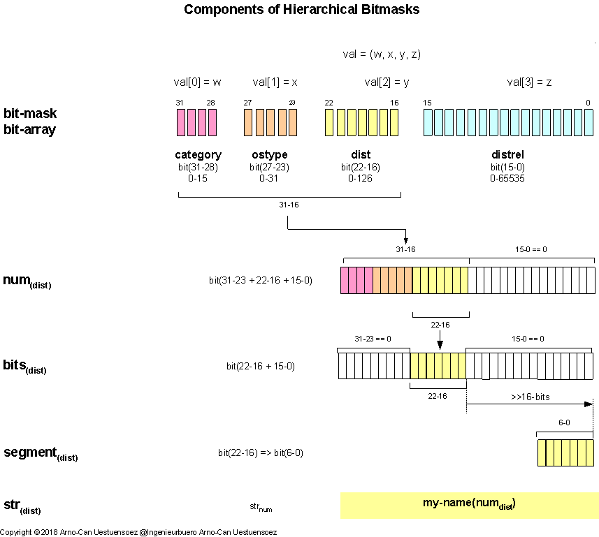

.. _PLATFORMIDSINIT:

.. raw:: html

   

platformids.__init__
====================

Module
------
.. automodule:: platformids.__init__

The core module contains the basic data definitions and the function interfaces
for the aquisition and conversion of platform parameters.

Sources: `platformids/__init__.py <_modules/platformids/__init__.html#>`_

The inline doc-strings of the module are spared in order to support in any case a slim memory-print
and fast load time without the requirement of global optimization flags.
Instead the documentation is enhanced free from restrictions resulting from inline format requirements.

The contained classes provide special variants of *dict* in order to manage 
dynamic enumeration repositories.
This also contains the creation of dynamic enumeration constants for short-term
reporistory integration.

.. raw:: html

   

.. inheritance-diagram:: platformids.ProtectedDict platformids.ProtectedDictEnum
   :parts: 1

.. raw:: html

   

Due to the required support for a wide range of OS platforms including 
various *Python* implementations the collection classes are avoided.

Constants
---------

.. _BITMASKNAMING:

Naming Conventions
^^^^^^^^^^^^^^^^^^
The bitmasks arrays represent a record of a set of hierachical components.
The hierrachy implies that a specific type is by definition a member of a specific upper class - similar 
to the inheritance hierachy of classes in object oriented designs.
For example a distribution *Fedora* is also a member of the *Linux* type of OS, and therefore a member of 
the *POSIX* based OS category.
Thus the numeric definition of *RTE_FEDORA* <*dist*> implies by default the bits for *RTE_LINUX* <*ostype*> and *RTE_POSIX* <*category*> also
to be set.  

The managed values are hereby represented in various input and output formats.
Therefore the name of the appropriate function interfaces are based on a
simple convention.
The main representation is a bitmask vector representing a record with contained
values shifted to the assigned bit position.
The numeric values in general are defined as appropriate for simple bit operations without 
required shift operations.
The conversion in some cases requires the content of the bitmask field, which is defined
as the segment, where the value is defined by the bitmask relative to the field defined 
by the segment of the record.

.. _FIGURE_BITARRAYSTACKDEFINITIONS:

   
   Figure: Bitarray stack numbering definitions |bitarraystackdefinitions_zoom|

.. |bitarraystackdefinitions_zoom| image:: _static/zoom.png
   :alt: zoom 
   :target: _static/bitarray-stack-bits-definitions.png
   :width: 16

The the introduced names are used as part of the encoding and decoding interfaces
as a hint to their input and output formats. 
The general definition of the names are:

* **num**:
   For numeric values based on shifted 32bit values, where the complete upper
   hierarchy is contained.
   E.g. the category *RTE_POSIX* has the 32bit value *0x10000000*,
   the distribution *RTE_FEDORA* has the 32bit value of *dist* *0x10810000*:
   
   .. parsed-literal::
   
      RTE_FEDORA = 0x00010000 | RTE_LINUX
      RTE_FEDORA = 0x00010000 | 0x00800000 | RTE_POSIX
      RTE_FEDORA = 0x00010000 | 0x00800000 | 0x10000000 
      RTE_FEDORA = 0x10810000

* **bits**:
   For numeric values based on shifted 32bit values, where the upper
   hierarchy is not contained. This could be easily evaluated from
   the 32bit value by using the pre defined bitmask *RTE_DIST_B*
   for the *dist* field.
   
   .. parsed-literal::
   
      RTE_FEDORA_B = RTE_FEDORA & RTE_DIST_B
      RTE_FEDORA_B = 0x10810000 & RTE_DIST_B
      RTE_FEDORA_B = 0x10810000 & 0x007f0000 
      RTE_FEDORA_B = 0x00010000 

* **segment**:
   A segment is a pure field value, where the numeric value is defined
   by the portion of bits relative to the field. E.g. *RTE_POSIX* has the 
   numeric value *0x100000000*, while it's segment value of the *category* field is *0x1*,
     
   .. parsed-literal::
   
      RTE_FEDORA_S = RTE_FEDORA_S & RTE_FEDORA_B >> 16 
      RTE_FEDORA_S = 0x00010000   >> 16 
      RTE_FEDORA_S = 0x1 

* **str**:
   The string representation of the appropriate field, which is in
   most cases the cumulated value of the hierarchical upper fields.
   This is because for the relative values no specific definitions exist, or better to say
   the represent a branch of attributes in a hierarchical graph.
   E.g. *CentOS*, or *Solaris11* is in any case defined as a *POSIX* based OS,
   of type *Linux* or *SunOS5*.

   .. parsed-literal::
   
      RTE_FEDORA_STR = "Fedora" 

.. _ENUM_PLATFORM:

Platform Definitions
^^^^^^^^^^^^^^^^^^^^
The internal representation of the platform parameter is an *int* used 
as bit-array for binary logic operations  - see also 
`Bitmasks for Numeric Vectors <python_bitmasks.html#>`_.
The most interfaces support the bit-array representation as well as the
alternatively string name macros as defined by the *sys.platform* interface.

Structure of bit masks
^^^^^^^^^^^^^^^^^^^^^^
The predefined bitmasks are provided as contant-variables of the form *RTE_<name>*, 

   .. parsed-literal::
   
      RTE_RHEL7, RTE_CENTOS7, RTE_SOLARIS11, RTE_WIN2019S

which covers the grouping of bit-mask blocks and the increments within these groups.
For example the value of *CentOS7*

   .. parsed-literal::
   
      val = (w, x, y, z) = RTE_CENTOS7

is represented by the corresponding bit encodings

   .. parsed-literal::
   
      val[0] = w -> <category>    = RTE_POSIX
      val[1] = x -> <ostype>      = RTE_LINUX
      val[2] = y ->  <dist>       = RTE_CENTOS
      val[3] = z ->  <distrel>    = RTE_CENTOS7

as  defined by the following scheme

.. figure:: _static/bitarray-stack-bits.png
   :figwidth: 450
   :align: center
   :target: _static/bitarray-stack-bits.png
   
   Figure: Standard Bit-Arrays |bitarrayprinciple_zoom| - :ref:`read more... <BITMASKSOSDIST>`

.. |bitarrayprinciple_zoom| image:: _static/zoom.png
   :alt: zoom 
   :target: _static/bitarray-stack-bits.png
   :width: 16

The general algorithm of the calculation for the bit-mask is based on the grouping
of categories, type sets, and members into nested bit-blocks - <:ref:`Bit Masks for OS and Distro Releases <BITMASKSOSDIST>`>.
The combination of category bit masks for bit-blocks and the addition of sub-blocks
for context-bitmasks of it's members combines the performance of logical bit-operations
with the reduction of the number of required bits.
The principle is similar to the network addresses of TCP networks for routing.
The lower bits are reserved for the groups and members of a category, which is similar
to a class-X subnetwork address schemes.
This is required due to the vast number of permutations of possible OS releases, which else would lead to  
bit arrays of astronomical dimensions. 

.. index::
   pair: platform; RTE_PWEMU
   pair: platform; RTE_CYGWINNT
   pair: Cygwin; PWEMU
   pair: Cygwin; RTE_PWEMU
   pair: Cygwin; RTE_CYGWINNT
   pair: Cygwin; RTE_CYGWIN
   pair: Cygwin; RTE_CYGWIN26

.. _PLATFORMIDS:

Bit-Mask Definitions
^^^^^^^^^^^^^^^^^^^^
The following additional definitions are introduced.

* The bit-mask provides the bit for the OS as well as the bit for the 
  base category and set - see :ref:`OSTYPEANDDISTCATEGORIES`

  For the details and complete numbering refer to the distribution modules :ref:`OSTYPEANDDISTCATEGORIES`.
  The provided canonical details are - see commandline interface 
  `rtplatformids <rtplatformids_cli.html#rtplatformidsclisynopsis>`_: 
  
   .. parsed-literal::
   
      category             = posix
      ostype               = linux
      ostype-id             = linux
      osrel-vers           = [4, 16, 15]
      dist                 = fedora
      distrel              = fedora-27.0.0
      distrel-name         = Twenty Seven
      distrel-key          = fedora27
      distrel-version      = [27, 0, 0]
      distrel-hexversion   = 285279488

.. index::
   pair: platform; RTE
   pair: platform; RTE_BSD
   pair: platform; RTE_OPENBSD
   pair: platform; RTE_FREEBSD
   pair: platform; RTE_PWEMU
   pair: platform; RTE_OSX
   pair: platform; RTE_GENERIC
   pair: platform; RTE_LINUX
   pair: platform; RTE_OSX
   pair: platform; RTE_POSIX
   pair: platform; RTE_SOLARIS
   pair: platform; RTE_WIN32

* Enum Values:

  * Base type blocks:

    * **RTE_PWEMU** - **cygwin**: Cygwin [CYGWIN]_
    * **RTE_POSIX** - **posix**: Posix systems using *fcntl* [POSIX]_.
    * **RTE_WIN32** - **win**: All Windows systems
    * **RTE_GENERIC**: Undefined platform for special cases

  * Sets of POSIX base system platformids:

    * **RTE_BSD** - **bsd**: BSD, - OpenBSD, FreeBSD, NetBSD - as Posix system [POSIX]_.
    * **RTE_OSX** - **darwin**: Darwin/OS-X, as Posix system [POSIX]_, no macpath-legacy.
    * **RTE_DEBIAN** - **debian**: debian - as Posix system [POSIX]_.
    * **RTE_LINUX** - **linux**: Linux with specific add-ons - OS, DIST, GNU - as Posix system [POSIX]_.
    * **RTE_OSX** - **osx**: Darwin/OS-X, as Posix system [POSIX]_, no macpath-legacy.
    * **RTE_SOLARIS** - **solaris**: UNIX/Solaris, as Posix system [POSIX]_.

    .

  * **RTE_GENERIC**: Undefined platform for special cases.

* Control Variables:

  * **RTE**: Current runtime-environment variable.

For the complete list refer to the sources [`platformids.__init__.py <_modules/platformids/__init__.html#>`_].

Calculation of bit masks
^^^^^^^^^^^^^^^^^^^^^^^^
A typical example for the base of the mapping and algorithms is:

   .. parsed-literal::
   
      # category: posix
      RTE_POSIX = 8192  #: Posix systems using *fcntl* [POSIX]_.
   
      # set: OS-X
      # bit-block: Apple - OS-X
      RTE_OSX = RTE_POSIX + 1  #: Darwin/OS-X, as Posix system [POSIX]_, no macpath-legacy.
      RTE_OSX = RTE_POSIX + 2  #: Darwin/OS-X, as Posix system [POSIX]_, no macpath-legacy.
   
      # set: Sun - Solaris
      RTE_SOLARIS = RTE_POSIX + 16  #: UNIX/Solaris, as Posix system [POSIX]_.
   
      # set: BSD
      RTE_BSD = RTE_POSIX + 32  #: BSD, - OpenBSD, FreeBSD, NetBSD - as Posix system [POSIX]_.
   
      # set: Linux
      RTE_LINUX = RTE_POSIX + 64  #: Linux with specific add-ons - OS, DIST, GNU - as Posix system [POSIX]_.
      
      # members" Linux
      RTE_CENTOS  = RTE_LINUX + 1  #: CentOS
      RTE_CENTOS4 = RTE_LINUX + 2  #: CentOS-4
      RTE_CENTOS5 = RTE_LINUX + 3  #: CentOS-5
      RTE_CENTOS6 = RTE_LINUX + 4  #: CentOS-6
      RTE_CENTOS7 = RTE_LINUX + 5  #: CentOS-7
      
      RTE_FEDORA = RTE_LINUX + 32  #: Fedora
      RTE_FEDORA19 = RTE_LINUX + 33  #: Fedora-19
      RTE_FEDORA27 = RTE_LINUX + 34  #: Fedora-27
      
      RTE_DEBIAN = RTE_LINUX + 64  #: Debian
      RTE_DEBIAN6 = RTE_LINUX + 65  #: Debian - squeeze
      RTE_DEBIAN7 = RTE_LINUX + 66  #: Debian - wheezy
      RTE_DEBIAN8 = RTE_LINUX + 67  #: Debian - jessy
      RTE_DEBIAN9 = RTE_LINUX + 68  #: Debian - stretch
   
The calculations are for OS and distributions:

   .. parsed-literal::
   
      #
      # explicit
      #
      if RTE & RTE_POSIX: # use category
         pass
      
      if RTE & RTE_LINUX: # use set
         pass
         
      if RTE & RTE_CENTOS: # use distro
         pass
   
      if RTE & RTE_CENTOS7: # use release
         pass
   
      #
      # hierarchical
      #
      if RTE & RTE_POSIX: # use category
         if RTE & RTE_LINUX: # use set
            # do s.th. ...
                  
            if RTE & RTE_CENTOS7: # use release
               pass
            else:
               # do s.th. ...
   
         elif RTE & RTE_BSD: # use set
            # do s.th. else...
   
            if RTE & RTE_OPENBSD: # use release
               pass
            else:
               # do s.th. else...
               

The calculations are for URI and schemes:

   .. parsed-literal::
   
      if RTE & RTE_URI: # use category
         pass
      
      if RTE & RTE_HTTP: # use scheme
         pass

Bitmask Conversions
^^^^^^^^^^^^^^^^^^^
The provided bitmask is encoded as a 32bit integer vector, where the segments contain the partial values.
Due to the hierarch of the bit segments each value represents a hirarchical context.
Thus the actual semantic of a bit-segment depends on it's upper segment values.
The partial values are therefore by default represented as the cumulated bitmask from the highest bit.

   .. parsed-literal::
   
      RTE_CATEGORY =               0xf0000000     #: bit: 31-28
      RTE_OSTYPE =                 0xffc00000     #: bit: 31-22
      RTE_DIST =                   0xfffff000     #: bit: 31-12
      RTE_DISTREL =                0xffffffff     #: bit: 31-0

These could be converted by simple bit-operations into the isolated sub-values
by pre-defined bit-masks.

   .. parsed-literal::
   
      RTE_CATEGORY_B =             0xf0000000     #: bit: 31-28
      RTE_OSTYPE_B =               0x0fc00000     #: bit: 27-22
      RTE_DIST_B =                 0x003ff000     #: bit: 21-12
      RTE_DISTREL_B =              0x00000fff     #: bit: 11-0

For example the value for *Fedora* sets specific bits for the segment *dist*,
which has another semantics for the context of a *Windows* OS.
Here for *Fedora*

   .. parsed-literal::
   
      RTE_FEDORA =   RTE_POSIX  & RTE_CATEGORY_B 
                   + RTE_LINUX  & RTE_OSTYPE_B 
                   + RTE_FEDORA & RTE_DIST_B

The caller must be aware of the context in order to intepret the semantics.
For example

   .. parsed-literal::
   
      fedora_bits =   RTE_FEDORA & RTE_DIST_B
      winXY_bits =    RTE_WINXY  & RTE_DIST_B

could be equal when the context is omitted, even though the intentional semantics is forseen to be completely different:

   .. parsed-literal::
   
      fedora_bits = winXY_bits

The other aspect is the varying layout of the *distrel* field for specific versioning schemes.
The applied versioning schemes are 
:ref:`decided by the distributions <STANDARDOSDIST>`, which even changes during the lifetime of some distributions,
e.g. :ref:`CentOS <enumCENTOS>`, :ref:`Gentoo <enumGENTOO>`, and recently seemingly 
:ref:`Windows from Window10 <enumWINNT>` on.
This even includes the combined variation of the *dist* and *distrel* fileds for versioning schemes with large
value ranges.
Thus the context within the hierarchy is critical for the interpretation and extraction of the subfields.  

For simple reliable conversions refer to the provided :ref:`functions <PLATFORMIDS_FUNCTIONS>` of the API,
or the specific intefraces provided by the appropriate distribution module.

Memory Management
^^^^^^^^^^^^^^^^^
The custom bit-mask blocks are managed by the assignment of reserved value ranges.
These has to be handled cooperative by the application, no range checks for the assignment of
net key/value/pairs is done.

The values are readonly once assigned.
A basic protection is implemented, where a reassignment attempt raises an exception.  

Application Hints
^^^^^^^^^^^^^^^^^
The bitmasks schould be used as numeric values where ever possible.
The conversion shoudl be used for initial cases and code-segment decisions only, but avoided
within repetitive loops.

.. _BITMASK_HELPERCONSTS:

Helper Constants
^^^^^^^^^^^^^^^^
The helper support constant values to ease the calculations of the resulting values
from bitmask records for casual application. 

Bitmask Field
^^^^^^^^^^^^^
The bitmask field values extract the actual value of the selected field only.
 
* *RTE_CATEGORY_B = 0xf0000000* - bit: 31-28
* *RTE_OSTYPE_B = 0x0f800000* - bit: 27-23
* *RTE_DIST_B = 0x007f0000* - bit: 22-16
* *RTE_DISTREL_B = 0x0000ffff* - bit: 15-0

For example by:

   .. parsed-literal::
   
      (RTE & RTE_CATEGORY_B) == RTE_POSIX

      (RTE & RTE_OSTYPE_B) == RTE_LINUX

      (RTE & RTE_DIST_B) == RTE_RHEL

Bit-Shift
^^^^^^^^^
The shift values represent the numeric value of the first bit after the applied shift operation. 

* *RTE_CATEGORY_SHIFT = 28* - bit: 28
* *RTE_OSTYPE_SHIFT = 23* - bit: 23
* *RTE_DIST_SHIFT = 16* - bit: 16
* *RTE_DISTREL_SHIFT = 0* - bit: 0

For example:

   .. parsed-literal::
   
      ((RTE_CENTOS & RTE_OSTYPE_B) >> RTE_OSTYPE_SHIFT) == 1

      ((RTE_LINUX  & RTE_OSTYPE_B) >> RTE_OSTYPE_SHIFT) == 1
      

Bit-Field Offset
^^^^^^^^^^^^^^^^
The bit-field offsets provide the number of shifted bits for each
bitmask-field.

* *RTE_CATEGORY_OFFSET = 0x0fffffff* - bit: 28
* *RTE_OSTYPE_OFFSET = 0x007fffff* - bit: 23
* *RTE_DIST_OFFSET = 0x0000ffff* - bit: 16
* *RTE_DISTREL_OFFSET = 0x00000000* - bit: 0

For example:

   .. parsed-literal::
   
      (RTE_OSTYPE_OFFSET + 1) == (RTE_LINUX & RTE_OSTYPE_B)

Hirarchical Bit-Value
^^^^^^^^^^^^^^^^^^^^^
The hierarchical bit-values represent the resulting cumulated value of the bit-field
whithin the tree hierarchy.

* *RTE_CATEGORY = 0xf0000000* - bit: 31-28
* *RTE_OSTYPE = 0xff800000* - bit: 31-23
* *RTE_DIST = 0xffff0000* - bit: 31-16
* *RTE_DISTREL = 0xffffffff* - bit: 31-0

For example:

   .. parsed-literal::
   
      (
           (RTE_CENTOS & RTE_CATEGORY_B) 
         | (RTE_CENTOS & RTE_OSTYPE_B  ) 
         | (RTE_CENTOS & RTE_DIST_B    )
      ) == RTE_CENTOS

Attributes
----------
The following attributes are official interface and could be used alternively
to the access functions.

RTE
^^^
The *RTE* variable is assigned during the initial load of the module.
The value represents the current runtime platform as a bit mask with a mixed
bit array and integer encoding to be used for bit and integer operations.
The represented platforms, versions and releases are hierrachical and ordered, so greater and smaller,
or equal comparison operators could be applied.
For possible values refer to the constants '*RTE_\**', see `Platform Definitions <#platform-definitions>`_. 

rte2num
^^^^^^^
The map of string and for smart coding of the integer values too onto
the defined numerical enum values. 

   .. parsed-literal::
   
      rte2num = {
        <str-or-num>: RTE_<*>,
      }
   
      # application:
   
      rte2num['bsd']   == RTE_BSD 
      rte2num[RTE_BSD] == RTE_BSD

For the complete list refer to the sources [`platformids.__init__.py <_modules/platformids/__init__.html#>`_].

num2rte
^^^^^^^
The map of numerical values onto
the defined string values. 

   .. parsed-literal::
   
      num2rte = {
        RTE_<*>: <str-or-num>,
      }
   
      # application:
   
      rte2num[RTE_BSD] == 'bsd'  

For the complete list refer to the sources [`platformids.__init__.py <_modules/platformids/__init__.html#>`_].

.. _CUSTOM_CATEGORY:

custom_category
^^^^^^^^^^^^^^^

Manages the dynamic allocation of custom enumerations for the *category*.
Is defined by the class :ref:`ProtectedDictEnum <CLASS_ProtectedDictEnum>`,
which provides in particular the method 
:ref:`add_enum <add_enum>` for the assignment
of the next free number including the reservation for the rest of the lifetime
of the current process.

.. _CUSTOM_OSTYPE:

custom_ostype
^^^^^^^^^^^^^
Manages the dynamic allocation of custom enumerations for the *ostype*.
Is defined by the class :ref:`ProtectedDictEnum <CLASS_ProtectedDictEnum>`,
which provides in particular the method 
:ref:`add_enum <add_enum>` for the assignment
of the next free number including the reservation for the rest of the lifetime
of the current process.

.. _CUSTOM_DIST:

custom_dist
^^^^^^^^^^^
Manages the dynamic allocation of custom enumerations for the *dist*.
Is defined by the class :ref:`ProtectedDictEnum <CLASS_ProtectedDictEnum>`,
which provides in particular the method 
:ref:`add_enum <add_enum>` for the assignment
of the next free number including the reservation for the rest of the lifetime
of the current process.

.. _PLATFORMIDS_ENVIRONMENT:

Environment
-----------

PLATFORMIDS_ALTBASE
^^^^^^^^^^^^^^^^^^^
The environment variable **PLATFORMIDS_ALTBASE**
defines an alternative base directory for the internal search by the pattern:

   .. parsed-literal::
   
      # try defaults
      modname, modfilepath = :ref:`get_modlocation('mymodule') <get_modlocation_doc>`
      
      if modfilepath == None:
         # try alternate by environ
         modname, modfilepath = :ref:`get_modlocation('mymodule', mbase=os.environ.get('PLATFORMIDS_ALTBASE', None) <get_modlocation_doc>`

The value is checked after the standard path as defined either by default, 
or by hard-coded parameters.
Thus it is for security reasons prohibited to replace any present
standard module.

.. _PLATFORMIDS_PLATFORMMODULES:

Platform Modules
----------------
The main module *platformids* implements the generic framework and configuration data for the
major standard platforms.
Additional platform data and eventually required functions are loaded during initialization.
This includes custom modules for new platforms an releases provided by the application.
Therefore a search for non-matched modules is performed, which in addition could be directed
by the environment variable :ref:`PLATFORMIDS_ALTBASE <PLATFORMIDS_ENVIRONMENT>`.

The search hierarchy including platform dependencies is defined by:

.. parsed-literal::

   0. system data - prohibit redefinition of present system data
         0.1 mbase_altbase = os.environ['CommonProgramFiles'] + os.sep + 'platformids'
         
         0.2 mbase_altbase = os.sep + 'etc' + os.sep + 'platformids'

   1. alternate data
         1.1 mbase_altbase = os.getenv('PLATFORMIDS_ALTBASE', None)
 
   2. user data
         2.1 mbase_altbase = os.environ['LOCALAPPDATA'] + os.sep + 'platformids'
         
         2.2 mbase_altbase = os.environ['HOME'] + os.sep + '.config' + os.sep + 'platformids'
 
         2.3 mbase_altbase = os.environ['HOME'] + os.sep + 'platformids'

For additional details refer to :ref:`get_modlocation <get_modlocation_doc>`.

.. _PLATFORMIDS_FUNCTIONS:

Functions
---------

The provided functions are grouped into categrories:

* *decode_\*_to_\**: decodes a given element to specified representation type
      
      +------------------------------------------------------------------------+
      | :ref:`decode_rte_category_to_num <decode_rte_category_to_num>`         |
      +------------------------------------------------------------------------+
      | :ref:`decode_rte_dist_to_num <decode_rte_dist_to_num>`                 |
      +------------------------------------------------------------------------+
      | :ref:`decode_rte_distrel_to_num <decode_rte_distrel_to_num>`           |
      +------------------------------------------------------------------------+
      | :ref:`decode_rte_distrel_to_segments <decode_rte_distrel_to_segments>` |
      +------------------------------------------------------------------------+
      | :ref:`decode_rte_ostype_to_num <decode_rte_ostype_to_num>`             |
      +------------------------------------------------------------------------+
      | :ref:`decode_rte_to_segments <decode_rte_to_segments>`                 |
      +------------------------------------------------------------------------+
      | :ref:`decode_rte_to_tuple <decode_rte_to_tuple>`                       |
      +------------------------------------------------------------------------+
      | :ref:`decode_rte_to_tuple_str <decode_rte_to_tuple_str>`               |
      +------------------------------------------------------------------------+
      | :ref:`decode_version_str_to_segments <decode_version_str_to_segments>` |
      +------------------------------------------------------------------------+

* *encode_\*_to_32bit*: encodes a given element into it's 32bit bitmask representation as a hex-value

      +--------------------------------------------------------------------+
      | :ref:`encode_rte_to_32bit <encode_rte_to_32bit>`                   |
      +--------------------------------------------------------------------+
      | :ref:`encode_rte_segments_to_32bit <encode_rte_segments_to_32bit>` |
      +--------------------------------------------------------------------+

* *fetch_\**: reads out the specified value from the current runtime environment

      +--------------------------------------------------------------------------+
      | :ref:`fetch_category <fetch_category>`                                   |
      +--------------------------------------------------------------------------+
      | :ref:`fetch_dist <fetch_dist>`                                           |
      +--------------------------------------------------------------------------+
      | :ref:`fetch_dist_tuple <fetch_dist_tuple>`                               |
      +--------------------------------------------------------------------------+
      | :ref:`fetch_ostype <fetch_ostype>`                                       |
      +--------------------------------------------------------------------------+
      | :ref:`fetch_platform_distribution <fetch_platform_distribution_x>`       |
      +--------------------------------------------------------------------------+
      | :ref:`fetch_platform_distribution_num <fetch_platform_distribution_num>` |
      +--------------------------------------------------------------------------+
      | :ref:`fetch_platform_os <fetch_platform_os_X>`                           |
      +--------------------------------------------------------------------------+
      | :ref:`fetch_platform_os_num <fetch_platform_os_num>`                     |
      +--------------------------------------------------------------------------+
      | :ref:`fetch_rte_hexversion <fetch_rte_hexversion>`                       |
      +--------------------------------------------------------------------------+

* *get_\**: gets a value from the specified *dict*

      +----------------------------------+
      | :ref:`get_num2rte <get_num2rte>` |
      +----------------------------------+
      | :ref:`get-rte2num <get_rte2num>` |
      +----------------------------------+

* *set_\**: sets a value of the specified *dict*

      +----------------------------------+
      | :ref:`set_num2rte <set_num2rte>` |
      +----------------------------------+
      | :ref:`set_rte2num <set_rte2num>` |
      +----------------------------------+

.. _decode_rte_category_to_num:

decode_rte_category_to_num
^^^^^^^^^^^^^^^^^^^^^^^^^^
.. autofunction:: decode_rte_category_to_num

   Examples::
   
     decode_rte_category_to_num()     
     =>  RTE_WPEMU     # on windows emulator on posix
     =>  RTE_POSIX     # on posix platforms
     =>  RTE_PWEMU     # on posix on windows emulator - mainly Cygwin
     =>  RTE_WINDOWS   # on windows platforms

.. _decode_rte_dist_to_num:

decode_rte_dist_to_num
^^^^^^^^^^^^^^^^^^^^^^
.. autofunction:: decode_rte_dist_to_num

   Examples::

      decode_rte_dist_to_num()     
      =>  RTE_DEBIAN     # on Debian Linux
      =>  RTE_FEDORA     # on Fedora Linux
      =>  RTE_NT         # on Windows NT
      =>  RTE_OPENBSD    # on OpenBSD
      =>  RTE_OSX        # on newer apple osx platforms

   Recognizes the distrel extension flag and the date based version flag. ::

         decode_rte_dist_to_num()     
         =>  RTE_ARCHLINUX   # on Arch Linux
         =>  RTE_OPENWRT     # on OpenWRT Linux

.. _decode_rte_distrel_to_num:

decode_rte_distrel_to_num
^^^^^^^^^^^^^^^^^^^^^^^^^
.. autofunction:: decode_rte_distrel_to_num

   Examples: 
    ::

      decode_rte_distrel_to_num()     
      =>  RTE_DEBIAN96      # on Debian-9.6 - Stretch
      =>  RTE_FEDORA29      # on Fedora-29
      =>  RTE_OPENBSD63     # on OpenBSD-6.3
      =>  RTE_OSX1068       # on Snowleopard / last update 10.6.8
      =>  RTE_WIN2012R2     # on Windows2000R2 - dist = RTE_NT63 - distrel = 9600
      
      Beginning with NT10_0 the version changes continously, thus no complete const: 
      
      =>  RTE_NT100 + 1803  # on Windows10 Professional - dist = RTE_NT100 - distrel = 1803
      =>  RTE_NT100 + 1809  # on Windows10 Professional - dist = RTE_NT100 - distrel = 1809

.. _decode_rte_distrel_to_segments:

decode_rte_distrel_to_segments
^^^^^^^^^^^^^^^^^^^^^^^^^^^^^^

.. autofunction:: decode_rte_distrel_to_segments

   Examples:
     ::

        decode_rte_distrel_to_segments()
             
        =>  ret == (5, 50, 0)    # on Armbian-5.50 - Stretch
        =>  ret == (7, 6, 0)     # on CentOS-7.6-1804
        =>  ret == (9, 6, 0)     # on Debian-9.6 - Stretch
        =>  ret == (9, 6, 0)     # on Raspbian-9.6 - Stretch
        =>  ret == (29, 0, 0)    # on Fedora-29
        =>  ret == (2019, 1, 0)  # on KaliLinux-2019.01
        =>  ret == (6, 3, 0)     # on OpenBSD-6.3
        =>  ret == (18, 6, 2)    # on OpenWRT-18.6.2
        =>  ret == (10, 6, 8)    # on Snowleopard / last update 10.6.8
        =>  ret == (2600, 0, 0)  # on WindowsXP 32bit Professional
        =>  ret == (1809, 0, 0)  # on Windows10 Professional version 1809
        =>  ret == (1511, 0, 0)  # on Windows10 IoT Core version 1511

.. _decode_rte_ostype_to_num:

decode_rte_ostype_to_num
^^^^^^^^^^^^^^^^^^^^^^^^
.. autofunction:: decode_rte_ostype_to_num

   Examples::
   
     decode_rte_ostype_to_num()     
     =>  RTE_BSD       # on bsd platforms
     =>  RTE_DARWIN    # on newer apple osx platforms
     =>  RTE_LINUX     # on linux platforms
     =>  RTE_NT        # on windows-nt platforms
   

.. _decode_rte_to_segments:

decode_rte_to_segments
^^^^^^^^^^^^^^^^^^^^^^
.. autofunction:: decode_rte_to_segments

   Examples: 
    ::

      ret = decode_rte_to_tuple()
      =>  ret == (0x1, 0x2,  0x2,  0x1860)    # on OpenBSD-6.3
      =>  ret == (0x1, 0x4,  0x2,  0x28c8)    # on Snowleopard / last update 10.6.8
      =>  ret == (0x1, 0x1,  0x3,  0x24c0)    # on Debian-9.6 - Stretch
      =>  ret == (0x1, 0x1,  0x1,  0x7400)    # on Fedora-29
      =>  ret == (0x1, 0x8,  0x2,  0x2260)    # on Solaris-11.3
      =>  ret == (0x2, 0x1,  0x50, 0x4563)    # on Windows10 Professional - NT-10.0.17763

.. _decode_rte_to_tuple:

decode_rte_to_tuple
^^^^^^^^^^^^^^^^^^^
.. autofunction:: decode_rte_to_tuple

   Examples: 
    ::

      decode_rte_to_tuple()
      =>  (RTE_POSIX,   RTE_BSD,       RTE_OPENBSD,    RTE_OPENBSD63)    # on OpenBSD-6.3
      =>  (RTE_POSIX,   RTE_DARWIN,    RTE_OSX,        RTE_OSX1068)      # on Snowleopard / last update 10.6.8
      =>  (RTE_POSIX,   RTE_LINUX,     RTE_DEBIAN,     RTE_DEBIAN96)     # on Debian-9.6 - Stretch
      =>  (RTE_POSIX,   RTE_LINUX,     RTE_FEDORA,     RTE_FEDORA29)     # on Fedora-29
      =>  (RTE_POSIX,   RTE_UNIX,      RTE_SOLARIS,    RTE_SOLARIS11)    # on Solaris11
      =>  (RTE_WINDOWS, RTE_NT,        RTE_NT100,      RTE_WIN10)        # on Windows10 Professional

.. _decode_rte_to_tuple_str:

decode_rte_to_tuple_str
^^^^^^^^^^^^^^^^^^^^^^^
.. autofunction:: decode_rte_to_tuple_str

   Examples: 
    ::

      decode_rte_to_tuple_str()
      =>  ('posix',     'bsd',         'openbsd',      'openbsd63')      # on OpenBSD-6.3
      =>  ('posix',     'darwin',      'osx',          'osx1068')        # on Snowleopard / last update 10.6.8
      =>  ('posix',     'linux',       'debian',       'debian96')       # on Debian-9.6 - Stretch
      =>  ('posix',     'linux',       'fedora',       'fedora29')       # on Fedora-29
      =>  ('posix',     'unix',        'solaris',      'solaris11')      # on Solaris11
      =>  ('windows',   'nt',          'nt100',        'win10p')         # on Windows10 Professional

.. _decode_version_str_to_segments:

decode_version_str_to_segments
^^^^^^^^^^^^^^^^^^^^^^^^^^^^^^
.. autofunction:: decode_version_str_to_segments

.. _encode_rte_to_32bit:

encode_rte_to_32bit
^^^^^^^^^^^^^^^^^^^
.. autofunction:: encode_rte_to_32bit

.. _encode_rte_segments_to_32bit:

encode_rte_segments_to_32bit
^^^^^^^^^^^^^^^^^^^^^^^^^^^^
.. autofunction:: encode_rte_segments_to_32bit

.. _fetch_category:

fetch_category
^^^^^^^^^^^^^^
.. autofunction:: fetch_category

   Examples::
    
      fetch_category()
      
      => RTE_POSIX
      => RTE_WIN

.. _fetch_dist:

fetch_dist
^^^^^^^^^^
.. autofunction:: fetch_dist

   Examples::
   
      fetch_ostype()
   
      => RTE_DEBIAN
      => RTE_FEDORA
      => RTE_CENTOS
      => RTE_OPENBSD
      => RTE_SOLARIS

.. _fetch_dist_tuple:

fetch_dist_tuple
^^^^^^^^^^^^^^^^
.. autofunction:: fetch_dist_tuple

   Examples::
   
      fetch_dist_tuple()

      => ('sunos', '5.10.0' , (5, 10, 0, int(_p)), 'sunos5100')
      => ('sunos', '5.11.3' , (5, 11, 3), 'sunos5113')
      => ('fedora', '27.0.0' , (27, 0, 0), 'fedora27')
      => ('centos', '7.6.0' , (7, 6, 0), 'centos76')
      => ('debian', '9.4.0' , (9, 4, 0), 'debian94')
   
.. _fetch_ostype:

fetch_ostype
^^^^^^^^^^^^
.. autofunction:: fetch_ostype

   Examples::
   
      fetch_ostype()
   
      => RTE_BSD
      => RTE_CYWINNT
      => RTE_DARWIN
      => RTE_LINUX
      => RTE_NT
      => RTE_UNIX

.. _fetch_platform_distribution_x:

fetch_platform_distribution
^^^^^^^^^^^^^^^^^^^^^^^^^^^
.. autofunction:: fetch_platform_distribution

   For the supported standard platforms see :ref:`Supported Standard OS and Dists <STANDARDOSDIST>`. 

   Examples:

      +--------------------------------+----------+----------+---------+-----------+--------------+---------------------------------------------------------------------------+
      | public distribution            | category | ostype   | dist    | distrel   | product-type | returned tuple                                                            |
      +================================+==========+==========+=========+===========+==============+===========================================================================+
      | Cywin                          | pwemu    | cygwinnt | cygwin  | 2.6.8     | --           | ('cywin268', '2.6.8', 'Cygwin-2.6.8', 'Cygwin', (2, 6, 8), 'cywin')       |
      +--------------------------------+----------+----------+---------+-----------+--------------+---------------------------------------------------------------------------+
      | Fedora27                       | posix    | linux    | fedora  | 27        | --           | ('fedora27', '27', 'Fedora-27', 'Fedora', (27, 0, 0), 'fedora')           |
      +--------------------------------+----------+----------+---------+-----------+--------------+---------------------------------------------------------------------------+
      | OS-X HighSierra                | posix    | darwin   | osx     | 17.6.0    | --           | ('osx1760', '17.6.0', 'OSX-17.6.0', 'Snowleopard', (17, 6, 0), 'osx')     |
      +--------------------------------+----------+----------+---------+-----------+--------------+---------------------------------------------------------------------------+
      | OS-X Snowleopard               | posix    | darwin   | osx     | 10.8.0    | --           | ('osx1068', '10.6.8', 'OSX-10.6.8', 'Snowleopard', (10, 8, 0), 'osx')     |
      +--------------------------------+----------+----------+---------+-----------+--------------+---------------------------------------------------------------------------+
      | Solaris10                      | posix    | unix     | solaris | 10        | --           | ('solaris10', '10.0', 'Solaris-10', 'Solaris', (10, 0, 0), 'solaris')     |
      +--------------------------------+----------+----------+---------+-----------+--------------+---------------------------------------------------------------------------+
      | Solaris11                      | posix    | unix     | solaris | 11.3      | --           | ('solaris11', '11.3.0', 'Solaris-11.3', 'Solaris', (5, 11, 3), 'solaris') |
      +--------------------------------+----------+----------+---------+-----------+--------------+---------------------------------------------------------------------------+
      | Windows Server 2016            | windows  | nt       | nt100   | 10.0.1809 | server       | ('nt100', '10.0.1809', 'NT-10.0.1809', 'NT', (10, 0, 1809),'nt')          |
      +--------------------------------+----------+----------+---------+-----------+--------------+---------------------------------------------------------------------------+
      | Windows Server 2019 Essentials | windows  | nt       | nt100   | 10.0.1809 | server       | ('nt100', '10.0.1809', 'NT-10.0.1809', 'NT', (10, 0, 1809),'nt')          |
      +--------------------------------+----------+----------+---------+-----------+--------------+---------------------------------------------------------------------------+
      | Windows10 Home                 | windows  | nt       | nt100   | 10.0.1809 | home         | ('nt100', '10.0.1809', 'NT-10.0.1809', 'NT', (10, 0, 1809),'nt')          |
      +--------------------------------+----------+----------+---------+-----------+--------------+---------------------------------------------------------------------------+
      | Windows10 Professional         | windows  | nt       | nt100   | 10.0.1809 | workstation  | ('nt100', '10.0.1809', 'NT-10.0.1809', 'NT', (10, 0, 1809),'nt')          |
      +--------------------------------+----------+----------+---------+-----------+--------------+---------------------------------------------------------------------------+

.. _fetch_platform_distribution_num:

fetch_platform_distribution_num
^^^^^^^^^^^^^^^^^^^^^^^^^^^^^^^
.. autofunction:: fetch_platform_distribution_num

   Examples:

      +------------------------+----------+----------+---------+-----------+--------------+----------------------------------------+
      | public distribution    | category | ostype   | dist    | distrel   | product-type | returned tuple                         |
      +========================+==========+==========+=========+===========+==============+========================================+
      | Cywin                  | pwemu    | cygwinnt | cygwin  | 2.6.8     | --           | (RTE_CYGWIN, #CYGWIN268, (2, 6, 8))    |
      +------------------------+----------+----------+---------+-----------+--------------+----------------------------------------+
      | Fedora27               | posix    | linux    | fedora  | 27        | --           | (RTE_FEDORA, #FEDORA27, (27, 0, 0))    |
      +------------------------+----------+----------+---------+-----------+--------------+----------------------------------------+
      | OS-X Snowleopard       | posix    | darwin   | osx     | 17.6.0    | --           | (RTE_OSX, #OSX1068, (10, 6, 0))        |
      +------------------------+----------+----------+---------+-----------+--------------+----------------------------------------+
      | Solaris10              | posix    | unix     | solaris | 10        | --           | (RTE_SOLARIS, #SOLARIS100, (10, 0, 0)) |
      +------------------------+----------+----------+---------+-----------+--------------+----------------------------------------+
      | Solaris11              | posix    | unix     | solaris | 11.3      | --           | (RTE_SOLARIS, #SOLARIS113, (11, 3, 0)) |
      +------------------------+----------+----------+---------+-----------+--------------+----------------------------------------+
      | Windows Server 2016    | windows  | nt       | nt100   | 10.0.1809 | server       | (RTE_NT100, #NT1001809, (10, 0, 1809)  |
      +------------------------+----------+----------+---------+-----------+--------------+----------------------------------------+
      | Windows10 Professional | windows  | nt       | nt100   | 10.0.1809 | workstation  | (RTE_NT100, #NT1001809, (10, 0, 1809)  |
      +------------------------+----------+----------+---------+-----------+--------------+----------------------------------------+

.. _fetch_platform_os_x:

fetch_platform_os
^^^^^^^^^^^^^^^^^
.. autofunction:: fetch_platform_os

   Examples:
   
      +--------------------------------+----------+----------+--------+-----------+--------------+-----------------------------------------------------------+
      | public distribution            | category | ostype   | osname | osrel     | product-type | returned tuple                                            |
      +================================+==========+==========+========+===========+==============+===========================================================+
      | Cywin                          | pwemu    | cygwinnt | cygwin | 2.6.8     | --           | ('cywin', '2.6.8', (2, 6, 8), 'cywin268')                 |
      +--------------------------------+----------+----------+--------+-----------+--------------+-----------------------------------------------------------+
      | Fedora27                       | posix    | linux    | linux  | 4.17.14   | --           | ('linux', '4.17.14', (4, 17, 14), 'linux41714')           |
      +--------------------------------+----------+----------+--------+-----------+--------------+-----------------------------------------------------------+
      | OS-X HighSierra                | posix    | darwin   | darwin | 17.6.0    | --           | ('darwin', '17.6.0', (17, 6, 0), 'darwin1760')            |
      +--------------------------------+----------+----------+--------+-----------+--------------+-----------------------------------------------------------+
      | OS-X Snowleopard               | posix    | darwin   | darwin | 10.8.0    | --           | ('darwin', '10.8.0', (10, 8, 0),'darwin1080')             |
      +--------------------------------+----------+----------+--------+-----------+--------------+-----------------------------------------------------------+
      | Solaris10 (1)                  | posix    | unix     | sunos  | 5.10.0    | --           | ('sunos', '5.10.0', (5, 10, 0, **<patch>**), 'sunos5100') |
      +--------------------------------+----------+----------+--------+-----------+--------------+-----------------------------------------------------------+
      | Solaris11                      | posix    | unix     | sunos  | 5.11.3    | --           | ('sunos', '5.11.3', (5, 11, 3), 'sunos5113')              |
      +--------------------------------+----------+----------+--------+-----------+--------------+-----------------------------------------------------------+
      | Windows Server 2016            | windows  | nt       | nt100  | 10.0.1809 | server       | ('nt', '10.0.1809', (10, 0, 1809), 'nt1001809')           |
      +--------------------------------+----------+----------+--------+-----------+--------------+-----------------------------------------------------------+
      | Windows Server 2019 Essentials | windows  | nt       | nt100  | 10.0.1809 | server       | ('nt', '10.0.1809', (10, 0, 1809), 'nt1001809')           |
      +--------------------------------+----------+----------+--------+-----------+--------------+-----------------------------------------------------------+
      | Windows10 Home                 | windows  | nt       | nt100  | 10.0.1809 | home         | ('nt', '10.0.1809', (10, 0, 1809), 'nt1001809')           |
      +--------------------------------+----------+----------+--------+-----------+--------------+-----------------------------------------------------------+
      | Windows10 Professional         | windows  | nt       | nt100  | 10.0.1809 | workstation  | ('nt', '10.0.1809', (10, 0, 1809), 'nt1001809')           |
      +--------------------------------+----------+----------+--------+-----------+--------------+-----------------------------------------------------------+
   
      **(1)**: **Solaris10**      
         The supported OS *Solaris10* is here treated special, though it returns the
         combined **kernel patch level** as part of it's release version.
         For example:
         
            .. parsed-literal::
            
               ('SunOS', 'solaris10', '5.10', '**Generic_147148-26**', 'i86pc', 'i386')  # for the architecture refer to [machineids]_
                                               ^^^^^^^^^^^^^^^^^
               
         results in the optional non-standard enty *dist[2][3]*:
            
            .. parsed-literal::
            
               ('sunos', '5.10.0', (5, 10, 0, **14714826**), 'sunos5100')
                                           ^^^^^^^^
         
         Anyhow, due to the nearby coming EOL of Solaris10, the patch-level is ignored by the
         numeric calculations.
         Thus treated as additional optional information to be used when required.

   The major members of the OS family of the *BSD* type OS's are numbered slightly different.
   While the *Solaris* distibution and operating system numbering is already related, the major *BSD*
   operating systems do not distinguish the release numbering between the distribution and the
   operating system.
   These are actually derived from *BSD-4.x* releases, an have even anchestor relationships to each other
   these could meanwhile could be treated as autonomous operating systems with common anchestors.
   This is also dur to the partially compatible, but independent kernels which are bound to specific
   distributions and releases.
   Thus the numbers of OS and distributions are treated identical by the *platformids*.

   Some Examples:
   
   +---------------------+----------+--------+--------------+-------+--------------+---------------------------------------------------------+
   | public distribution | category | ostype | osname       | osrel | product-type | returned tuple                                          |
   +=====================+==========+========+==============+=======+==============+=========================================================+
   | DragonFlyBSD        | posix    | bsd    | dragonflybsd | 5.4.0 | --           | ('dragonflybsd', '5.4.0', (5, 4, 0), 'dragonflybsd540') |
   +---------------------+----------+--------+--------------+-------+--------------+---------------------------------------------------------+
   | FreeBSD             | posix    | bsd    | freebsd      | 11.2  | --           | ('freebsd', '11.2', (11, 2, 0), 'freebsd112')           |
   +---------------------+----------+--------+--------------+-------+--------------+---------------------------------------------------------+
   | NetBSD              | posix    | bsd    | netbsd       | 8.0   | --           | ('netbsd', '8.0', (8, 0, 0), 'netbsd80')                |
   +---------------------+----------+--------+--------------+-------+--------------+---------------------------------------------------------+
   | OpenBSD             | posix    | bsd    | openbsd      | 6.4   | --           | ('openbsd', '6.4', (6, 4, 0), 'openbsd64')              |
   +---------------------+----------+--------+--------------+-------+--------------+---------------------------------------------------------+

.. _fetch_platform_os_num:

fetch_platform_os_num
^^^^^^^^^^^^^^^^^^^^^
.. autofunction:: fetch_platform_os_num

.. _fetch_rte_hexversion:

fetch_rte_hexversion
^^^^^^^^^^^^^^^^^^^^
.. autofunction:: fetch_rte_hexversion

   **The Resolution Algorithm**

   The resolution of the numeric distribution IDs is based on the enumeration
   of the contained parts. This is finally based on the arbitrary assignment
   of specific integer numbers to specific distributions. These are dynamically
   maintained in the data structure *platformids.rte2num*. Each known
   distribution and release requires an entry in this dictionary. The values 
   consist of a core-set and additional sets whch are loaded dynamically.
   
   The function *fetch_rte_hexversion* is the main encryption point for the
   gathered data from the actual platform in order to read out the corresponding
   bitmask.
   
   The handling of the bulk of releases is designed by either a literal match
   of an existing key, or the incremental search by iteration of the release
   version components.
   
   For example the ditribution *Debian* may have defined a mapping *debian9*,
   while the actual release has the version *9.6*.
   Or for example *CentOS* a mapping for *CentOS-7*, missing the release *7.6*.
   The resolution algoritm first tries to find a mapping for the key 

      .. parsed-literal::

         distrelkey = debian96
  
   when missing the next trial is 

      .. parsed-literal::

         distrelkey = debian9
  
   which is one of the major core defintions. Thus the default setup will match 

      .. parsed-literal::
  
         distrelkey = ret2num['debian9']

   or by the function interface 

      .. parsed-literal::
  
         distrelkey = get_ret2num('debian9')

   The returned components of the hexvalue on *Debian-9.6* without a specific
   map for the release *9.6*, but for *9* or *9.0* are: 

      .. parsed-literal::
  
         platformids.decode_rte_to_tuple_str(RTE)
     
         => ('posix', 'linux', 'debian', 'debian9')
 
   The complete algorithm tries the additional resolution steps for the hierarchical
   sub identifiers, when the *Debian* definitions are for example completely missing. 

      .. parsed-literal::
  
         0. literal distrelkey
         1. reduced distrelkey
         2. distname
         3. ostype
         4. category

.. _get_modlocation_doc:

get_modlocation
^^^^^^^^^^^^^^^
.. autofunction:: get_modlocation

.. _get_num2rte:

get_num2rte
^^^^^^^^^^^
.. autofunction:: get_num2rte

.. _get_rte2num:

get_rte2num
^^^^^^^^^^^
.. autofunction:: get_rte2num

.. _set_num2rte:

set_num2rte
^^^^^^^^^^^
.. autofunction:: set_num2rte

.. _set_rte2num:

set_rte2num
^^^^^^^^^^^
.. autofunction:: set_rte2num

.. _CLASS_ProtectedDict:

ProtectedDict
-------------

.. raw:: html

   

.. inheritance-diagram:: platformids.ProtectedDict
   :parts: 1

.. raw:: html

   

.. autoclass:: ProtectedDict

__init__
^^^^^^^^
.. automethod:: ProtectedDict.__init__

__setattr__
^^^^^^^^^^^
.. automethod:: ProtectedDict.__setattr__

__setitem__
^^^^^^^^^^^
.. automethod:: ProtectedDict.__setitem__

update
^^^^^^
.. automethod:: ProtectedDict.update

   
.. _CLASS_ProtectedDictEnum:

ProtectedDictEnum
-----------------

.. raw:: html

   

.. inheritance-diagram:: platformids.ProtectedDict platformids.ProtectedDictEnum
   :parts: 1

.. raw:: html

   

.. autoclass:: ProtectedDictEnum

   
__init__
^^^^^^^^
.. automethod:: ProtectedDictEnum.__init__

__delattr__
^^^^^^^^^^^
.. automethod:: ProtectedDictEnum.__delattr__

__delitem__
^^^^^^^^^^^
.. automethod:: ProtectedDictEnum.__delitem__

__setattr__
^^^^^^^^^^^
.. automethod:: ProtectedDictEnum.__setattr__

__setitem__
^^^^^^^^^^^
.. automethod:: ProtectedDictEnum.__setitem__

.. _add_enum:

add_enum
^^^^^^^^
.. automethod:: ProtectedDictEnum.add_enum

check_next_free_enum
^^^^^^^^^^^^^^^^^^^^
.. automethod:: ProtectedDictEnum.check_next_free_enum

delete_enum
^^^^^^^^^^^
.. automethod:: ProtectedDictEnum.delete_enum
   

purge
^^^^^
.. automethod:: ProtectedDictEnum.purge

update
^^^^^^
.. automethod:: ProtectedDictEnum.update

Exceptions
----------

.. raw:: html

   

.. inheritance-diagram:: 
      platformids.PlatformIDsError 
      platformids.PlatformIDsUnknownError 
      platformids.PlatformIDsPresentError 
      platformids.PlatformIDsCustomError 
      platformids.PlatformIDsKeyError
      platformids.PlatformIDsEnumerationError
   :parts: 1

.. raw:: html

   

.. autoexception:: PlatformIDsCustomError
.. autoexception:: PlatformIDsEnumerationError
.. autoexception:: PlatformIDsError
.. autoexception:: PlatformIDsKeyError
.. autoexception:: PlatformIDsPresentError
.. autoexception:: PlatformIDsUnknownError

.. raw:: html

   

