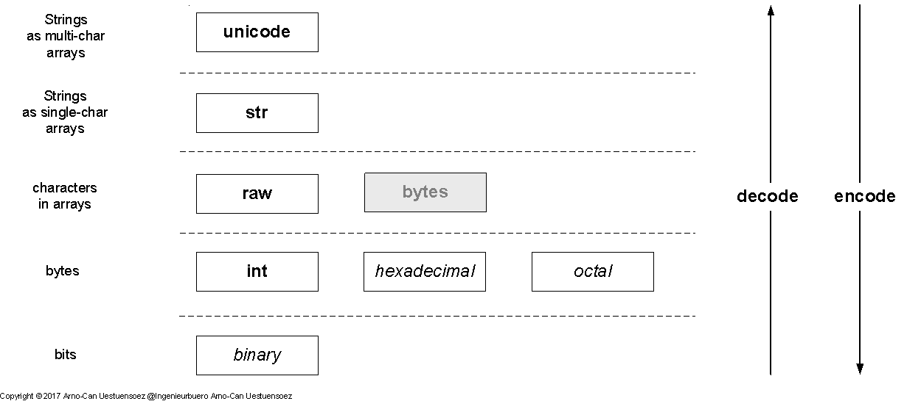
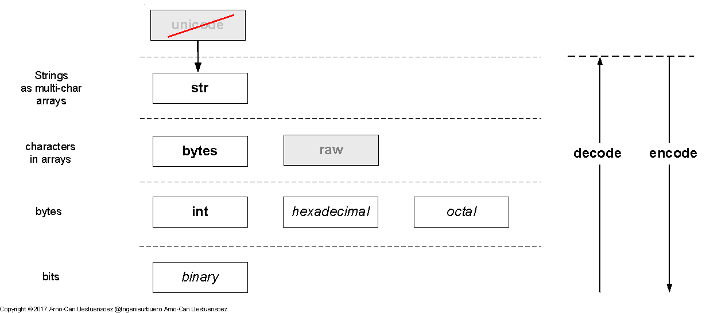

Python2 and Python3 Encoding and Decoding
=========================================

The encoding and decoding is on one hand designed based on special characters representing
a token for the scanners and parsers, on the other hand it is targeting a flexible representation
in human readable formats.
Therefore in modern environments this makes use of multiple character sets and internaionalization.
This in particular makes in multi-language applications excessive use of the character
and string encoding and decoding. 
The following definitions apply: 

* **encoding**
  Encrypt into the direction of machine language

* **decoding**
  Decrypt into the direction of human language

The encoding and decoding is one of the major changes from Python2 to Python3.
This causes for the porting to Python3 of several opensource projects larger 
efforts.

Basics of Encoding and Decoding
-------------------------------
The encoding and decoding is commonly designed as a hierarchy for the conversion of bits into human readable symbols.
The sub-processes are commonly designed as a stack of conversion routines where the bottom layer represents
the machine language, and the top layer the written loacalized human language.
The stack itself defines commonly the sublayers of the syntactic information units:

* *String* - groups of characters
* *Multilingual Character* - one or more bytes with special mapping onto complex human language characters,
  most popular *Unicode*
* *Character* - a byte with special mapping onto a human language character
* *Byte* - group of bits
* *Bit*  

Python2
-------
Python2 distinguishes basically the encoding stack into **5-encoding-layers**.
 
4. **unicode** - Strings a multi-character arrays

3. **str** - Strings a single-character arrays

2. **raw** - characters in arrays - *ASCII* / *order*

1. bytes as **int** -  bit groups

0. bits - bits which may not, but could be used in general raw processing

|encodingdecodinghierarchypython2|
|encodingdecodinghierarchypython2_zoom|

.. |encodingdecodinghierarchypython2_zoom| image:: _static/zoom.png
   :alt: zoom 
   :target: _static/encoding-decoding-hierarchy-python2.png
   :width: 16

The special case is here *bytes* which represent a prepration for the migration to Python3,
but neither has a real distinction to the Python2 *str* type, nor prerents a call compatible
interface.

Thus it seems to be a general viable approach to prefer the *encode()* and *decode()* calls.

Python3
-------
Python3 distinguishes basically the encoding stack into **4-encoding-layers**.
 
3. **str** - Strings a unicode character arrays, either one or more characters

2. **bytes** - characters in arrays - *ASCII* / *order*

1. bytes as **int** -  bit groups

0. bits - bits which may not, but could be used in general raw processing

|encodingdecodinghierarchypython3|
|encodingdecodinghierarchypython3_zoom|

.. |encodingdecodinghierarchypython3_zoom| image:: _static/zoom.png
   :alt: zoom 
   :target: _static/encoding-decoding-hierarchy-python3.png
   :width: 16

The *unicode* class is migrated into the *str* class. The *raw* string is replaced by the *bytes*
class.
This in particular leaves some Python2 calls non-compilable.
Thus it seems to be a general viable approach to prefer the *encode()* and *decode()* calls in case of 
shared code with Python2.

Shared Code for Python2 and Python3
-----------------------------------
The access to file system path names as in general to resource path names reauires commonly
the processing of localized names and segments.
Thus the encoding and decoding is minor but essential detail for internationalized applications.

The basic approach provided by *filesysobjects* is to evaluate the current platform and provide some
constants.

.. code-block:: python
   :linenos:
   
   V3K = False  #: Python3.5+
   if version_info[:2] > (3, 4):
      V3K = True
      ISSTR = (str, bytes)  #: string and unicode
      unicode = str  # @ReservedAssignment
      """Superpose for generic Python3 compatibility."""

   elif version_info[:2] > (2, 6) and version_info[:2][0] < 3:
      ISSTR = (str, unicode)  #: string and unicode

   else:
      raise FileSysObjectsError(
          "Requires Python 2.7+, or 3.5+:" +
          str(version_info[:2]))

* **V3K**

  Provides a constant with the values *True* for Python3.5+, and *False* else.

* **unicode**

  Remaps the *unicode* class onto the *str* class.

  .. note::

     The reassignment of the Python build-in classes is a casual and smart approach, 
     for the porting and shared code between Python2 and Python3, e.g.
   
     .. code-block:: python
        :linenos:
   
        unicode = str  # 2 => 3

     The remapping has sadly some limits, when it comes to *bytes* in Python3.
     This is beacuse the *str()* call is actually a constructor which calls *bytes.__str__()*/*bytes.__repr__()*.
     Both of these calls mix-up type and content information in their results, which makes it basically impossible
     to use ste standard *str* as a literal replacement for the *unicode* class from the box:

     .. code-block:: python
        :linenos:
   
        In [1]: repr(bytes('a'))
        ---------------------------------------------------------------------------
        TypeError                                 Traceback (most recent call last)
        <ipython-input-1-4cd3098acb34> in <module>()
        ----> 1 repr(bytes('a'))

        TypeError: string argument without an encoding

        In [2]: repr(bytes('a', 'ascii'))
        Out[2]: "b'a'"

        In [3]: len(repr(bytes('a', 'ascii')))
        Out[3]: 4

        In [4]: str(bytes('a', 'ascii'))
        Out[4]: "b'a'"

        In [5]: len(str(bytes('a', 'ascii')))
        Out[5]: 4

     So also in the case of using e.g. *functools.partial()*, the prepended char 'b' as type information
     breaks the current standard constructor of the *str* class.
     See also 'Issue32078 - string result of str(bytes()) in Python3' [ISSUE32078]_.

* **ISSTR**

  Defines a tuple of string representation classes for the dynamic type check.

As a result, the full degree application of *encode()* and *decode()* is currently the most reliable approach
for complex text processing which may include arbitrary languages including processed regular expressions.

For minor shared coded requirements the remapping works fine.

Call Interfaces
---------------
The following major interfaces are provided for encoding and decoding.

.. raw:: html

   

+---------+----+---------+-------------------------------+---------------------------------------------+-----------------------------------------------+
|         |    |         | Python2                       | Python3                                     | Remarks                                       |
+=========+====+=========+===============================+=============================================+===============================================+
| bytes   | => | str     | str(x), x.decode('ascii')     | x.decode('ascii'), x.decode('utf_8')        | 2:bytes==str                                  |
+---------+----+---------+-------------------------------+---------------------------------------------+-----------------------------------------------+
| bytes   | => | unicode | x.decode('utf_8')             | arg = str(arg_b,'utf_8'), x.decode('utf_8') | 3: NOK: str(arg_b) -> str: b'\\u0041\\u0042/' |
+---------+----+---------+-------------------------------+---------------------------------------------+-----------------------------------------------+
| raw     | => | bytes   | bytes(x)                      | bytes(x, 'ascii'), x.encode('ascii')        | 2:bytes==str, 3:bytes==raw-str                |
+---------+----+---------+-------------------------------+---------------------------------------------+-----------------------------------------------+
| raw     | => | str     | str(x)                        | str(x), x.decode('utf_8')                   | 2:bytes==str, 3:bytes==raw-str                |
+---------+----+---------+-------------------------------+---------------------------------------------+-----------------------------------------------+
| raw     | => | unicode | unicode(x)                    | str(x), x.decode('utf_8')                   | 2:bytes==str, 3:bytes==raw-str                |
+---------+----+---------+-------------------------------+---------------------------------------------+-----------------------------------------------+
| str     | => | bytes   | x.encode('ascii')             | bytes(x, 'ascii'), x.encode('ascii')        | 2:bytes==str                                  |
+---------+----+---------+-------------------------------+---------------------------------------------+-----------------------------------------------+
| str     | => | raw     | x.encode('ascii')             | bytes(x, 'ascii'), x.encode('ascii')        | 3:bytes==raw-str                              |
+---------+----+---------+-------------------------------+---------------------------------------------+-----------------------------------------------+
| str     | => | unicode | unicode(x), x.decode('utf_8') | --                                          | 3: str == unicode                             |
+---------+----+---------+-------------------------------+---------------------------------------------+-----------------------------------------------+
| unicode | => | bytes   | x.encode('ascii')             | x.encode('ascii'), bytes('ascii')           |                                               |
+---------+----+---------+-------------------------------+---------------------------------------------+-----------------------------------------------+
| unicode | => | str     | x.encode('ascii')             | --                                          | 3: str == unicode                             |
+---------+----+---------+-------------------------------+---------------------------------------------+-----------------------------------------------+

.. raw:: html

   

See [codecsStandard]_ for standard codecs.

Special Remarks:

* bytes => str - Python2

  Because *bytes* is a str, the *x.decode('ascii')* call results in unitype.

Supported Encodings
-------------------
The *filesysobjects* supports as input and ouput *str*, *raw*-str and *unicode*.
The *str* and *unicode* are in Python3 the same, while in Python2
these are different types.
The type *bytes* has to be converted into an *str* for Python3, while it is the same type
as *str*, thus could not be distinguished.

.. raw:: html

   

+---------+-------------+---------+--------------+-------------------+
| Input   | API         | Output  |              | Remarks           |
+---------+-------------+---------+--------------+-------------------+
|         |             | Python2 | Python3      |                   |
+=========+=============+=========+==============+===================+
| str     | str         | str     | str(unicode) | 3: unicode == str |
+---------+-------------+---------+--------------+-------------------+
| raw     | raw         | str     | str(unicode) | raw str           |
+---------+-------------+---------+--------------+-------------------+
| unicode | unicode/str | str     | str(unicode) | 3: unicode == str |
+---------+-------------+---------+--------------+-------------------+

.. raw:: html

   

The limit is given here by the internal *re* based scanners and parsers.
The input type is kept for the output values, or choosen as close to the original as possible.
